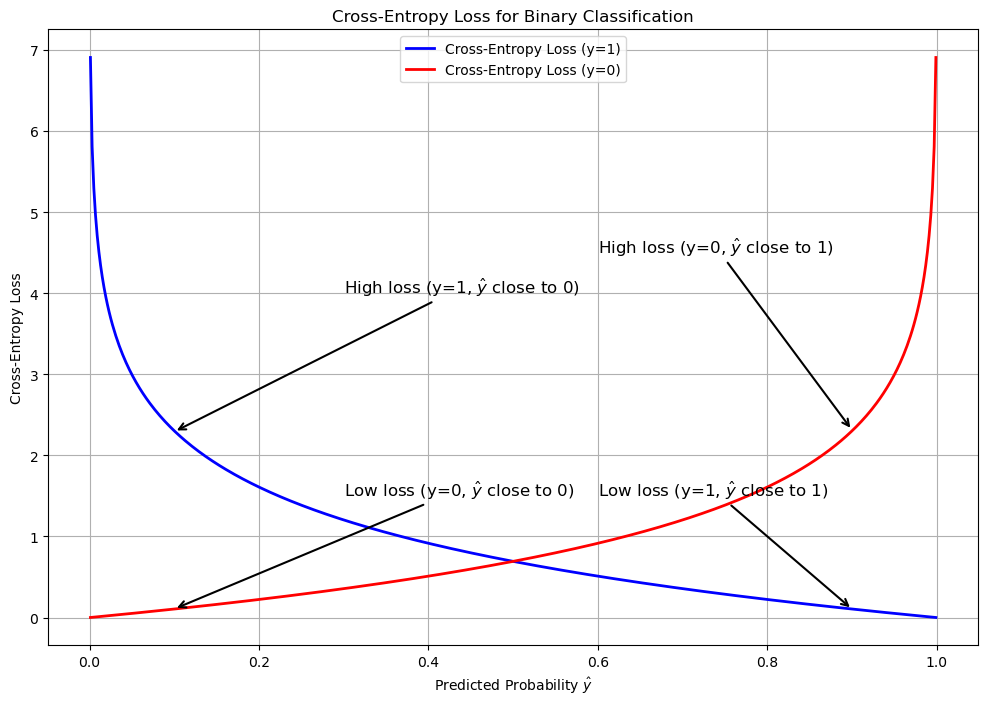
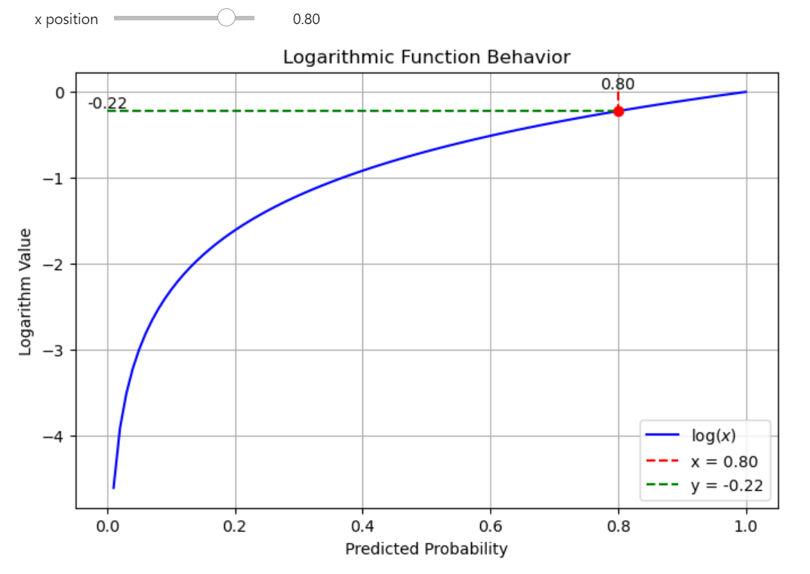
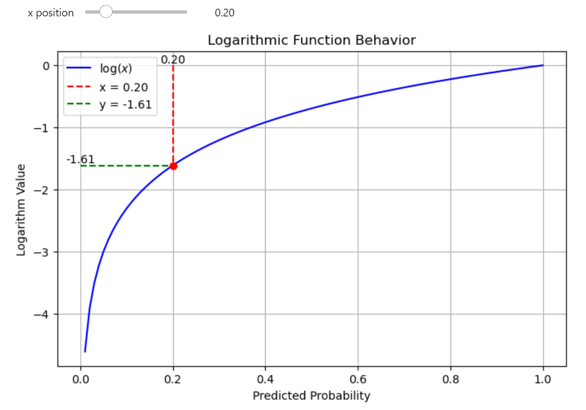
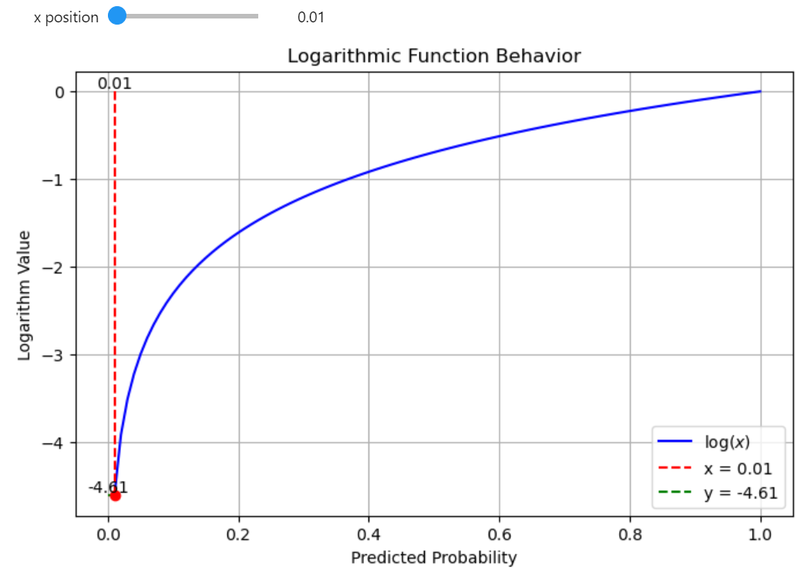
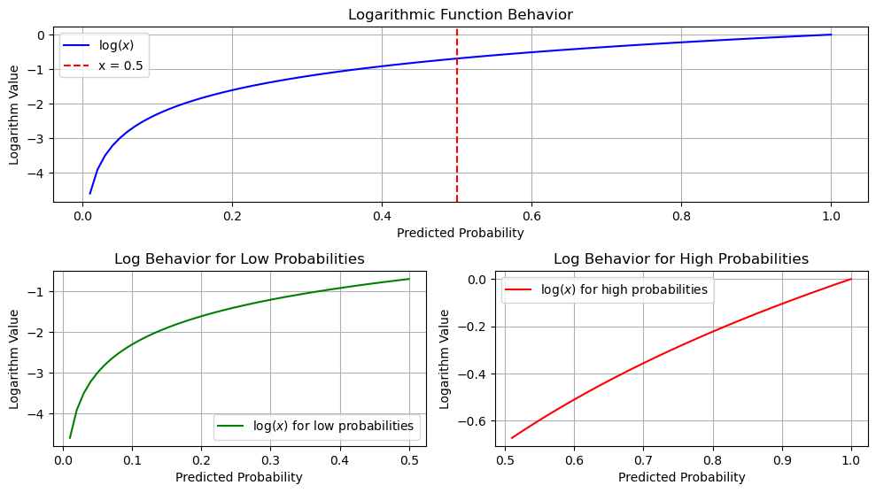
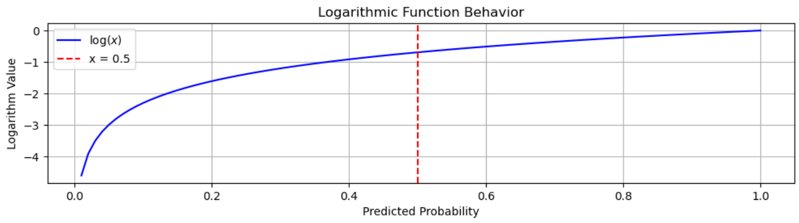
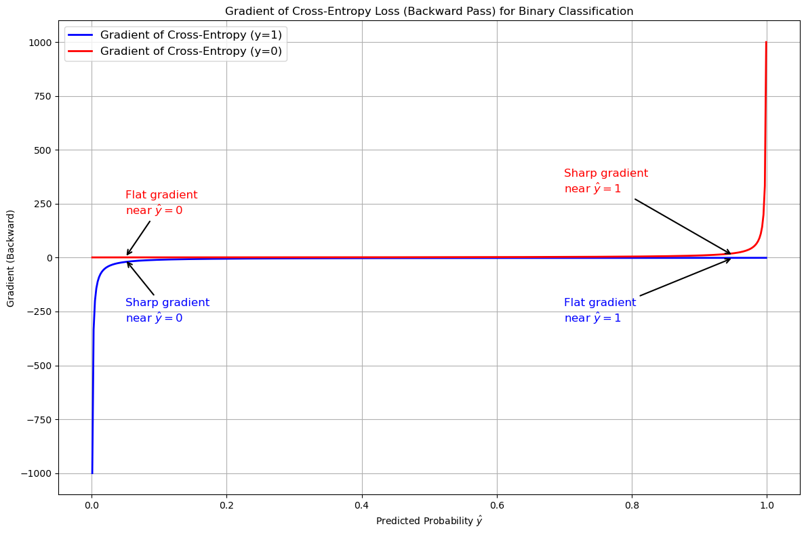

Cross-Entropy is a widely used loss function, especially in classification tasks, that measures the difference between two probability distributions. 


/// caption
Binary Cross-Entropy (BCE)
///


<!-- more -->


<iframe width="1402" height="765" src="https://www.youtube.com/embed/BKjOBO1hkkA" title="Cross-Entropy Loss Explained: A Complete Visual Guide" frameborder="0" allow="accelerometer; autoplay; clipboard-write; encrypted-media; gyroscope; picture-in-picture; web-share" referrerpolicy="strict-origin-when-cross-origin" allowfullscreen></iframe>


### [Check the jupyter notebook](https://github.com/nickovchinnikov/datasatanism/blob/master/code/6.CrossEntropy.ipynb)

Loss measures how different the true data labels are from the model's predictions. Consider two binary vectors, where "binary" means the vectors have only two possible values: 0 and 1. If we have two vectors

**True labels ($y$):**

$$y = \left[0, 1, 1, 1, 0, 1, 1, 1 \right]$$

**And predicted labels ($\hat{y}$)**:

$$\hat{y} = \left[1, 1, 1, 0, 0, 1, 1, 0 \right]$$

The loss function provides a universal measure of the difference between these vectors. This is the general purpose of any loss function and the role of **Binary Cross-Entropy** in particular.

The Cross-Entropy might look complex, but once we break it down, each part becomes clear and manageable. Let's begin with the foundation: **the logarithmic function.** 


### Log function

To understand **Cross-Entropy**, let's first recall the concept of the **logarithm**:

$$\tag{log} \label{eq:log}
\log_a(b) = c \quad \iff \quad a^c = b$$

In simpler terms, the logarithm answers the question: "To what power $c$ should we raise the base $a$ to obtain the value $b$?"

When you take the logarithm of a value in range `(0, 1)` (which is common for predicted probabilities), the result is always **negative**. The closer the probability is to 0, the more **negative** the log becomes.


**High-probability predictions** (closer to 1) will have a logarithmic value that is closer to 0. For example if the predicted probability is 0.8, the log will be approximately -0.223. This is still negative, but relatively **close to 0**.



**Low-probability predictions** (closer to 0) will result in **highly negative log values**. For example:

If the probability is 0.2, the log value will be -1.609.



If the probability is 0.01, the log will be close to -4.605.



You can experiment with this function on your own [check the jupyter notebook](#check-the-jupyter-notebook)


### Log function: high vs low

This plot illustrates the behavior of the logarithmic function in two regions: low probabilities (close to 0) and high probabilities (closer to 1).


/// caption
High vs Low
///


- The first subplot shows the entire log function, with a vertical line at $x = 0.5$ highlighting the transition point. 

- The second subplot zooms in on the low-probability region (0.01 to 0.5), where the log function steeply declines.

- The third subplot focuses on high probabilities (0.5 to 1), where the slope of the log function flattens.

This visualization demonstrates how the log function's steepness varies across different probability ranges.


## Binary Cross-Entropy (BCE)

The **binary cross-entropy (BCE)** formula (for two classes, 0 and 1) is given by:

$$\tag{BCE} \label{eq:bce}
\mathcal{L} = - \frac{1}{N} \sum_{i=1}^{N} y_i \log(p_i) + (1 - y_i) \log(1 - p_i)
$$

$y_i$ is the true label for the $i$-th sample, can either be 0 or 1. The model predicts $p_i$, the predicted probability for the $i$-th sample, it's the model's output, typically a value between 0 and 1. $N$ represents the number of samples in the dataset or batch. The loss is averaged over all samples, and we divide the sum result by the $N$.

Now let's break down the **logarithmic terms**. Since $y_i$ can be either 0 or 1, the expression:

$$y_i \log(p_i) + (1 - y_i) \log(1 - p_i)$$

**activates only one of the terms depending on the value of $y_i$**.

**First Term $y_i \log(p_i)$:** Active when $y_i = 1$, it evaluates the predicted probability for the true class. A high $p_i$ (close to 1) results in a small penalty, while a low $p_i$ (close to 0) leads to a large penalty. The logarithm amplifies errors for low probabilities, encouraging confident and correct predictions.  

**Second Term $(1 - y_i) \log(1 - p_i)$:** Active when $y_i = 0$, it evaluates the predicted probability for the incorrect class. A low $p_i$ (close to 0) keeps the penalty small, while a high $p_i$ (close to 1) results in a large penalty. The logarithm amplifies errors for high probabilities, penalizing confident but incorrect predictions.  


/// caption
Log function
///


## Forward Implementation

```python
import numpy as np


class BinaryCELoss:
    r"""
    Binary Cross-Entropy Loss module.

    Computes the Binary Cross-Entropy loss and its gradient during the forward and backward passes.
    This is typically used for binary classification tasks.
    """

    def forward(self, pred: np.ndarray, target: np.ndarray, epsilon: float = 1e-7) -> np.ndarray:
        r"""
        Compute the Binary Cross-Entropy loss between the predicted values and the target values.

        Args:
            pred (np.ndarray): The predicted values from the model.
            target (np.ndarray): The true target values.
            epsilon (float): A small value to avoid log(0) which can lead to numerical instability.

        Returns:
            np.ndarray: The computed Binary Cross-Entropy loss. Scalar for binary classification.
        """
        
        loss = -(target * np.log(pred + epsilon) + (1 - target) * np.log(1 - pred + epsilon))

        # Average the loss over the batch size
        return np.mean(loss)

```


## Binary Cross-Entropy derivative

For a single sample $i$, the BCE loss is:

$$\ell_i = - \left[ y_i \log(p_i) + (1 - y_i) \log(1 - p_i) \right]$$

**Remember the log derivative:**

$$\frac{d}{dx}\left(\log(x)\right) = \frac{1}{x}$$

Taking the partial derivative with respect to $p_i$:

$$\frac{\partial \ell_i}{\partial p_i} = - \left[ \frac{y_i}{p_i} - \frac{1 - y_i}{1 - p_i} \right]$$

Expanding and simplifying:

$$\frac{\partial \ell_i}{\partial p_i} = \frac{p_i - y_i}{p_i (1 - p_i)}$$

This gradient follows your notation and describes how the BCE loss changes with respect to the predicted probabilities $p_i$.


## Backward Implementation

```python
import numpy as np


class BinaryCELoss:
    # ... forward code

    def backward(self, pred: np.ndarray, target: np.ndarray, epsilon: float = 1e-7) -> np.ndarray:
        r"""
        Compute the gradient of the Binary Cross-Entropy loss with respect to the predicted values.

        Args:
            pred (np.ndarray): The predicted values from the model.
            target (np.ndarray): The true target values.
            epsilon (float): A small value to avoid log(0) which can lead to numerical instability.

        Returns:
            np.ndarray: The gradient of the loss with respect to the predictions.
        """

        d_out = (pred - target) / (pred * (1 - pred) + epsilon)

        # you should not average the gradients!
        # instead, you should return the gradient for each example,
        # as gradients represent how much the loss changes with
        # respect to each individual prediction.

        return d_out

```


## Binary Cross-Entropy plot

The best way to understand how cross-entropy works is to visualize it. Let's build the widely recognized plot with crossing lines that represents the binary case with two classes.


The plot visualizes the behavior of cross-entropy loss for binary classification, focusing on how the predicted probability $\hat{y}$ impacts the loss for each true class ($y = 1$ and $y = 0$). 

For $y = 1$ (blue curve), the loss is low when the predicted probability is close to 1, indicating a confident correct prediction. As $\hat{y}$ approaches 0, the loss increases sharply, penalizing confident incorrect predictions. 

For $y = 0$ (red curve), the loss is low when $\hat{y}$ is close to 0, reflecting an accurate prediction for the negative class. When $\hat{y}$ nears 1, the loss grows steeply, again emphasizing penalties for confidently wrong predictions. 

The annotated arrows highlight key points, showing regions of low and high loss for both classes, and the overall behavior underscores the role of cross-entropy in guiding models to make confident and correct predictions.

### Deivative plot

This plot visualizes the gradient of the binary cross-entropy loss with respect to the predicted probability $\hat{y}$, for two cases: when the true label $y = 1$ and when $y = 0$. The gradient indicates how the loss changes as the predicted probability moves closer to or farther from the true label. 


/// caption
Cross-Entropy Derivative plot
///

For $y = 1$ (blue line), the gradient is steep (large positive values) near $\hat{y} = 0$. This signifies a strong correction when the model predicts a probability far from the true label. As $\hat{y}$ approaches 1, the gradient becomes smaller, meaning minimal adjustments are needed since the prediction aligns well with the true label.

For $y = 0$ (red line), the pattern is reversed. The gradient is steep near $\hat{y} = 1$, penalizing predictions that incorrectly favor the positive class. When $\hat{y}$ approaches 0, the gradient diminishes, reflecting minimal penalties for predictions that align with the true label.


## Multiclass Cross-Entropy

For multiclass classification, the cross-entropy loss extends from the binary case to handle more than two classes. The **multiclass cross-entropy** formula for a **single sample** is:

$$\mathcal{L} = - \sum_{i=1}^{C} y_i \log(p_i)$$

Where $C$ is the number of classes, $y_i$ is the true label, encoded as a one-hot vector (i.e., one class has a label of 1, and all others have 0) and $p_i$ is the predicted probability for class $i$.

**For a batch of $N$ examples**, the loss is averaged over the batch:

$$\mathcal{L} = - \frac{1}{N} \sum_{n=1}^N \sum_{i=1}^C y_i^{(n)} \log(p_i^{(n)})$$

Where $y_i^{(n)}$ and $p_i^{(n)}$ are the true label and predicted probability for class $i$ of the $n$-th example.

Unlike binary cross-entropy, where only one term in the loss function is active, **multiclass cross-entropy** considers all classes. The loss is computed across all classes, but the log term only "activates" for the correct class.


### Multiclass CE derivative

**Write the summation explicitly**:

$$\mathcal{L} = -\left(y_1 \log(p_1) + y_2 \log(p_2) + \dots + y_C \log(p_C)\right)$$

Since $y_i$ is non-zero only for the true class (in one-hot encoding), most terms in the summation vanish except for the term where $y_i = 1$. **Consider the term where $y_i = 1$**: assume $y_k = 1$ for some class $k$, and $y_j = 0$ for $j \neq k$. The loss simplifies to:

$$\mathcal{L} = - \log(p_k)$$

Thus, for the true class $k$, the relevant term is $-y_k \log(p_k)$. Differentiate with respect to $p_i$:

$$\frac{\partial \mathcal{L}}{\partial p_k} = \frac{\partial}{\partial p_k} \left(-\log(p_k)\right) = -\frac{1}{p_k}$$

For all other classes $j \neq k$, $y_j = 0$, so:

$$\frac{\partial \mathcal{L}}{\partial p_j} = 0$$


**Final Derivative**: Using the general summation form, the derivative of the loss with respect to $p_i$ is:

$$\frac{\partial \mathcal{L}}{\partial p_i} = -\frac{y_i}{p_i}$$

This adjusts the predicted probability for each class based on the difference between the predicted probability and the true label.

### Implementation of CE loss:

```python

import numpy as np

class CrossEntropyLoss:
    def forward(self, pred: np.ndarray, target: np.ndarray, epsilon: float = 1e-7) -> float:
        """
        Compute the Cross-Entropy loss for multiclass classification.

        Args:
            pred (np.ndarray): The predicted class probabilities from the model (output of softmax).
            target (np.ndarray): The one-hot encoded true target values.
            epsilon (float): A small value to avoid log(0) for numerical stability.

        Returns:
            float: The computed Cross-Entropy loss. Scalar for multiclass classification.
        """
        # Clip predictions to avoid log(0)
        pred = np.clip(pred, epsilon, 1. - epsilon)
        
        # Compute cross-entropy loss for each example
        loss = -np.sum(target * np.log(pred), axis=1)  # sum over classes for each example

        # Return the mean loss over the batch
        return np.mean(loss)
    
    def backward(self, pred: np.ndarray, target: np.ndarray, epsilon: float = 1e-7) -> np.ndarray:
        """
        Compute the gradient of the Cross-Entropy loss with respect to the predicted values.

        Args:
            pred (np.ndarray): The predicted class probabilities from the model (output of softmax).
            target (np.ndarray): The one-hot encoded true target values.
            epsilon (float): A small value to avoid division by zero for numerical stability.

        Returns:
            np.ndarray: The gradient of the loss with respect to the predictions.
        """

        # Clip predictions to avoid division by zero
        pred = np.clip(pred, epsilon, 1. - epsilon)
        
        # Compute the gradient of the loss with respect to predictions
        grad = -target / pred  # gradient of cross-entropy w.r.t. predictions
        
        return grad

```

## Summary

**Binary Cross-Entropy (BCE)** is used for two-class problems, where only one term is active at a time. **Multiclass Cross-Entropy** handles more than two classes, using all the predicted probabilities, but the true class has a label of 1, and all others are 0. The loss for multiclass classification accumulates over all classes, making it more complex, but **the underlying principle of penalizing incorrect predictions remains the same.**

**Cross-Entropy Loss** is a powerful tool in classification tasks, particularly useful in penalizing confident but incorrect predictions. Logarithmic function amplifies the loss for wrong predictions made with high certainty, helping models learn more effectively.
