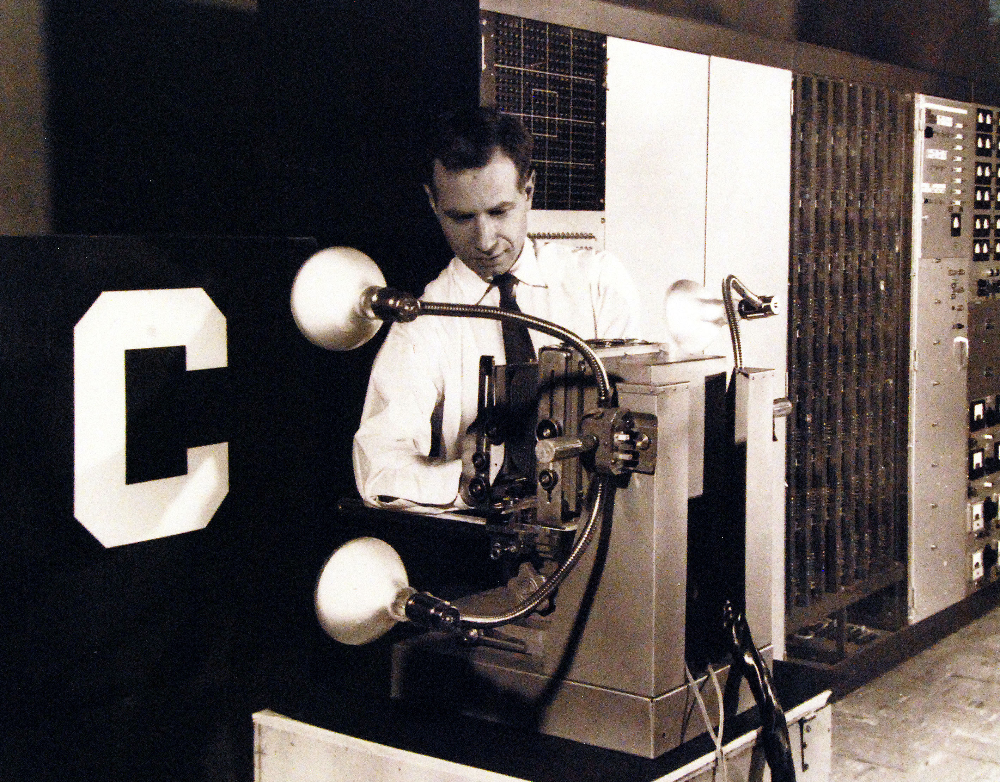
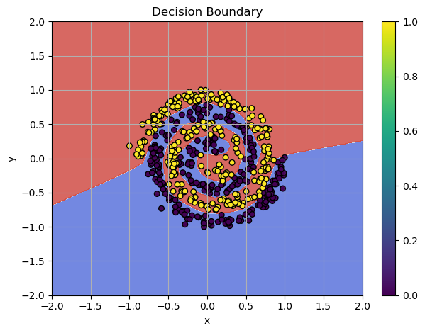

The **Perceptron**, created by Frank Rosenblatt in the 1950s, was one of the first neural networks designed to classify patterns. Initially celebrated, it became a foundational milestone in machine learning.



/// caption
Frank Rosenblatt and the Perceptron, a simple neural network machine designed to classify patterns
///


<!-- more -->


<iframe width="942" height="530" src="https://www.youtube.com/embed/F09squ1quN0" title="Building a Multi-Layer Neural Network from Scratch: Solving the Spiral Classification Problem" frameborder="0" allow="accelerometer; autoplay; clipboard-write; encrypted-media; gyroscope; picture-in-picture; web-share" referrerpolicy="strict-origin-when-cross-origin" allowfullscreen></iframe>

### [Check the jupyter notebook](https://github.com/nickovchinnikov/datasanta/blob/master/code/10.MultiLayerNetwork.ipynb)


To understand the Perceptron, imagine it analyzing an image of the number "5." Each pixel serves as an input, connected to a weight. The Perceptron calculates a weighted sum, or dot product, between inputs ($x_i$) and weights ($w_i$):  

$$x_w = \sum_{i=0}^n x_i w_i$$  

The **activation function** decides the output based on this sum:  

$$f(x_w) = 
\begin{cases} 
1, & \text{if } x_w \geq 0 \\ 
-1, & \text{otherwise}
\end{cases}$$

Here, $x_0$ is a **bias term** set to $1$, balancing the model.


<iframe width="1416" height="765" src="https://www.youtube.com/embed/qSVl51w7WUI" title="The Perceptron" frameborder="0" allow="accelerometer; autoplay; clipboard-write; encrypted-media; gyroscope; picture-in-picture; web-share" referrerpolicy="strict-origin-when-cross-origin" allowfullscreen></iframe>


Despite its promise, the Perceptron had a major limitation: it could only classify **linearly separable patterns**. For example, in 2D space, two sets of points (red and blue) are linearly separable if a single straight line can separate them.


/// caption
Example: Linearly Separable Pattern
///


This limitation made the Perceptron unsuitable for real-world problems with complex patterns. In 1969, Marvin Minsky and Seymour Papert demonstrated these limitations in their book *Perceptrons*.


{ width="300" }
/// caption
Perceptrons Book Cover
///


After the devastating criticism of the Perceptron, the first AI winter began - a time when numerous AI projects lost funding and support leaving them frozen for better days to come. The limitations of early models like the Perceptron highlighted the need for more advanced architectures to tackle complex problems.

In my [previous post](./linear_layer_and_sgd.md), I used the Linear Layer as the model for the `SGD` optimizer. While it successfully handled linearly separable patterns, I can demonstrate that it fails with more complex non-linear patterns. For instance, a single Linear Layer cannot solve the spiral problem - a classic example that requires non-linear transformations.


## Spiral Dataset

The `make_spiral_dataset` function generates a dataset of two intertwined spirals, which is a common benchmark problem for testing machine learning models on non-linearly separable data.


```python
import numpy as np
import matplotlib.pyplot as plt

from typing import Tuple


def make_spiral_dataset(
    n_samples: int = 100,
    noise: float = 0.2,
    seed: int = None,
    x_range: Tuple[int, int] = (-1, 1),
    y_range: Tuple[int, int] = (-1, 1)
):
    # Install the random seed
    if seed:
        np.random.seed(seed)

    n = n_samples // 2  # Split samples between two spirals

    # Generate first spiral
    theta1 = np.sqrt(np.random.rand(n)) * 4 * np.pi
    r1 = 2 * theta1 + np.pi
    x1 = np.stack([r1 * np.cos(theta1), r1 * np.sin(theta1)], axis=1)

    # Generate second spiral
    theta2 = np.sqrt(np.random.rand(n)) * 4 * np.pi
    r2 = -2 * theta2 - np.pi
    x2 = np.stack([r2 * np.cos(theta2), r2 * np.sin(theta2)], axis=1)

    # Combine spirals and add noise
    X = np.vstack([x1, x2])
    X += np.random.randn(n_samples, 2) * noise

    # Scale X to fit within the specified x and y ranges
    X[:, 0] = np.interp(X[:, 0], (X[:, 0].min(), X[:, 0].max()), x_range)
    X[:, 1] = np.interp(X[:, 1], (X[:, 1].min(), X[:, 1].max()), y_range)

    # Create labels
    y_range = np.zeros(n_samples)
    y_range[:n] = 0  # First spiral
    y_range[n:] = 1  # Second spiral

    return X, y_range

```

Let's generate an example of the spiral dataset:

```python
# Generate synthetic classification data
n_samples = 500
features = 2

# Usage example:
x, y_target = make_spiral_dataset(n_samples=n_samples, noise=1.5, seed=1)

y_target = y_target.reshape(-1, 1)

# visualize in 2D
plt.figure(figsize=(5, 5))
plt.scatter(x[:, 0], x[:, 1], c=y_target, s=20, cmap="jet")
plt.xlim(x[:, 0].min() - 0.2, x[:, 0].max() + 0.2)
plt.ylim(x[:, 1].min() - 0.2, x[:, 1].max() + 0.2)
plt.show()

```


/// caption
Spiral dataset
///


Now, we can apply the `Linear` model to the `spiral` dataset and observe its performance.


```python
model = Linear(input_size=features, output_size=1, init_method="xavier")
activation = Sigmoid()
bce = BCELoss()
optimizer = SGD(lr=0.01, momentum=0.9)

```

Training loop for 100 epoch:

```python
n_epoch = 100

for epoch in range(n_epoch):
    # Forward
    output = model(x)
    y_pred = activation(output)
    loss = bce(y_pred, y_target)

    model.zero_grad()

    # Backward
    grad = bce.backward(y_pred, y_target)
    grad = activation.backward(grad)
    model.backward(grad)

    optimizer.step(model)

    print(f"Epoch {epoch}, Loss: {loss:.4f}")

```

**Output:**

```
Epoch 0, Loss: 0.6395
Epoch 1, Loss: 0.6352
Epoch 2, Loss: 0.6320
Epoch 3, Loss: 0.6317
Epoch 4, Loss: 0.6339
Epoch 5, Loss: 0.6358
...
Epoch 96, Loss: 0.6310
Epoch 97, Loss: 0.6310
Epoch 98, Loss: 0.6310
Epoch 99, Loss: 0.6310
```

Plotting the decision boundaries reveals that the `SGD` optimizer is stuck in a local minimum, and the model's complexity is insufficient to solve such a pattern:

```python
plot_decision_boundaries(model, x, y_target)

```


/// caption
Linear Layer Failed
///

Using our previously implemented Linear Layer, we train the model for 100 epochs and, there is no meaningful progress - the model is too simple to handle the spiral problem effectively.


## Universal Approximator

Minsky and Puppet in their book briefly discussed about the multi-layer nets.


/// caption
A quote from the book Perceptron about the **Multi-Layer Perceptron.**
///

They have not investigated this direction, because back in the day it was barelly possible to build such model, considering the hardware limitation. The cost of the `RAM` in *(1957-1973)*:

| Date (X) | $/Mbyte (Y) | Date        | Ref       | Page | Company  | Size (KByte) | Cost (US $) | Speed (nsec) | Memory Type                 | JDR Chip Prices |
|----------|-------------|-------------|-----------|------|----------|--------------|--------------|--------------|-----------------------------|------------------|
| 1957  | 411,041,792 | 1957        | Phister   | 366  | C.C.C.   | 0.00098      | 392.00       | 10000        | Transistor Flip-Flop        |                  |
| 1959  | 67,947,725  | 1959        | Phister   | 366  | E.E.Co.  | 0.00098      | 64.80        | 10000        | Vacuum Tube Flip-Flop       |                  |
| 1960  | 5,242,880   | 1960        | Phister   | 367  | IBM      | 0.00098      | 5.00         | 11500        | IBM 1401 Core Memory        |                  |
| 1965  | 2,642,412   | 1965        | Phister   | 367  | IBM      | 0.00098      | 2.52         | 2000         | IBM 360/30 Core Memory      |                  |
| 1970  | 734,003     | 1970        | Phister   | 367  | IBM      | 0.00098      | 0.70         | 770          | IBM 370/135 Core Memory     |                  |
| 1973  | 399,360     | 1973 Jan    | PDP8/e User Price List |      | DEC      | 12           | 4680.00      |              | Core Memory 8KwordX12 bit |                  |

[Source: Memory Prices](https://jcmit.net/memoryprice.htm)


The multi-layer models have the ability to approximate non-linear patterns. This principle lies at the heart of the **Deep Learning** revolution. These architectures act as a **Universal Approximator Function**, enabling them to model and learn highly complex relationships in data, thanks to the **Universal Approximation Theorem!** This theorem proves that a feedforward neural network with at least one hidden layer can approximate any continuous function to an arbitrary degree of accuracy, given the right configuration and activation functions. It underscores the power and flexibility of neural networks in modeling complex relationships in data.

??? info annotate "Universal Approximation Theorem (UAT)"
    **Universal Approximation Theorem (UAT)** asserts that feedforward neural networks with at least one hidden layer and a non-constant, bounded, continuous, and monotonically increasing activation function (e.g., sigmoid, tanh) can approximate any continuous function on a compact subset of $\mathbb{R}^n$ to any desired accuracy. Formally, for any continuous function $f$ and any $\epsilon > 0$, there exists a neural network $\hat{f}$ such that $|f(x) - \hat{f}(x)| < \epsilon$ for all $x$ in the set.


## Deep Neural Network

The solution to the spiral pattern problem lies in the **Deep Neural Network**, which we can easily build using our framework, since we already have all the necessary building blocks! To recall the key components, check out my previous post: [Mastering Neural Network - Linear Layer and SGD](./linear_layer_and_sgd.md)

First, let's introduce the `LeakyReLU` activation function, which we will use between the layers. Mathematically, it is defined as a piecewise function:

$$f(x) = \begin{cases} 
x & \text{if } x > 0 \\
\alpha x & \text{if } x \leq 0
\end{cases}$$

Here, $\alpha$ is a small positive constant that controls the slope of the function when $x$ is negative.

The derivative of the `LeakyReLU` activation function is:

$$f'(x) = \begin{cases} 
1 & \text{if } x > 0 \\
\alpha & \text{if } x \leq 0
\end{cases}$$

For positive inputs ($x > 0$), the derivative is simply 1, meaning the function behaves like the identity function for positive values. For negative inputs ($x \leq 0$), the derivative is $\alpha$, where $\alpha$ is a small constant (typically around 0.01), which controls the slope of the function in the negative domain.

**Implementation:**

```python
class LeakyReLU(Module):
    def __init__(self, alpha: float = 0.01):
        self.alpha = alpha

    def forward(self, x: np.ndarray):
        self.input = x
        return np.where(x > 0, x, self.alpha * x)
    
    def backward(self, d_out: np.ndarray):
        dx = np.ones_like(self.input)
        dx[self.input <= 0] = self.alpha
        return d_out * dx
    

```

The second piece that we need to add is the `Sequential` class, which allows us to compose multiple layers into a single sequential model. This class facilitates both the `forward` and `backward` propagation of data through the layers of the network and makes managing the parameters of all layers in one unified structure.

Here's the code for the `Sequential` class:

```python
class Sequential(Module):
    r"""
    A class that represents a sequence of layers, used to build the multi-layer network.
    
    This class allows layers to be stacked in a sequential manner, where data flows from one layer to the next.
    It supports both forward and backward passes through the layers, as well as managing parameters for optimization.

    Attributes:
      - layers (List[Module]): A list of layers that compose the sequential model.
    """

    def __init__(self, layers: List[Module]):
        r"""
        Initializes the Sequential model with the given list of layers.

        Args:
          - layers (List[Module]): List of layers to be included in the sequential model.
        """

        self.layers = layers

    def forward(self, x: np.ndarray) -> np.ndarray:
        r"""
        Performs the forward pass through all layers in the sequence.
        
        Args:
          - x (np.ndarray): Input data to the model.

        Returns:
          - np.ndarray: Output after passing through all layers in the sequence.
        """

        for layer in self.layers:
            x = layer.forward(x)
        return x

    def backward(self, d_out: np.ndarray) -> np.ndarray:
        r"""
        Performs the backward pass through all layers in reverse order.
        
        Args:
          - d_out (np.ndarray): Gradient of the loss with respect to the output.

        Returns:
          - np.ndarray: Gradient of the loss with respect to the input of the first layer.
        """

        for layer in reversed(self.layers):
            d_out = layer.backward(d_out)
        return d_out
    
    def parameters(self) -> List[Parameter]:
        r"""
        Retrieves all parameters from the layers in the sequence, including weights and biases.
        
        This method appends a unique prefix to the parameter name to differentiate the parameters of different layers
        when optimizing.

        Returns:
          - List[Parameter]: A list of parameters (weights, biases, etc.) from all layers.
        """

        params = []
        for i, layer in enumerate(self.layers):
            for param in layer.parameters():
                # Add a unique prefix name for optimization step
                param.name = f"layer_{i}_{param.name}"
                params.append(param)
        return params

```

Now, let's use the `Sequential` and compose the Multi-Layer model

```python
# Model architecture
model = Sequential([
    Linear(x.shape[1], 128, init_method="he_leaky"),
    LeakyReLU(alpha=0.01),
    Linear(128, 64, init_method="he_leaky"),
    LeakyReLU(alpha=0.01),
    Linear(64, 1, init_method="xavier"),
    Sigmoid()
])

bce = BCELoss()
optimizer = SGD(lr=0.001, momentum=0.9)

```

And we are ready to run the training loop:

```python
n_epoch = 1000

for epoch in range(n_epoch):
    # Forward
    y_pred = model(x)
    loss = bce(y_pred, y_target)

    model.zero_grad() 

    # Backward
    grad = bce.backward(y_pred, y_target)
    model.backward(grad)

    optimizer.step(model)

    print(f"Epoch {epoch}, Loss: {loss:.4f}")

```

**Output:**

```
Epoch 0, Loss: 0.7561
Epoch 1, Loss: 0.6769
Epoch 2, Loss: 0.6555
Epoch 3, Loss: 0.6653
Epoch 4, Loss: 0.6509
Epoch 5, Loss: 0.6272
...
Epoch 996, Loss: 0.0037
Epoch 997, Loss: 0.0037
Epoch 998, Loss: 0.0037
Epoch 999, Loss: 0.0037
```

We get almost perfect score! The decision boundaries shows the solutions:

```python
plot_decision_boundaries(model, x, y_target)

```


/// caption
**Multi-Layer Model** Cracked the Spiral!
///


## The Training Process with animated decision boundaries

<iframe width="1416" height="765" src="https://www.youtube.com/embed/OE_HlKJm72I" title="Solving Non-Linear Patterns with Multi-Layer Networks" frameborder="0" allow="accelerometer; autoplay; clipboard-write; encrypted-media; gyroscope; picture-in-picture; web-share" referrerpolicy="strict-origin-when-cross-origin" allowfullscreen></iframe>

## Sign Off

Deep learning has transformed from a theoretical concept to a practical tool, enabling solutions to problems once thought impossible. With the right architectures of the network the potential is truly limitless!
