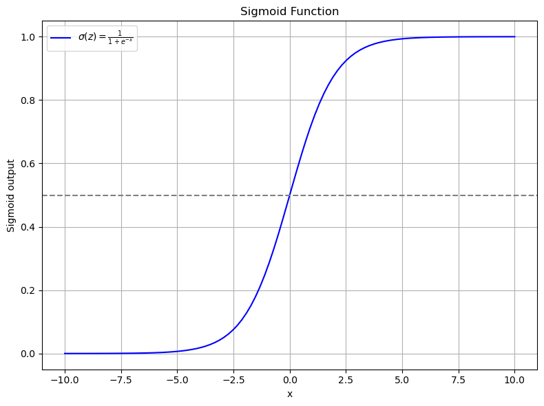
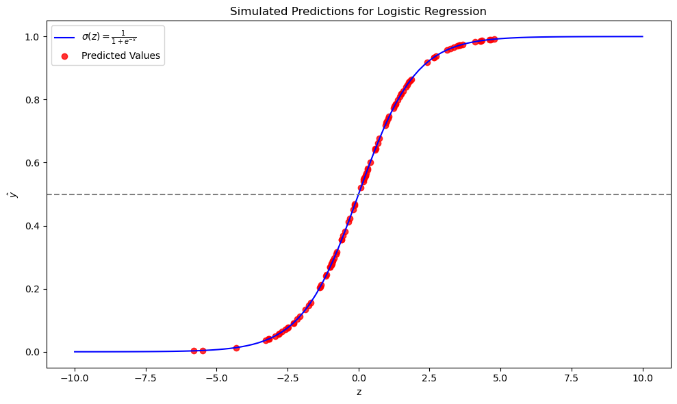
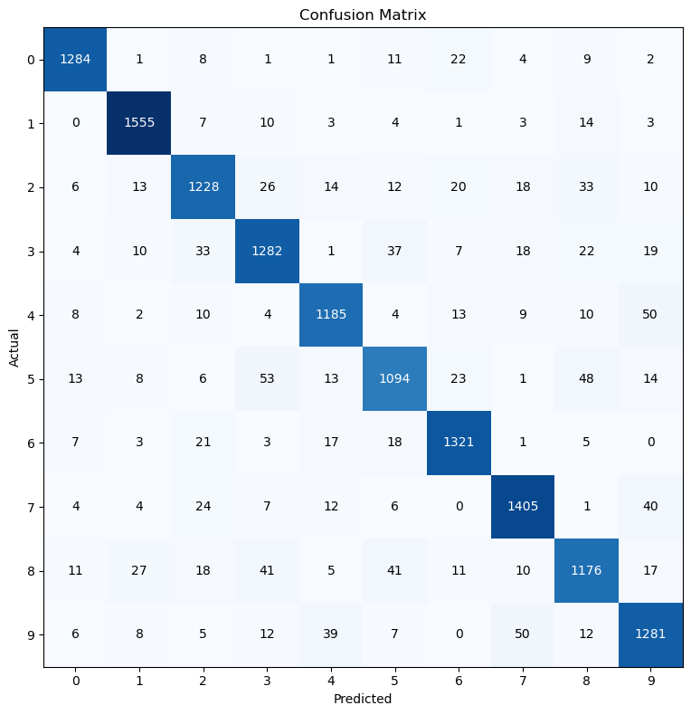

{ align=center, width="500" }

Hey there, data enthusiasts! Today, we're diving into the fascinating world of **Machine Learning Classification** using one of the most iconic datasets out there - the **MNIST dataset**. *MNIST stands for Modified National Institute of Standards and Technology.*

We're diving into the realm of MNIST - a dataset that's like a treasure map for budding data scientists. It contains thousands of handwritten digits from 0 to 9. Each image is a snapshot of someone's attempt to scribble a number, and our mission is to make sense of these.

<!-- more -->

### [Check the jupyter notebook](https://github.com/nickovchinnikov/datasatanism/blob/master/code/0.MNIST_Adventure.ipynb)

<iframe width="1707" height="765" src="https://www.youtube.com/embed/csZ4dIAPowA" title="Dive Into Learning From Data" frameborder="0" allow="accelerometer; autoplay; clipboard-write; encrypted-media; gyroscope; picture-in-picture; web-share" referrerpolicy="strict-origin-when-cross-origin" allowfullscreen></iframe>

### What's Classification?

Classification is like teaching your computer to distinguish between cats and dogs in photos. You feed it images, labeled "cat" or "dog", and it learns to predict which label to slap on a new photo.

{ align=center, width="500" }
/// caption
Cat VS Dog
///

### Let's Meet MNIST

**MNIST** stands for **Modified National Institute of Standards and Technology** database. It's not about cats and dogs, but it's just as exciting. This dataset contains images of handwritten digits (0 through 9). Your mission is to train a model to identify these digits correctly.

{ align=center }
/// caption
MNIST digits
///

### Setup and Data Exploration

First, you'll need to set up your environment. I'm rocking a Jupyter Notebook inside VS Code, but any Python environment will do the trick. Let's get our hands dirty with some code:

```python
# Import necessary libraries
from sklearn.datasets import fetch_openml
import pandas as pd
import matplotlib.pyplot as plt

# Fetch the MNIST dataset
mnist = fetch_openml('mnist_784', version=1)

# Check what we've got in our dataset
print(mnist.keys())

# Separate the pixel information (images) and labels
X, y = mnist['data'], mnist['target']

# Let's peek at the data
print(X.shape)  # Should print (70000, 784) - 70k images, each 784 pixels
```

### Understanding Pixel Data

Notice how most of the data in `X` is close to zero? That's because most of the image is empty space:

```python
# Check the range of pixel intensities
print("Minimum pixel intensity:", X.min().min())
print("Maximum pixel intensity:", X.max().max())
```

### Data Insights:

- **Why 784 pixels?** Each image in MNIST is 28x28 pixels, which totals to 784 when flattened.
- **Pixel Intensity:** A value of 0 means the pixel is as black as a shadow, while 255 is a light as bright as the sun. In between, there's a spectrum of grays.
- **Data Dimensionality:** With 70,000 images, each with 784 features, we're dealing with a lot of information. But how much of it is truly useful?

{ align=center, width="500" }
/// caption
Direct radio image of a supermassive black hole at the core of Messier 87
///

### Focusing on the Relevant Data

Most of these images are like the night sky, mostly dark with occasional stars (activated pixels). Here's how we peek at the center of these images:

```python
# Look at the middle band of the images where digits usually reside
X.iloc[:, 400:500]
```

#### Questions to Explore:

- How does a computer learn from pixels what humans recognize by patterns?
- What patterns do we humans overlook that machines might find fascinating?

### Visualizing The Data

Images are typically represented as matrices where each cell might represent the intensity of a pixel. Here's how we can look at what we're dealing with:

```python
# Display the first image
some_digit = X.iloc[0].values.reshape(28, 28)
plt.imshow(some_digit, cmap='binary')
plt.axis("off")
plt.show()

print("Label for this image:", y[0])
```

This code reshapes the `X` data into a 28x28 matrix (since 28 * 28 = 784), which is the size of our digit images. We use `matplotlib` to visualize it.

### A Gallery of Digits

Alright, let's take a moment to appreciate the art of handwritten numbers! This snippet of code takes the first ten images from our dataset and lays them out in a grid.

```python
import matplotlib.pyplot as plt

# Setting up a 2x5 grid of subplots
fig, axes = plt.subplots(2, 5, figsize=(10, 5))

# Loop through our subplots
for i, ax in enumerate(axes.flat):
    # Display the image in the subplot
    ax.imshow(X.iloc[i].values.reshape(28, 28), cmap="gray")
    # Set the title of each subplot to the digit label
    ax.set_title(y[i])
    # Turn off the axis ticks
    ax.axis("off")

# Adjust the layout to prevent overlapping
plt.tight_layout()
# Show the gallery
plt.show()
```

{ align=center, width="500" }
/// caption
MNIST grid example
///

You've turned raw pixel data into a visual representation that's not only informative but also engaging, allowing us to see the variety in how digits are handwritten.

#### Questions to Explore:

- **How does the choice of color map (cmap) in `plt.imshow()` affect our perception and interpretation of the digit images?** Does using `cmap='binary'` versus `cmap='gray'` or other colormaps reveal different nuances in the digits that might influence a model's learning process?

- **What does the distribution of pixel intensities across different digits tell us about the writing styles or variations in the dataset?** Could analyzing this distribution help in preprocessing steps like normalization or in feature engineering for better classification?

### Understanding Logistic Regression

Once we've got our dataset ready, it's time to apply a classification algorithm. We'll use **logistic regression**, which, despite its name, is designed for classification. It's not about predicting a continuous outcome; instead, it helps us decide whether an image represents a specific digit or not.

Logistic regression works by transforming input values through a **sigmoid function**, which squeezes any real number into a range between 0 and 1, effectively representing a probability. Here's how it looks:

- If the output of the sigmoid function is less than a certain threshold (commonly 0.5), we classify the input as belonging to one class.
- If it's greater than or equal to that threshold, we classify it into another class.

#### The Sigmoid Function

The sigmoid function takes any real-valued number and squashes it into a range from 0 to 1. It's defined as:

$$
\sigma(z) = \frac{1}{1 + e^{-z}}
$$

Here's how you can define and visualize it:

```python
import numpy as np
import matplotlib.pyplot as plt

def sigmoid(x):
    """
    Compute the sigmoid of x.
    
    Parameters:
    x (float or numpy array): Input value or array of values.
    
    Returns:
    float or numpy array: The sigmoid output.
    """
    return 1 / (1 + np.exp(-x))

# Generate a range of x values
y = np.linspace(-10, 10, 100)

# Apply sigmoid function to generate y values
x = sigmoid(y)

# Plot the sigmoid function
plt.figure(figsize=(8, 6))
plt.plot(y, x, label=r"$\sigma(x) = \frac{1}{1 + e^{-x}}$", color='blue')
plt.axhline(y=0.5, linestyle="--", color="grey", label='Threshold = 0.5')  # Adding threshold line

plt.title("Sigmoid Function: The Heart of Logistic Regression")
plt.xlabel("Input (x)")
plt.ylabel("Output (Probability)")
plt.legend()
plt.grid(True)
plt.tight_layout()
plt.show()
```

**Remember, this isn't just about plotting a curve;** it's about understanding how logistic regression decides on class boundaries using the sigmoid function to transform our input into a probability of belonging to a certain class.

{ align=center, width="500" }
/// caption
This simple plot shows how the sigmoid function takes inputs from `-10` to `10` and transforms them into a probability curve. The gray dashed line represents our decision boundary at 0.5.
///

- **Why this shape?** The sigmoid function gives us a smooth transition from 0 to 1, which is ideal for interpreting the output as probability. It's symmetric around `x = 0`, where `sigmoid(0) = 0.5`, making this the natural choice for our classification threshold.

- **Why is this useful?** When we're dealing with images of digits, this function allows us to convert the raw pixel data into something more interpretable—a probability that the image belongs to a particular class.

*By understanding this function, we gain insight into how logistic regression makes its classifications, turning raw data into decisions in a way that's both mathematically sound and intuitively understandable.*

#### Questions to Explore:

- How does the choice of the threshold in logistic regression affect the classification results? Can adjusting this threshold improve the model's performance for certain classes over others?

- What are the implications of using logistic regression with the sigmoid function for multi-class classification problems like MNIST, where we have more than two classes? How does the softmax function, an extension of the sigmoid for multiple classes, compare in this context?

### How Logistic Regression Works:

Logistic regression initially calculates a linear combination of the input features:

$$
z = w_1x_1 + w_2x_2 + ... + w_nx_n + b
$$

Where:

- $w_1, w_2, ..., w_n$ are the weights for each feature.
  
- $x_1, x_2, ..., x_n$ are the feature values.
  
- $b$ is the bias term.

Then, we apply the sigmoid function to this linear combination:

$$
\hat{y} = \sigma(z)
$$

Where:

- $\sigma(z)$ is our sigmoid function.

- $\hat{y}$ is the predicted probability that the input belongs to class 1.

Based on this probability, we can classify data points by setting a threshold (often 0.5):

- If $\hat{y} < 0.5$, predict class 0.

- If $\hat{y} \geq 0.5$, predict class 1.

### Sigmoid in action

<iframe width="1707" height="765" src="https://www.youtube.com/embed/iRecnibNI2Q" title="Sigmoid function in action" frameborder="0" allow="accelerometer; autoplay; clipboard-write; encrypted-media; gyroscope; picture-in-picture; web-share" referrerpolicy="strict-origin-when-cross-origin" allowfullscreen></iframe>

**Interpreting the Sigmoid Output:**

- As `x` goes to negative infinity, the output of the sigmoid function approaches 0.
- As `x` goes to positive infinity, the output approaches 1.
- A common threshold for classification is 0.5. If the output is less than 0.5, we might classify it as class 0, and if it's greater than 0.5, as class 1.

### Simulating Logistic Regression

Let's delve deeper into how logistic regression processes data to make predictions. We'll simulate this process using Python to illustrate the transformation from input to output.

**Setting Up Our Simulation:**
First, we define our parameters:

- **Number of Samples:** 100
- **Number of Features:** 3

```python
import numpy as np
import matplotlib.pyplot as plt

def sigmoid(x):
    return 1 / (1 + np.exp(-x))

num_samples, num_features = 100, 3
```

**Generating Weights, Bias, and Input Data:**

```python
# Initialize weights and bias randomly
weights = np.random.randn(num_features)
bias = np.random.randn()

# Create input data X
X = np.random.randn(num_samples, num_features)
```

**Computing the Linear Combination:**

```python
# Compute Z, which is our linear combination of weights and features plus bias
Z = X @ weights + bias  # Using @ for matrix multiplication
print(f"Shape of Z: {Z.shape}")  # This should be a 1-dimensional array of length 100
```

The `Z` array represents the linear combination of our input features with the weights, plus the bias. Here, `@` performs the dot product between `X` (100 samples by 3 features) and `weights` (3 features), resulting in a vector of 100 values, one for each sample.

#### If it's not clear why we have a vector with 100 items, you might need a review of [matrix multiplication and broadcasting rules.](./matmul_broadcasting.md)

**Applying the Sigmoid Function:**
Now we'll apply the sigmoid function to transform `Z` into probabilities:

```python
# Apply sigmoid to Z to get probabilities (y_hat)
y_hat = sigmoid(Z)
```

**Plotting the Results:**
We'll now plot the sigmoid curve along with our simulated predictions:

```python
# Generate data for the sigmoid plot
z_sigmoid = np.linspace(-10, 10, 100)
sigmoid_values = sigmoid(z_sigmoid)

plt.figure(figsize=(10, 6))
# Plot the sigmoid function
plt.plot(z_sigmoid, sigmoid_values, label=r"$\sigma(z) = \frac{1}{1 + e^{-x}}$", color='blue')

# Plot our predicted values
plt.scatter(Z, y_hat, color="red", label="Predicted Values", alpha=0.8)
plt.axhline(y=0.5, linestyle="--", color="grey")  # Threshold line

plt.title("Simulated Predictions for Logistic Regression")
plt.xlabel("z")
plt.ylabel(r"$\hat{y}$")

plt.legend()
plt.tight_layout()

plt.show()
```

{ align=center, width="500" }
/// caption
This simulation visualizes how logistic regression uses the sigmoid function to convert a linear combination of features into class probabilities. Keep in mind, this is a simulation with random weights and bias, not an optimized model, but it helps to illustrate the concept.
///

**Explaining the Plot:**

- The blue line is the theoretical sigmoid function, showing how inputs are transformed into probabilities.
- The red dots represent our simulated model's predictions, where each dot corresponds to a sample's `Z` value mapped to its predicted probability `y_hat`.
- The horizontal grey dashed line at `y=0.5` is our decision boundary; points above this line would be classified as class 1, and below as class 0.

#### Questions to Explore:

- How does the distribution of `Z` values affect the classification accuracy? What happens if most `Z` values are clustered around zero?

- What would happen if we were to change the threshold from 0.5 to another value? How would this affect the classification of samples near the threshold?

## Logistic Regression with `sklearn`

Now that we've understood the basics of logistic regression, let's apply this knowledge using scikit-learn's implementation. Remember, we've already set up our data with `X` containing the pixel data and `y` representing the labels. 

```python
from sklearn.linear_model import LogisticRegression
from sklearn.model_selection import train_test_split
from sklearn.metrics import accuracy_score

# We defined X and y earlier:
X, y = mnist['data'], mnist['target']

# Here we convert y to integers because mnist['target'] might be strings
y = y.astype(int)

# Splitting the dataset into training and testing sets
X_train, X_test, y_train, y_test = train_test_split(X, y, test_size=0.2, random_state=42)
```

**Splitting the Data**: We use `train_test_split` to divide our data. This is crucial to evaluate how well our model generalizes to unseen data. Here, we've decided to use 20% of the data for testing, keeping the rest for training.

### Training the Model

Next, we'll set up our logistic regression model with an increased number of iterations to ensure it converges:

```python
# Creating and training the model
model = LogisticRegression(max_iter=2000)
model.fit(X_train, y_train)
```

**`max_iter`**: Set to 2000 to give the model enough iterations to converge. Increasing this can be useful if the model doesn't converge with fewer iterations.

### Making Predictions and Evaluating

Now, let's use the model to **predict on the test set**:

```python
# Predicting on the test set
y_pred = model.predict(X_test)

# Evaluating the model
score = accuracy_score(y_test, y_pred)
print(f"Accuracy Score: {score:.2%}")
```

This gives us a straightforward metric to assess our model's performance.

```
Accuracy Score: 0.9150714285714285
```

This indicates that the model correctly predicts the digit in about `91%` of cases, which is quite good for a simple model like logistic regression on this dataset. 

### Model Convergence

This error:

```
d:\anaconda3\envs\au2grad\lib\site-packages\sklearn\linear_model\_logistic.py:469: ConvergenceWarning: lbfgs failed to converge (status=1):
STOP: TOTAL NO. of ITERATIONS REACHED LIMIT.

Increase the number of iterations (max_iter) or scale the data as shown in:
    https://scikit-learn.org/stable/modules/preprocessing.html
Please also refer to the documentation for alternative solver options:
    https://scikit-learn.org/stable/modules/linear_model.html#logistic-regression
  n_iter_i = _check_optimize_result(

```

indicating the model failed to converge.

We've achieved a pretty good score for a straightforward model like logistic regression with 91%. However, there's an indication that our model hasn't fully converged because it hit the iteration limit. This suggests we could either increase `max_iter` to, say, 5,000 or more, or scale the data as we've discussed in data preprocessing. 

The complexity of our data might exceed what logistic regression can effectively handle. Rather than getting lost in the maze of hyperparameter tuning or further optimization, let’s pivot and analyze the results we have.

#### Questions to Explore:

- How does the choice of solver in logistic regression (`lbfgs`, `liblinear`, `newton-cg`, etc.) influence model convergence and performance on MNIST?

- What impact does changing the `test_size` in `train_test_split` have on model performance metrics like accuracy? Could this reveal overfitting or underfitting issues in our model?

## Visualizing Misclassified Images

Now let's look at how we can visualize the images our model got wrong:

```python
misclassified_idxs, = np.where(y_test != y_pred)
print(misclassified_idxs)

fig, axes = plt.subplots(2, 5, figsize=(10, 5))

for y, ax in enumerate(axes.flat):
    idx = misclassified_idxs[y]
    ax.imshow(X_test.iloc[idx].values.reshape(28, 28), cmap="gray")
    ax.set_title(f"True: {y_test.iloc[idx]}\nPred: {y_pred[idx]}")
    ax.axis("off")

plt.tight_layout()
plt.show()
```

In this code, we:

- Identify the indices where the model's predictions do not match the actual labels using `np.where`. This gives us the `misclassified_idxs`.

- Set up a figure with 2 rows and 5 columns to display up to 10 misclassified digits.

- Loop through each subplot, displaying the misclassified image, its true label, and the model's prediction.

Visualizing these errors helps us understand the types of mistakes our model makes. For example, we might see an image that looks clearly like an '8', but our model predicted it as '5'. Sometimes, the digits might be ambiguous even to human eyes, which could explain why our model gets confused.

## Confusion Matrix: A Deeper Look at Model Errors

Moving beyond simple visualization, a confusion matrix provides a comprehensive view of our model's performance:

### What Does a 2x2 Confusion Matrix Look Like?

|                     | **Predicted Positive** | **Predicted Negative** |
|---------------------|------------------------|------------------------|
| **Actual Positive** | True Positive (TP)     | False Negative (FN)    |
| **Actual Negative** | False Positive (FP)    | True Negative (TN)     |


### Example:

Consider a medical test for detecting a disease: out of 100 people, 60 actually have the disease, and 40 do not.

The confusion matrix would look like this:

|                     | **Predicted Positive** | **Predicted Negative** |
|---------------------|------------------------|------------------------|
| **Actual Positive** | 50 (TP)                | 10 (FN)                |
| **Actual Negative** | 5 (FP)                 | 35 (TN)                |

- **True Positive (TP)**: 50 people correctly identified as having the disease.
- **False Negative (FN)**: 10 people with the disease were not detected (a type of error).
- **False Positive (FP)**: 5 healthy people were incorrectly diagnosed with the disease.
- **True Negative (TN)**: 35 people correctly identified as not having the disease.

This matrix is invaluable because:

- **It shows us not just how often we're right or wrong**, but the specifics of our errors. 
- **False Negatives and False Positives** indicate where the model might be overly cautious or not cautious enough.
- **Metrics like accuracy, precision, recall, and F1 score** can be derived from these numbers, providing quantitative measures of performance.

For our MNIST dataset, the confusion matrix expands to a `10x10` table since we have 10 classes (0-9), which will give us an even more detailed picture of how our model performs across all digits.

#### Questions to Explore:

- Which digits are most often misclassified, and which are most commonly confused with each other? What might these confusions tell us about the
- How does the performance vary across different classes? Could this variation suggest that some digits are inherently harder to classify due to their visual complexity or similarity with other digits?

### Visualize the Confusion Matrix

When dealing with 10 digits, our confusion matrix becomes a `10x10` grid. Each cell represents how often an image from one digit (row) was classified as another digit (column). Here's how we can visualize this:

```python
from sklearn.metrics import confusion_matrix
import matplotlib.pyplot as plt

def plot_confusion_matrix(y_true, y_preds):
    # Generate confusion matrix
    cm = confusion_matrix(y_true, y_preds)

    # Plot the confusion matrix using matplotlib
    plt.figure(figsize=(8, 8))
    plt.imshow(cm, interpolation='nearest', cmap='Blues')

    # Add title and axis labels
    plt.title('Confusion Matrix for MNIST Dataset')
    plt.xlabel('Predicted Label')
    plt.ylabel('True Label')

    # Add tick marks (integer labels) on x and y axis
    tick_marks = range(len(set(y_true)))
    plt.xticks(tick_marks)
    plt.yticks(tick_marks)

    # Annotate each cell with the numeric value of the confusion matrix
    for y in range(cm.shape[0]):
        for x in range(cm.shape[1]):
            plt.text(x, y, format(cm[y, x], 'd'),
                     ha="center", va="center",
                     color="white" if cm[y, x] > cm.max() / 2 else "black")

    # Display the plot
    plt.tight_layout()
    plt.show()

# Plotting the confusion matrix using our test labels and predictions
plot_confusion_matrix(y_test, y_pred)
```

**This code:**

- Computes the confusion matrix for our MNIST dataset.
- Creates a visual representation with matplotlib, using a blue color map where darker colors indicate higher occurrences.
- Labels the axes with 'Predicted Label' and 'True Label' for clarity.
- Places the number of occurrences in each cell, which helps to identify patterns in misclassification.

{ align=center, width="500" }
/// caption
Confusion Matrix for MNIST
///

#### Questions to Explore:

- Which class pairs exhibit the highest confusion rates? What characteristics of these digits might contribute to their frequent misclassification?

- How would changing the model's decision threshold or perhaps using a different probability calibration method affect the entries in this confusion matrix?

- If we were to implement data augmentation techniques (like rotations, scaling, or noise addition), how might this influence the distribution of values in the confusion matrix? Could this help in reducing misclassifications for certain digit pairs?

### Understanding the Confusion Matrix for MNIST

- **Diagonal Elements**: These show true positives where the model correctly classified an image. For example, if our model correctly identified 1284 instances of '0', this would be on the diagonal of the matrix.

- **Off-Diagonal Elements**: These indicate misclassifications:
  - **Columns**: When reading down a column, you see how often a digit was **predicted** as this digit. For instance, in the '0' column, any non-zero value except for the diagonal represents a false positive, meaning digits other than '0' were incorrectly labeled as '0'.
  - **Rows**: Reading across a row shows how often a digit was **actually** this digit but was misclassified. This represents false negatives for that specific digit.

**Here are some insights from the matrix:**

- **Class '0'**: The model might have 1284 correct identifications (on the diagonal), but perhaps 8 '0's were misclassified as '1' (row 0, column 1).
- **Class '5'**: If the model correctly identified 1094 '5's, it might have confused '5' with '6' 18 times (row 5, column 6), '7' 6 times (row 5, column 7), and '8' 48 times (row 5, column 8).

**By analyzing this matrix, we can pinpoint where the model struggles:**

- **Ambiguities**: Certain digits like '5' and '8' might be easily confused due to similar shapes.
- **Model Bias**: If the model consistently predicts one digit over another, this might suggest a bias in the model or in the training data.

The confusion matrix thus serves as a critical tool for diagnosing model performance, allowing us to delve into the specifics of classification errors and refine our approach accordingly.

#### Questions to Explore:

- If we were to look at the misclassification patterns, can we hypothesize which parts of the digit images (e.g., strokes, curvatures, or loops) the model might be overlooking or overemphasizing?

- How does the prevalence of certain digits in the training data correlate with misclassification rates? Could an imbalance in training data lead to higher off-diagonal values for certain classes?

### Calculating Accuracy from the Confusion Matrix

Let's compute the accuracy by examining the confusion matrix:

```python
# Import confusion_matrix from sklearn.metrics
from sklearn.metrics import confusion_matrix

# Generate the confusion matrix
cm = confusion_matrix(y_test, y_pred)

# Calculate accuracy by taking the sum of the diagonal (correct predictions) 
# and dividing by the total number of predictions
accuracy = cm.trace() / cm.sum()

print(f"Accuracy: {accuracy}")
```

**Output:**

```
0.9150714285714285
```

Here, we:

- Use `cm.trace()` to sum up the diagonal elements of the confusion matrix, which are the true positives for each class.
- Divide this sum by the total sum of all elements in the matrix `cm.sum()`, which represents the total number of instances.

This gives us the accuracy, which should match what we've seen before using `sklearn`'s accuracy score:

$$
\text{Accuracy} = \frac{\sum \text{Diagonal elements}}{\text{Total number of instances}}
$$

### Exploring Precision

- **Formula**: $\text{Precision}_i = \frac{\text{TP}_i}{\text{TP}_i + \text{FP}_i}$
- **Example**: If our model predicts 100 images to be "3", and 90 of these are truly "3", the precision for class "3" is $\frac{90}{100} = 0.90$ or 90%. This means our model is quite precise when it says an image is a "3".

Precision is another key metric, particularly useful when the costs of false positives are high. Here's how we calculate it with `sklearn`:

```python
# Import precision_score from sklearn.metrics
from sklearn.metrics import precision_score

# Calculate precision for each class
precision_per_class = precision_score(y_test, y_pred)

for idx, score in enumerate(precision_per_class):
    print(f'Precision for class {idx}: {score:.4f}')
```

**Output:**

```
Precision for class 0: 0.9561
Precision for class 1: 0.9534
Precision for class 2: 0.9029
Precision for class 3: 0.8909
Precision for class 4: 0.9186
Precision for class 5: 0.8865
Precision for class 6: 0.9316
Precision for class 7: 0.9250
Precision for class 8: 0.8842
Precision for class 9: 0.8921
```

- **Precision Calculation**: For each class $i$, precision is calculated as:

$$
\text{Precision}_i = \frac{\text{TP}_i}{\text{TP}_i + \text{FP}_i}
$$

Where:
  - **TP** (True Positives) are the correct predictions for the class.
  - **FP** (False Positives) are instances incorrectly predicted as class $i$.

- **Parameters for `precision_score`**:
  - `average=None` ensures we get the precision for each class independently.
  - `zero_division=1` handles cases where there might be no predictions for a class to avoid division by zero.

This breakdown shows us how precise our model is at predicting each digit. For instance, our model is highly precise for class 0 (95.61%), but less so for class 5 (88.65%). This information can guide us in understanding where our model might need improvement or where data might be inherently more difficult to classify.

### Calculating Precision from Confusion Matrix

Let's isolate our precision calculation in a separate step:

```python
from sklearn.metrics import confusion_matrix

# Generate the confusion matrix
cm = confusion_matrix(y_test, y_pred)

# Initialize an empty list to store precision scores
precision_per_class = []

# Loop through all classes
for i in range(len(cm)):
    # True Positives (TP) are on the diagonal
    TP = cm[i, i]
    
    # Sum all predictions for this class (True Positives + False Positives)
    FP_TP = cm[:, i].sum()
    
    # Precision calculation with safeguard against division by zero
    precision = TP / FP_TP if FP_TP > 0 else 0
    precision_per_class.append(precision)

# Print precision for each class
for idx, prec in enumerate(precision_per_class):
    print(f'Precision for class {idx}: {prec:.4f}')
```

**Output:**

```
Precision for class 0: 0.9561
Precision for class 1: 0.9534
Precision for class 2: 0.9029
Precision for class 3: 0.8909
Precision for class 4: 0.9186
Precision for class 5: 0.8865
Precision for class 6: 0.9316
Precision for class 7: 0.9250
Precision for class 8: 0.8842
Precision for class 9: 0.8921
```

#### Questions to Explore:

- How does the confusion matrix help in understanding the trade-offs between precision and other metrics like recall for each class?

### Moving to Recall

### $\text{Recall}_i = \frac{\text{TP}_i}{\text{TP}_i + \text{FN}_i}$

**Recall Example**: If the model correctly identifies 90 out of 120 actual "3"s, the recall for class "3" is 90/120 = 0.75, or 75%. Here's how we calculate it with `sklearn`:

```python
from sklearn.metrics import recall_score

# Calculate recall for each class
recall_per_class = recall_score(y_test, y_pred, average=None)

for idx, score in enumerate(recall_per_class):
    print(f'Recall for class {idx}: {score:.4f}')
```

**Output:**

```
Recall for class 0: 0.9561
Recall for class 1: 0.9719
Recall for class 2: 0.8899
Recall for class 3: 0.8946
Recall for class 4: 0.9151
Recall for class 5: 0.8594
Recall for class 6: 0.9463
Recall for class 7: 0.9348
Recall for class 8: 0.8666
Recall for class 9: 0.9021
```

Let's isolate our recall calculation in a separate step:

```python
from sklearn.metrics import confusion_matrix

# Confusion matrix
cm = confusion_matrix(y_test, y_pred)

# Initialize an empty list to store recall scores
recall_per_class = []

# Loop through all classes
for i in range(len(cm)):
    # True Positives (TP) are on the diagonal
    TP = cm[i, i]
    
    # Sum all actual instances of this class (True Positives + False Negatives)
    FN_TP = cm[i, :].sum()
    
    # Recall calculation with safeguard against division by zero
    recall = TP / FN_TP if FN_TP > 0 else 0
    recall_per_class.append(recall)

# Print recall for each class
for idx, score in enumerate(recall_per_class):
    print(f'Recall for class {idx}: {score:.4f}')
```

**Output:**

```
Recall for class 0: 0.9561
Recall for class 1: 0.9719
Recall for class 2: 0.8899
Recall for class 3: 0.8946
Recall for class 4: 0.9151
Recall for class 5: 0.8594
Recall for class 6: 0.9463
Recall for class 7: 0.9348
Recall for class 8: 0.8666
Recall for class 9: 0.9021
```

#### Questions to Explore:

- Why might recall be particularly important in certain applications, like medical diagnosis or spam detection?
- How does the distribution of classes in the dataset influence recall scores? Could an imbalanced dataset lead to lower recall for minority classes?

### Understanding the F1-Score

The F1 score is a crucial metric in classification tasks, especially when you need to balance between precision (the accuracy of positive predictions) and recall (the ability to find all the positive instances). It's the harmonic mean of these two, ensuring both metrics are high for a high F1 score.

### **Mathematical Insight**

**F1-Score for class \(i\)**:

$$
\text{F1-Score}_i = 2 \times
\frac{\text{Precision}_i \times \text{Recall}_i}{\text{Precision}_i + \text{Recall}_i}
$$

**Example**:

When we predict 100 images as "3" and 90 are actually "3":

- Precision for class "3" = \( \frac{90}{100} = 0.90\)
  
- If the model identifies 90 out of true 120 "3"s:
  
  - Recall for class "3" = \( \frac{90}{120} = 0.75\)
  
  - Thus, F1 for class "3" = \( 2 \times \frac{0.90 \times 0.75}{0.90 + 0.75} \approx 0.818 \)

### Coding the F1-Score

Let's implement this in Python:

```python
from sklearn.metrics import f1_score

# Calculate f1 for each class
f1_per_class = f1_score(y_test, y_pred, average=None)

for idx, score in enumerate(f1_per_class):
    print(f'F1 for class {idx}: {score:.4f}')
```

**Output:**

```
F1 for class 0: 0.9561
F1 for class 1: 0.9626
F1 for class 2: 0.8964
F1 for class 3: 0.8928
F1 for class 4: 0.9168
F1 for class 5: 0.8728
F1 for class 6: 0.9389
F1 for class 7: 0.9298
F1 for class 8: 0.8753
F1 for class 9: 0.8971
```

### Manual Calculation of F1-Score

Here's how we manually compute the F1 score from a confusion matrix:

```python
from sklearn.metrics import confusion_matrix

cm = confusion_matrix(y_test, y_pred)

f1_per_class = []

for i in range(len(cm)):
    TP = cm[i, i]  # True positive for class i
    FN_TP = cm[i, :].sum()
    FP_TP = cm[:, i].sum()

    precision = TP / FP_TP if FP_TP > 0 else 0  # Avoid division by 0
    recall = TP / FN_TP if FN_TP > 0 else 0  # Avoid division by 0

    f1 = 2 * ((precision * recall) / (precision + recall)) if (precision + recall) > 0 else 0

    f1_per_class.append(f1)

for idx, score in enumerate(f1_per_class):
    print(f'F1 for class {idx}: {score:.4f}')
```

**Output:**

```
F1 for class 0: 0.9561
F1 for class 1: 0.9626
F1 for class 2: 0.8964
F1 for class 3: 0.8928
F1 for class 4: 0.9168
F1 for class 5: 0.8728
F1 for class 6: 0.9389
F1 for class 7: 0.9298
F1 for class 8: 0.8753
F1 for class 9: 0.8971
```

### Visualizing Metrics

Now, let's visualize precision, recall, and F1-score in a tabular format:

```python
import pandas as pd
from sklearn.metrics import precision_score, recall_score, f1_score

# Training and Evaluation (assuming X_train, y_train, X_test, y_test are defined)
model = LogisticRegression(max_iter=1000, class_weight='balanced')
model.fit(X_train, y_train)
y_pred = model.predict(X_test)

score = accuracy_score(y_test, y_pred)
print(f"Score: {score}")

# Calculate metrics per class
precision_per_class = precision_score(y_test, y_pred, average=None)
recall_per_class = recall_score(y_test, y_pred, average=None)
f1_per_class = f1_score(y_test, y_pred, average=None)

# Create a DataFrame to store the metrics per class
metrics_df = pd.DataFrame({
    'Class': range(len(precision_per_class)),
    'Precision': precision_per_class,
    'Recall': recall_per_class,
    'F1-Score': f1_per_class
})

print(metrics_df)
```

### Analysis

- **Class Imbalance**: Even with `class_weight='balanced'`, some classes still show lower performance. This could be due to inherent differences in the dataset's class representation or image quality.
- **Metric Insights**: The table helps in identifying which classes might need more attention, either in data preprocessing or feature engineering.

By understanding and applying the F1 score correctly, we ensure our model's performance is well-rounded across all classes, which is essential for robust machine learning models.

## Enhancing Model Performance through Data Scaling

### The Challenge: Convergence Issues

**Failure to Converge**: Our model might not converge if we stick to the default number of iterations. However, simply increasing iterations isn't always the solution. Let's dive into data preprocessing with scaling:

### Data Scaling: Why It Matters

Logistic regression uses the sigmoid function which works best when data is centered around zero. Here's what happens without scaling:

- **Sigmoid Function Bias**: With pixel values from 0 to 255, we're pushing the data to the upper end of the sigmoid curve, making gradient descent less effective.

### Implementing Scaling

Let's scale our data using `StandardScaler`:

```python
from sklearn.preprocessing import StandardScaler, MinMaxScaler

scaler = StandardScaler()

X_train_scaled = scaler.fit_transform(X_train)
X_test_scaled = scaler.transform(X_test)
```

Now, let's check how scaling affects our data:

```python
print(X_train.values[0, 400:500])  # Original data
print(X_train_scaled[0, 400:500])  # Scaled data
```

The scaling moves the data to a range around zero with a standard deviation of one.

### Visualizing Scaled Images

To see the effect visually:

```python
# Choose digits for visualization
chosen_digits = [0, 5, 1, 8, 9, 7, 4, 3]
digit_indices = np.where(np.isin(y_train, list(chosen_digits)))[0]

# Select and scale images
X_train_selected = X_train.iloc[digit_indices]
X_train_scaled_selected = X_train_scaled[digit_indices]

num_images = min(len(digit_indices), 5)  # Visualize up to 5 images

fig, axes = plt.subplots(num_images, 2, figsize=(12, 12))

for i in range(num_images):
    original_image = X_train_selected.iloc[i].values.reshape(28, 28)
    scaled_image = X_train_scaled_selected[i].reshape(28, 28)
    
    axes[i, 0].imshow(original_image, cmap='gray')
    axes[i, 0].set_title(f"Original Image (Digit {y_train.iloc[digit_indices[i]]})")
    axes[i, 0].axis('off')
    
    axes[i, 1].imshow(scaled_image, cmap='gray')
    axes[i, 1].set_title("Scaled Image")
    axes[i, 1].axis('off')

plt.tight_layout()
plt.show()
```

### Performance Check with StandardScaler

After scaling, we retrain and evaluate our model:

```python
model = LogisticRegression(max_iter=1000, class_weight='balanced')
model.fit(X_train_scaled, y_train)
y_pred = model.predict(X_test_scaled)

score = accuracy_score(y_test, y_pred)
print(f"Score: {score}")

# Metrics per class
metrics_df = pd.DataFrame({
    'Class': range(len(precision_per_class)),
    'Precision': precision_per_class,
    'Recall': recall_per_class,
    'F1-Score': f1_per_class
})
print(metrics_df)
```

**Results:**

```
Score: 0.9168571428571428
   Class  Precision    Recall  F1-Score
0      0   0.956003  0.954579  0.955291
1      1   0.950337  0.968750  0.959455
2      2   0.898477  0.897826  0.898152
3      3   0.904286  0.883461  0.893752
4      4   0.921947  0.921236  0.921591
5      5   0.871894  0.882168  0.877001
6      6   0.933663  0.947708  0.940633
7      7   0.927165  0.940120  0.933598
8      8   0.895945  0.862933  0.879129
9      9   0.899225  0.898592  0.898908
```

### Moving to MinMaxScaler

StandardScaler might not preserve the relative relationships within the data as well for image data. Let's try `MinMaxScaler`:

```python
scaler = MinMaxScaler()

X_train_scaled = scaler.fit_transform(X_train)
X_test_scaled = scaler.transform(X_test)
```

Visualizing again:

```python
# ... (same visualization code as above)
```

And checking the performance:

```
Score: 0.921
   Class  Precision    Recall  F1-Score
0      0   0.962908  0.966493  0.964697
1      1   0.950246  0.966875  0.958488
2      2   0.910767  0.894928  0.902778
3      3   0.903683  0.890440  0.897012
4      4   0.923254  0.928958  0.926097
5      5   0.874131  0.889238  0.881620
6      6   0.944051  0.954871  0.949430
7      7   0.930263  0.940785  0.935495
8      8   0.898318  0.865881  0.881801
9      9   0.903385  0.902113  0.902748
```

### Conclusion

- **StandardScaler**: Provided a slight improvement, but introduced artifacts in image representation.
- **MinMaxScaler**: Showed better preservation of data relationships and slightly improved performance metrics.

By choosing the right scaling method, we can enhance the performance of our model, particularly for image data where maintaining the structure is crucial. Remember, the choice of scaler can significantly affect how your model interprets the data, impacting both training convergence and prediction accuracy.

## Dimensionality Reduction and Feature Expansion: The Magic of PCA and Polynomial Features

### Introduction to Dimensionality Reduction with PCA

When dealing with image data, like handwritten digits from the MNIST dataset, much of the data consists of empty space. This is where **Principal Component Analysis (PCA)** becomes invaluable. **PCA's Role**: It reduces the dimensions of your dataset by capturing the variance in the data through new features called principal components.

### Implementing PCA

To apply PCA:

```python
from sklearn.decomposition import PCA

pca = PCA(n_components=30)  # Initially set to 30 components

X_train_scaled_pca = pca.fit_transform(X_train_scaled)
X_test_scaled_pca = pca.transform(X_test_scaled)
```

### Visualizing PCA Effects

To observe how PCA changes our images:

```python
X_train_scaled_pca_restored = pca.inverse_transform(X_train_scaled_pca)

# Define the digit to visualize, e.g., only "5"s
chosen_digit = 1
chosen_digits = [0, 5, 1, 8, 9, 7, 4, 3]


# Find indices of the chosen digit in y_train
# digit_indices = np.where(y_train == chosen_digit)[0]
digit_indices = np.where(np.isin(y_train, list(chosen_digits)))[0]

X_train_selected = X_train.iloc[digit_indices]
X_train_scaled_selected = X_train_scaled[digit_indices]
X_train_scaled_pca_restored_selected = X_train_scaled_pca_restored[digit_indices]

# Set the number of images to visualize (use min to handle cases with fewer examples)
num_images = min(len(digit_indices), 5)  # For example, visualize up to 5 images

# Create a figure for visualization
fig, axes = plt.subplots(num_images, 3, figsize=(12, 12))

for i in range(num_images):
    original_image = X_train_selected.iloc[i].values.reshape(28, 28)
    scaled_image = X_train_scaled_selected[i].reshape(28, 28)
    pca_restored_image = X_train_scaled_pca_restored_selected[i].reshape(28, 28)
    
    # Plot original image
    axes[i, 0].imshow(original_image, cmap='gray')
    axes[i, 0].set_title(f"Original Image (Digit {chosen_digit})")
    axes[i, 0].axis('off')
    
    # Plot scaled image
    axes[i, 1].imshow(scaled_image, cmap='gray')
    axes[i, 1].set_title("Scaled Image")
    axes[i, 1].axis('off')

    # Plot PCA restored image
    axes[i, 2].imshow(pca_restored_image, cmap='gray')
    axes[i, 2].set_title("PCA restored Image")
    axes[i, 2].axis('off')


plt.tight_layout()
plt.show()

```

**Note**: With fewer components, the images look less clear but still recognizable. Increasing components improves clarity.

### Evaluating PCA on Model Performance

After reducing dimensions, we train our model:

```python
model = LogisticRegression(max_iter=1000, class_weight='balanced')
model.fit(X_train_scaled_pca, y_train)
y_pred = model.predict(X_test_scaled_pca)

# ... (code for scoring and metrics)
```

**Results**: PCA reduced the dimensionality, and although we lost some detail, the performance was nearly as good as with unscaled data.

### Enhancing with Polynomial Features

To catch non-linear relationships:

```python
from sklearn.preprocessing import PolynomialFeatures

poly = PolynomialFeatures(degree=2, include_bias=False)

X_train_poly = poly.fit_transform(X_train_scaled_pca)
X_test_poly = poly.transform(X_test_scaled_pca)
```

**Example**: If we had 2 components reduced to `x1` and `x2`, polynomial features would expand this to `x1`, `x2`, `x1^2`, `x2^2`, `x1*x2`.

### Visualizing Polynomial Features

We can't visualize these new features as images, but we can:

```python
# Plot a histogram of polynomial features
axes[i, 3].hist(X_train_poly_digit[i], bins=50, color='skyblue', edgecolor='black')
axes[i, 3].set_title("PCA-Poly Features Histogram")
axes[i, 3].axis('off')
```

### Training with Polynomial Features

```python
model = LogisticRegression(max_iter=1000, class_weight='balanced')
model.fit(X_train_poly, y_train)
y_pred = model.predict(X_test_poly)

score = accuracy_score(y_test, y_pred)
print(f"Score: {score}")

# ... (code to display metrics)
```

### Results

```
Score: 0.9805
   Class  Precision    Recall  F1-Score
0      0   0.987332  0.986597  0.986965
1      1   0.991261  0.992500  0.991880
2      2   0.974747  0.978986  0.976862
3      3   0.981026  0.974180  0.977591
4      4   0.977029  0.985328  0.981161
5      5   0.977183  0.975648  0.976415
6      6   0.990688  0.990688  0.990688
7      7   0.980106  0.983367  0.981734
8      8   0.976048  0.960943  0.968437
9      9   0.967832  0.974648  0.971228
```


## Conclusion

- **Logistic Regression** provides a solid baseline for classification.
- **Data Scaling** is crucial for performance and convergence.
- **PCA** reduces dimensionality effectively.
- **Polynomial Features** introduce non-linearity, significantly boosting accuracy.

This journey through the MNIST dataset has shown us how even with relatively simple models like logistic regression, strategic preprocessing and feature engineering can yield impressive results. Remember, the journey in data science is as much about understanding your data as it is about applying algorithms. Keep experimenting, keep learning, and above all, enjoy the process.

Happy coding!
