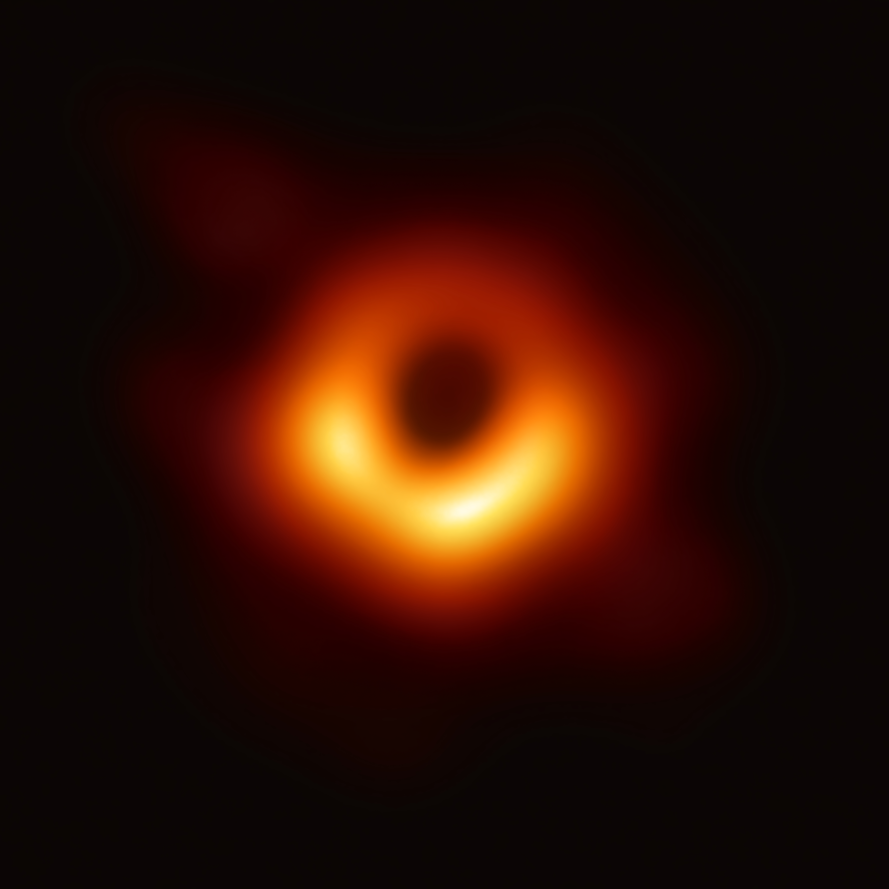

---
authors:
  - nick
date:
  created: 2024-11-22
comments: true
categories:
  - Classification
  - Dimensionality Reduction
  - Feature Engineering
  - Data Visualization
tags:
  - Classification
  - PCA (Principal Component Analysis)
  - Logistic Regression
  - Machine Learning
  - MNIST
  - Python
  - Data Preprocessing
  - Feature Engineering
  - sklearn
  - numpy
---


## Video: MNIST Adventure


{ align=center, width="500" }

Hey there, data enthusiasts! Today, we're diving into the fascinating world of **Machine Learning Classification** using one of the most iconic datasets out there - the **MNIST dataset**. *MNIST stands for Modified National Institute of Standards and Technology.*

We're diving into the realm of MNIST - a dataset that's like a treasure map for budding data scientists. It contains thousands of handwritten digits from 0 to 9. Each image is a snapshot of someone's attempt to scribble a number, and our mission is to make sense of these scribbles.

<!-- more -->

<iframe width="1707" height="765" src="https://www.youtube.com/embed/csZ4dIAPowA" title="Dive Into Learning From Data" frameborder="0" allow="accelerometer; autoplay; clipboard-write; encrypted-media; gyroscope; picture-in-picture; web-share" referrerpolicy="strict-origin-when-cross-origin" allowfullscreen></iframe>


### What's Classification?


Classification is like teaching your computer to distinguish between cats and dogs in photos. You feed it images, labeled "cat" or "dog", and it learns to predict which label to slap on a new photo.

{ align=center, width="500" }
/// caption
Cat VS Dog
///


### Let's Meet MNIST


**MNIST** stands for **Modified National Institute of Standards and Technology** database. It's not about cats and dogs, but it's just as exciting. This dataset contains images of handwritten digits (0 through 9). Your mission, should you choose to accept it, is to train a model to identify these digits correctly.

{ align=center }
/// caption
MNIST digits
///


### Setup and Data Exploration


First, you'll need to set up your environment. I'm rocking a Jupyter Notebook inside VS Code, but any Python environment will do the trick. Let's get our hands dirty with some code:

```python
# Import necessary libraries
from sklearn.datasets import fetch_openml
import pandas as pd
import matplotlib.pyplot as plt

# Fetch the MNIST dataset
mnist = fetch_openml('mnist_784', version=1)

# Check what we've got in our dataset
print(mnist.keys())

# Separate the pixel information (images) and labels
X, y = mnist['data'], mnist['target']

# Let's peek at the data
print(X.shape)  # Should print (70000, 784) - 70k images, each 784 pixels
```


### Understanding Pixel Data


Notice how most of the data in `X` is close to zero? That's because most of the image is empty space:

```python
# Check the range of pixel intensities
print("Minimum pixel intensity:", X.min().min())
print("Maximum pixel intensity:", X.max().max())
```


### Data Insights:


- **Why 784 pixels?** Each image in MNIST is 28x28 pixels, which totals to 784 when flattened.
- **Pixel Intensity:** A value of 0 means the pixel is as black as a shadow, while 255 is a light as bright as the sun. In between, there's a spectrum of grays.
- **Data Dimensionality:** With 70,000 images, each with 784 features, we're dealing with a lot of information. But how much of it is truly useful?

{ align=center, width="500" }
/// caption
Direct radio image of a supermassive black hole at the core of Messier 87
///


### Focusing on the Relevant Data


Most of these images are like the night sky, mostly dark with occasional stars (activated pixels). Here's how we peek at the center of these images:

```python
# Look at the middle band of the images where digits usually reside
X.iloc[:, 400:500]
```


#### Questions to Explore:


- How does a computer learn from pixels what humans recognize by patterns?
- What patterns do we humans overlook that machines might find fascinating?


### Visualizing The Data


Images are typically represented as matrices where each cell might represent the intensity of a pixel. Here's how we can look at what we're dealing with:

```python
# Display the first image
some_digit = X.iloc[0].values.reshape(28, 28)
plt.imshow(some_digit, cmap='binary')
plt.axis("off")
plt.show()

print("Label for this image:", y[0])
```

This code reshapes the `X` data into a 28x28 matrix (since 28 * 28 = 784), which is the size of our digit images. We use `matplotlib` to visualize it.


### A Gallery of Digits


Alright, let's take a moment to appreciate the art of handwritten numbers! This snippet of code takes the first ten images from our dataset and lays them out in a grid.

```python
import matplotlib.pyplot as plt

# Setting up a 2x5 grid of subplots
fig, axes = plt.subplots(2, 5, figsize=(10, 5))

# Loop through our subplots
for i, ax in enumerate(axes.flat):
    # Display the image in the subplot
    ax.imshow(X.iloc[i].values.reshape(28, 28), cmap="gray")
    # Set the title of each subplot to the digit label
    ax.set_title(y[i])
    # Turn off the axis ticks
    ax.axis("off")

# Adjust the layout to prevent overlapping
plt.tight_layout()
# Show the gallery
plt.show()
```

{ align=center, width="500" }
/// caption
MNIST grid example
///

You've turned raw pixel data into a visual representation that's not only informative but also engaging, allowing us to see the variety in how digits are handwritten.

