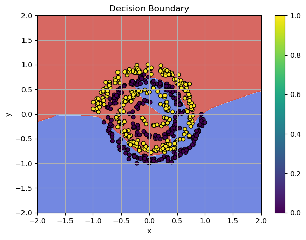

**Gradient descent** is fundamental method in training a deep learning network. It aims to minimize the loss function $\mathcal{L}$ by updating model parameters in the direction that reduces the loss. By using only batch of the data we can compute the direction of the steepest descent. However, for large networks or more complicated challenges, this algorithm may not be successful! Let's find out why this happens and how we can fix this.



/// caption
Training Failure: `SGD` can't classify the spiral pattern
///


<!-- more -->


<iframe width="942" height="530" src="https://www.youtube.com/embed/V60ylfHqTe8" title="Fixing Unstable Gradient Descent: Momentum and Gradient Clipping in Deep Learning" frameborder="0" allow="accelerometer; autoplay; clipboard-write; encrypted-media; gyroscope; picture-in-picture; web-share" referrerpolicy="strict-origin-when-cross-origin" allowfullscreen></iframe>


### [Check the jupyter notebook for this chapter](https://github.com/nickovchinnikov/datasatanism/blob/master/code/11.GradientCliping.ipynb)


Check the code from the previous post [Solving Non-Linear Patterns with Deep Neural Networks](./deep_learning_network.md#deep-neural-network) and try experimenting with the learning rate for the `optimizer`. For example, setting `lr=0.01` can cause the optimizer to bounce around local minima. Even with `lr=0.001`, this problem can occur sometimes. When the optimizer moves too far in steep areas of the loss surface, the updates bounce back and forth, making the training oscillate and become unstable.

In this chapter, I use the training loop code many times. Let's build a unified training loop:


```python
def train_model(
    model: Module,
    loss_f: Module,
    optimizer,
    n_epochs: int = 500
):
    for epoch in range(n_epochs):
        # Forward
        y_pred = model(x)
        loss = loss_f(y_pred, y_target)

        model.zero_grad() 

        # Backward
        grad = loss_f.backward(y_pred, y_target)
        model.backward(grad)

        optimizer.step(model)

        print(f"Epoch {epoch}, Loss: {loss:.4f}")

```

**Example:**

```python
# Model architecture
model = Sequential([
    Linear(x.shape[1], 128, init_method="he_leaky"),
    LeakyReLU(alpha=0.01),
    Linear(128, 64, init_method="he_leaky"),
    LeakyReLU(alpha=0.01),
    Linear(64, 1, init_method="xavier"),
    Sigmoid()
])

bce = BCELoss()
optimizer = SGD(lr=0.01, momentum=0.9)

# Training: SGD Epic Fail!
train_model(model, bce, optimizer, n_epochs=100)

```

**Output:**

```
# Bouncing
Epoch 0, Loss: 0.6892
Epoch 1, Loss: 1.9551
Epoch 2, Loss: 4.4117
Epoch 3, Loss: 3.7495
Epoch 4, Loss: 1.0243
Epoch 5, Loss: 0.7010
Epoch 6, Loss: 2.5385
Epoch 7, Loss: 3.0514
Epoch 8, Loss: 3.6277
Epoch 9, Loss: 2.2218
Epoch 10, Loss: 8.0590
...
# Overflow!
Epoch 77, Loss: 8.0590
Epoch 78, Loss: 8.0590
Output is truncated. View as a scrollable element or open in a text editor. Adjust cell output settings...
C:\Users\oaiw\AppData\Local\Temp\ipykernel_4280\1697699738.py:124: RuntimeWarning: overflow encountered in exp
  self.output = 1 / (1 + np.exp(-x))
# No further progress...
Epoch 94, Loss: 8.0590
Epoch 95, Loss: 8.0590
...
Epoch 498, Loss: 8.0590
Epoch 499, Loss: 8.0590
```


### SGD and Momentum, again!

[In my previous post](./linear_layer_and_sgd.md#stochastic-gradient-descent-sgd), I used separate terms for the momentum and gradient directions inside `SGD` for demonstration purposes. This is not the standard way of applying momentum, and it doesn't seem quite right. I used this for experimentation — you can amplify the direction for the velocity and the current gradient step separately.

$$v_{t+1} = \mu \cdot v_{t} - \alpha \nabla f(x_t)$$

The update rule for our position becomes:

$$x_{t+1} = x_t + v_{t+1}$$

And the implementation is here:

```python
# Update with momentum
self.velocity[param_id] = self.momentum * self.velocity[param_id] - self.lr * grad

# Update parameters
param.data += self.velocity[param_id]
```

Now let's use the correct, standard form where $\mu$ controls the influence of previous gradients, and $1 - \mu$ scales the current gradient like this:

$$v_{t+1} = \mu \cdot v_{t} + (1 - \mu) \nabla f(x_t)$$

The update rule for our position, where $\alpha$ is the step size, is:

$$x_{t+1} = x_t - \alpha \cdot v_{t+1}$$

In the correct implementation, we use **both** terms in the **negative direction.**

**Implementation:**

```python
class SGD:
    def __init__(
        self,
        lr: float = 0.01,
        momentum: float = 0.9,
    ):
        self.lr = lr
        self.momentum = momentum
        self.velocity = {}

    def step(self, module: Module):
        for param in module.parameters():
            param_id = param.name

            # Init velocity if not exists
            if param_id not in self.velocity:
                self.velocity[param_id] = np.zeros_like(param.data)

            grad = param.grad.copy()

            # Update momentum
            self.velocity[param_id] = (
                self.momentum * self.velocity[param_id] +
                (1 - self.momentum) * grad
            )

            # Update parameters in the *negative* direction!
            param.data -= self.lr * self.velocity[param_id]

```

Let's re-run our training loop with the same parameters:

```python
# Recreate Model, BCE, optimizer
model = Sequential([
    Linear(x.shape[1], 128, init_method="he_leaky"),
    LeakyReLU(alpha=0.01),
    Linear(128, 64, init_method="he_leaky"),
    LeakyReLU(alpha=0.01),
    Linear(64, 1, init_method="xavier"),
    Sigmoid()
])

bce = BCELoss()
optimizer = SGD(lr=0.01, momentum=0.9)

train_model(model, bce, optimizer)

```

**Output:**

```
Epoch 0, Loss: 0.7023
Epoch 1, Loss: 0.6343
Epoch 2, Loss: 0.6479
Epoch 3, Loss: 0.6560
Epoch 4, Loss: 0.6377
Epoch 5, Loss: 0.6282
Epoch 6, Loss: 0.6342
Epoch 7, Loss: 0.6373
Epoch 8, Loss: 0.6352
Epoch 9, Loss: 0.6288
# ...
Epoch 497, Loss: 0.0027
Epoch 498, Loss: 0.0027
Epoch 499, Loss: 0.0027
```

Stable movement towards the global minimum! The `SGD` optimization algorithm with vanilla `Momentum` now works stably!


## Gradient Clipping

The *spiral pattern* is highly non-linear which makes `SGD` struggles. **Momentum helps speed up convergence in consistent gradient directions**, but it can amplifies the problem. Momentum accumulates large, changing gradients, and **the velocity term becomes too large. Large gradient updates cause oscillations**.

In `SGD`, weights are updated with $\mu = 0.9$ (the momentum term), can which causes **large accumulated gradients**. **Momentum can lead to gradient explosion** because it accumulates *past gradients* and amplifies them by multiplying with the $\mu$ term:

The velocity term: $v_{t+1} = \mu \cdot v_{t} + (1 - \mu) \nabla f(x_t)$ and the update rule: $x_{t+1} = x_t - \alpha \cdot v_{t+1}$

Let's use the $\alpha=0.1$ and the same $\mu=0.9$:

$$x_{t+1} = x_t - 0.1 \cdot (0.9 \cdot v_t - 0.1 \cdot \nabla f(x_t))$$

If gradients ($\nabla f(x_t)$) are **large** (which is common in deep neural networks), the velocity term can build up, leading to **exploding updates**. This causes **SGD to fail to adapt**, bouncing around **sharp ridges** in the loss landscape instead of converging smoothly.

Let's run the training loop with the $\alpha=0.1$:

```python
# Recreate Model, BCE, optimizer
model = Sequential([
    Linear(x.shape[1], 128, init_method="he_leaky"),
    LeakyReLU(alpha=0.01),
    Linear(128, 64, init_method="he_leaky"),
    LeakyReLU(alpha=0.01),
    Linear(64, 1, init_method="xavier"),
    Sigmoid()
])
bce = BCELoss()
# lr=0.1
optimizer = SGD(lr=0.1, momentum=0.9)

train_model(model, bce, optimizer)

```

**Output:**

```
Epoch 0, Loss: 0.6846
Epoch 1, Loss: 2.3613
Epoch 2, Loss: 4.6792
Epoch 3, Loss: 2.0382
Epoch 4, Loss: 1.3863
Epoch 5, Loss: 1.6400
Epoch 6, Loss: 6.8190
Epoch 7, Loss: 2.9502
# ...
# Overflow!
Epoch 87, Loss: 6.6729
Epoch 88, Loss: 6.6729
Output is truncated. View as a scrollable element or open in a text editor. Adjust cell output settings...
C:\Users\oaiw\AppData\Local\Temp\ipykernel_5404\1697699738.py:124: RuntimeWarning: overflow encountered in exp
  self.output = 1 / (1 + np.exp(-x))
Epoch 89, Loss: 6.6729
Epoch 90, Loss: 6.6729
# No further progress...
Epoch 496, Loss: 6.6729
Epoch 497, Loss: 6.6729
Epoch 498, Loss: 6.6729
Epoch 499, Loss: 6.6729
```

<iframe width="942" height="530" src="https://www.youtube.com/embed/be_FJk8k9UM" title="Exploding Gradient Problem" frameborder="0" allow="accelerometer; autoplay; clipboard-write; encrypted-media; gyroscope; picture-in-picture; web-share" referrerpolicy="strict-origin-when-cross-origin" allowfullscreen></iframe>

You might proudly tell me, "The learning rate is simply too high! Reduce the learning rate, and the result will stabilize." But I know a better way to fix this - one that works even with `lr=0.1`!

To fix the exploding gradient problem, I use **gradient clipping**. It limits the size of the gradients to a min/max range:

$$\nabla \mathcal{L} \leftarrow \text{clip}(\nabla \mathcal{L}, -\text{clip_value}, \text{clip_value})$$

This ensures that the gradients won't explode during backpropagation. Also, let's use the standard form where $\mu$ controls the influence of previous gradients and $1 - \mu$ scales the current gradient

**Implementation:**

```python
class SGD:
    def __init__(
        self,
        lr: float = 0.01,
        momentum: float = 0.9,
        clip_value: float = 1.0
    ):
        r"""
        Initializes the Stochastic Gradient Descent (SGD) optimizer.

        Args:
            lr (float): Learning rate for updating the model's parameters.
            momentum (float): Momentum for accelerating gradient descent.
            clip_value (float): Value to clip gradients to avoid exploding gradients.
        """

        self.lr = lr
        self.momentum = momentum
        # Clipping value to avoid exploding gradients
        self.clip_value = clip_value
        # Store momentum for each parameter
        self.velocity = {}

    def step(self, module: Module):
        r"""
        Performs a single update step on the module parameters using the gradients.

        Args:
            module (Module): The module (e.g., layer) whose parameters are being updated.
        """

        for param in module.parameters():
            param_id = param.name

            # Initialize velocity if not exists
            if param_id not in self.velocity:
                self.velocity[param_id] = np.zeros_like(param.data)

            # Make a copy to avoid modifying original
            grad = param.grad.copy()  

            # Gradient clipping!
            if self.clip_value is not None:
                np.clip(grad, -self.clip_value, self.clip_value, out=grad)

            # Update momentum
            self.velocity[param_id] = (
                self.momentum * self.velocity[param_id] +
                (1 - self.momentum) * grad
            )

            # Update parameters in the *negative* direction!
            param.data -= self.lr * self.velocity[param_id]

```

This simple fix:

```python
if self.clip_value is not None:
  np.clip(grad, -self.clip_value, self.clip_value, out=grad)

```

Makes the training much more stable! Let's build the training loop and try to solve the spiral dataset.

```python
# Model architecture
model = Sequential([
    Linear(x.shape[1], 128, init_method="he_leaky"),
    LeakyReLU(alpha=0.01),
    Linear(128, 64, init_method="he_leaky"),
    LeakyReLU(alpha=0.01),
    Linear(64, 1, init_method="xavier"),
    Sigmoid()
])
bce = BCELoss()

# Use lr=0.1 for stable convergence!
optimizer = SGD(lr=0.1, momentum=0.9)

# 200 epochs are enoght!
train_model(model, bce, optimizer, n_epoch=200)

```

**Output:**

```
Epoch 0, Loss: 0.6648
Epoch 1, Loss: 0.6432
Epoch 2, Loss: 0.6413
Epoch 3, Loss: 0.6532
Epoch 4, Loss: 0.6473
Epoch 5, Loss: 0.6478
...
Epoch 196, Loss: 0.0234
Epoch 197, Loss: 0.0205
Epoch 198, Loss: 0.0223
Epoch 199, Loss: 0.0195
```


**Stable movement towards the solution!** We prevent the *exploding gradient* problem with gradient clipping!


/// caption
Plot of `SGD` decision boundaries with gradient clipping
///

Also, we **reduced the training epochs by more than half from `500` to `200`**, and got approximatelly the same result!
