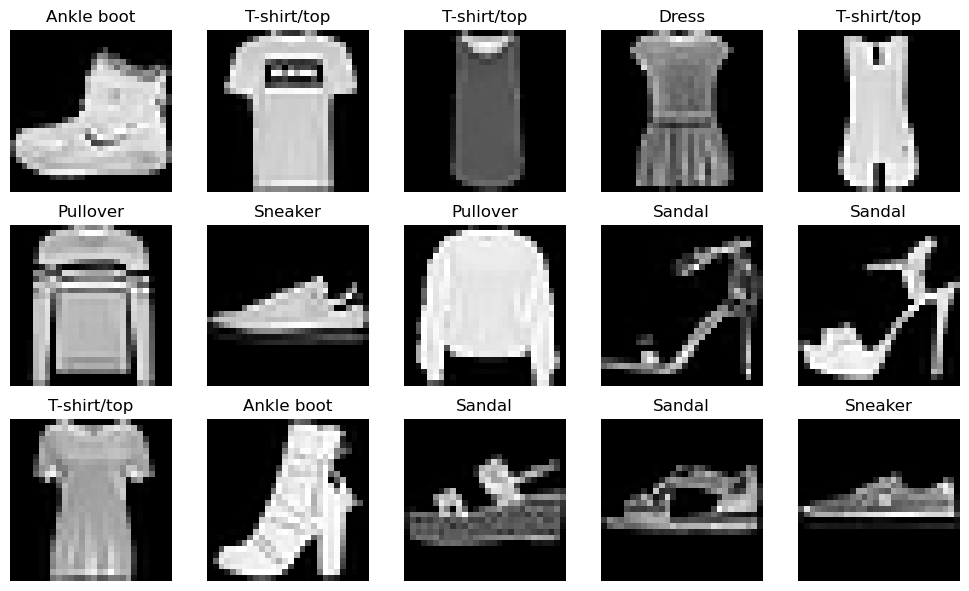
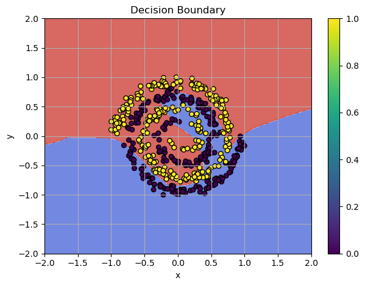
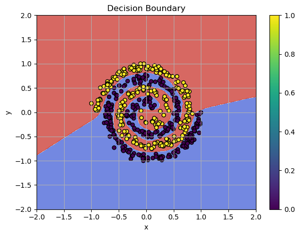

**Gradient descent** is fundamental method in training a deep learning network. It aims to minimize the loss function $\mathcal{L}$ by updating model parameters in the direction that reduces the loss. By using only batch of the data we can compute the direction of the steepest descent. However, for large networks or more complicated challenges, this algorithm may not be successful! Let's find out why this happens and how we can fix this.

{ align=center }
/// caption
Fashion-MNIST Dataset Visualization
///

<!-- more -->

Check the code from the previous post [Solving Non-Linear Patterns with Deep Neural Networks](./deep_learning_network.md#deep-neural-network) and try experimenting with the learning rate for the `optimizer`. For example, setting `lr=0.01` can cause the optimizer to bounce around local minima. Even with `lr=0.001`, this problem can occur sometimes. When the optimizer moves too far in steep areas of the loss surface, the updates bounce back and forth, making the training oscillate and become unstable.


/// caption
Training Failure: `SGD` can't classify the spiral pattern
///

**Example:**

```python
# Model architecture
model = Sequential([
    Linear(x.shape[1], 128, init_method="he_leaky"),
    LeakyReLU(alpha=0.01),
    Linear(128, 64, init_method="he_leaky"),
    LeakyReLU(alpha=0.01),
    Linear(64, 1, init_method="xavier"),
    Sigmoid()
])

bce = BCELoss()
# For example lr=0.007
optimizer = SGD(lr=0.007, momentum=0.9)

# Training Loop
n_epoch = 500

for epoch in range(n_epoch):
    # Forward
    y_pred = model(x)
    loss = bce(y_pred, y_target)

    model.zero_grad() 

    # Backward
    grad = bce.backward(y_pred, y_target)
    model.backward(grad)

    optimizer.step(model)

    print(f"Epoch {epoch}, Loss: {loss:.4f}")

```

**Output:**

```
# Bouncing
Epoch 0, Loss: 0.7288
Epoch 1, Loss: 1.4533
Epoch 2, Loss: 4.2994
Epoch 3, Loss: 0.7953
Epoch 4, Loss: 2.7994
Epoch 5, Loss: 3.4502
Epoch 6, Loss: 1.5146
Epoch 7, Loss: 5.0268
Epoch 8, Loss: 0.8145
Epoch 9, Loss: 0.8004
...
# Overflow!
Epoch 92, Loss: 8.0590
Epoch 93, Loss: 8.0590
Output is truncated. View as a scrollable element or open in a text editor. Adjust cell output settings...
C:\Users\oaiw\AppData\Local\Temp\ipykernel_4280\1697699738.py:124: RuntimeWarning: overflow encountered in exp
  self.output = 1 / (1 + np.exp(-x))
# No further progress...
Epoch 94, Loss: 8.0590
Epoch 95, Loss: 8.0590
...
Epoch 498, Loss: 8.0590
Epoch 499, Loss: 8.0590
```

The *spiral pattern* is highly non-linear which makes `SGD` struggles. **Momentum helps speed up convergence in consistent gradient directions**, but in this case, it actually amplifies the problem. Momentum accumulates these large, changing gradients, and **the velocity term becomes too large. Large gradient updates cause oscillations**.

$$v_{t+1} = \mu \cdot v_{t} - \alpha \nabla f(x_t)$$

Update rule for our position:

$$x_{t+1} = x_t + v_{t+1}$$

The key factors are a high learning rate (0.007) and momentum (0.9). `SGD` updates weights with $\mu = 0.9$ (momentum term), which causes **large accumulated gradients**, while $\alpha = 0.007$ (learning rate) is relatively high. **Momentum Causes Gradient Explosion** because the momentum accumulates *past gradients*:

$$x_{t+1} = x_t + 0.9 \cdot v_{t} - 0.007 \cdot \nabla f(x_t)$$

If gradients ($\nabla f(x_t)$) are **large** (common in deep neural networks), the velocity term builds up, leading to **exploding updates**. **SGD fails to adapt**, bouncing around **sharp ridges** instead of converging smoothly.


<iframe width="942" height="530" src="https://www.youtube.com/embed/be_FJk8k9UM" title="Exploding Gradient Problem" frameborder="0" allow="accelerometer; autoplay; clipboard-write; encrypted-media; gyroscope; picture-in-picture; web-share" referrerpolicy="strict-origin-when-cross-origin" allowfullscreen></iframe>


## Gradient Clipping

To fix the exploding gradient problem, we can use **gradient clipping**. It limits the size of the gradients to a min/max range:

$$\nabla \mathcal{L} \leftarrow \text{clip}(\nabla \mathcal{L}, -\text{clip_value}, \text{clip_value})$$

This ensures that the gradients won't explode during backpropagation.

**Implementation:**

```python
class SGD:
    def __init__(
        self,
        lr: float = 0.01,
        momentum: float = 0.0,
        clip_value: float = 1.0
    ):
        r"""
        Initializes the Stochastic Gradient Descent (SGD) optimizer.

        Args:
            lr (float): Learning rate for updating the model's parameters.
            momentum (float): Momentum for accelerating gradient descent.
            clip_value (float): Value to clip gradients to avoid exploding gradients.
        """

        self.lr = lr
        self.momentum = momentum
        # Clipping value to avoid exploding gradients
        self.clip_value = clip_value
        # Store momentum for each parameter
        self.velocity = {}

    def step(self, module: Module):
        r"""
        Performs a single update step on the module parameters using the gradients.

        Args:
            module (Module): The module (e.g., layer) whose parameters are being updated.
        """

        for param in module.parameters():
            param_id = param.name

            # Initialize velocity if not exists
            if param_id not in self.velocity:
                self.velocity[param_id] = np.zeros_like(param.data)

            # Make a copy to avoid modifying original
            grad = param.grad.copy()  

            # Gradient clipping!
            if self.clip_value is not None:
                np.clip(grad, -self.clip_value, self.clip_value, out=grad)

            # Update with momentum
            self.velocity[param_id] = self.momentum * self.velocity[param_id] + grad

            # Update parameters
            param.data -= self.lr * self.velocity[param_id]

```

This simple fix:

```python
if self.clip_value is not None:
  np.clip(grad, -self.clip_value, self.clip_value, out=grad)

```

Makes the training much more stable! Let's build the training loop and try to solve the spiral dataset.

```python
# Model architecture
model = Sequential([
    Linear(x.shape[1], 128, init_method="he_leaky"),
    LeakyReLU(alpha=0.01),
    Linear(128, 64, init_method="he_leaky"),
    LeakyReLU(alpha=0.01),
    Linear(64, 1, init_method="xavier"),
    Sigmoid()
])

bce = BCELoss()

# Use the lr=0.01!
optimizer = SGD(lr=0.01, momentum=0.9)

# 200 epoch!
n_epoch = 200

for epoch in range(n_epoch):
    # Forward
    y_pred = model(x)
    loss = bce(y_pred, y_target)

    model.zero_grad() 

    # Backward
    grad = bce.backward(y_pred, y_target)
    model.backward(grad)

    optimizer.step(model)

    print(f"Epoch {epoch}, Loss: {loss:.4f}")
```

**Output:**

```
Epoch 0, Loss: 0.6892
Epoch 1, Loss: 0.6578
Epoch 2, Loss: 0.6596
Epoch 3, Loss: 0.6820
Epoch 4, Loss: 0.6494
Epoch 5, Loss: 0.6412
Epoch 6, Loss: 0.6399
Epoch 7, Loss: 0.6491
Epoch 8, Loss: 0.6296
Epoch 9, Loss: 0.6296
...
Epoch 188, Loss: 0.0005
Epoch 189, Loss: 0.0005
Epoch 190, Loss: 0.0005
Epoch 191, Loss: 0.0005
Epoch 192, Loss: 0.0005
Epoch 193, Loss: 0.0004
Epoch 194, Loss: 0.0004
Epoch 195, Loss: 0.0004
Epoch 196, Loss: 0.0004
Epoch 197, Loss: 0.0004
Epoch 198, Loss: 0.0004
Epoch 199, Loss: 0.0004
```


**Stable movement towards the solution!** We prevent the *exploding gradient* problem with gradient clipping!


/// caption
Plot of `SGD` decision boundaries with gradient clipping
///


## Meet Fashion-MNIST!

Synthetic data is great for debugging and testing, but let's put our framework to the test with **Fashion-MNIST**! You can check my post [Dive into Learning from Data - MNIST Video Adventure](./dive_into_learning_from_data.md) to understand the original `MNIST` challenge. `Fashion-MNIST` is a similar challenge - but this time, we're classifying clothing items instead of handwritten digits.

**Fashion-MNIST** is a dataset created by *Zalando Research* as a drop-in replacement for `MNIST`. It consists of 70,000 grayscale images (28×28 pixels) categorized into **10 different classes of clothing**, such as shirts, sneakers, and coats. **Your mission? Train a model to classify these fashion items correctly!**

Unlike `MNIST`, where a simple *Feed-Forward Neural Network* might achieve near-perfect accuracy, `Fashion-MNIST` is a bit more challenging due to the complexity of clothing patterns. But that won't stop us from trying! Let's download the dataset and plot some sample images.


```python
import matplotlib.pyplot as plt

# Define label names for Fashion MNIST classes
label_names = [
    "T-shirt/top", "Trouser", "Pullover", "Dress", "Coat",
    "Sandal", "Shirt", "Sneaker", "Bag", "Ankle boot"
]

# Plot some sample images
fig, axes = plt.subplots(3, 5, figsize=(10, 6))
axes = axes.ravel()

for i in range(15):
    img = X[i].reshape(28, 28)  # Reshape the 1D array into a 28x28 image
    axes[i].imshow(img, cmap='gray')  # Display in grayscale
    axes[i].set_title(label_names[y[i]])  # Set label as title
    axes[i].axis('off')  # Hide axis

plt.tight_layout()
plt.show()

```

**Output:**

{ align=center }
/// caption
Fashion-MNIST Dataset Visualization
///

We need to prepare the data for training, so let's split the dataset into training and testing sets. This helps us train our model on one part of the data and test it on another. The main goal of training is to create a **generalized solution** that works on new, unseen data. To measure performance on unseen data, we set aside a portion of the dataset that won't be used during training. Instead, we use it **after training** to evaluate the model's accuracy.


```python
# Train/test split
X_train, X_test, y_train, y_test = train_test_split(
    X, y, test_size=0.2, random_state=42
)

# Convert labels to integers
y_train, y_test = y_train.astype(int), y_test.astype(int)

```

Let's also convert the labels to one-hot format. **One-hot labels are used because they make training more stable and efficient.** They allow neural networks to treat each class independently, preventing unintended relationships between class indices. This is especially useful for classification tasks with *softmax activation*, ensuring proper probability distribution and better gradient flow.

```python
# Convert labels to one-hot encoding
num_classes = 10
y_train_one_hot = np.eye(num_classes)[y_train]
y_test_one_hot = np.eye(num_classes)[y_test]
```

??? note "`np.eye` and one-hot encoding"
    We use `np.eye(num_classes)`, which creates an **identity matrix** of size `num_classes × num_classes`.

    ```python
    np.eye(4)
    ```

    **Output:**

    ```plaintext
    [[1. 0. 0. 0.]
    [0. 1. 0. 0.]
    [0. 0. 1. 0.]
    [0. 0. 0. 1.]]
    ```

    Indexing with`y_train = [2, 0, 3, 1]` (`np.eye(num_classes)[y_train]`)
    ```python
    np.eye(4)[np.array([2, 0, 3, 1])]
    ```
    This selects the 2nd, 0th, 3rd, and 1st rows from the identity matrix.

    **Final One-Hot Encoded Output:**

    ```plaintext
    [[0. 0. 1. 0.]  # Class 2
    [1. 0. 0. 0.]  # Class 0
    [0. 0. 0. 1.]  # Class 3
    [0. 1. 0. 0.]] # Class 1
    ```

    `np.eye(num_classes)` gives a **lookup table** where each row is a one-hot vector, indexing with `y_train` **selects the correct rows** for the given labels. It's a **fast and memory-efficient** way to convert class indices to one-hot encoding.


For data preprocessing let's use the `MinMaxScaler`. In short - `MinMaxScaler` scales features to a fixed range, usually [0, 1], improving model performance and stability.

```python
from sklearn.preprocessing import MinMaxScaler

# Rescale
scaler = MinMaxScaler()
X_train = scaler.fit_transform(X_train)
X_test = scaler.transform(X_test)

```

You can check my post [Dive into Learning from Data - MNIST Video Adventure](./dive_into_learning_from_data.md), where we cracked the `MNIST` challenge and analyzed the image data.


## CrossEntropyLoss and Softmax

In this problem, we have **10 different classes** of clothing: `["T-shirt/top", "Trouser", "Pullover", "Dress", "Coat", "Sandal", "Shirt", "Sneaker", "Bag", "Ankle boot"]`  

Since we are dealing with multiple classes instead of just two, we need to **scale up** the entropy from `BinaryEntropyLoss` to `CrossEntropyLoss`. And the `Sigmoid` function is not the best choice for this task. `Sigmoid` outputs probabilities for each class independently, which is not good for multi-class classification. Instead, we need to assign probabilities across multiple classes, ensuring they **sum to 1**. A much better approach is to use the `Softmax` function, which converts raw model outputs (logits) into a probability distribution over all classes. This allows our model to make more accurate predictions by selecting the class with the highest probability.

In **multiclass classification**, the combination of **Softmax + Cross-Entropy Loss** has a unique property that simplifies the backward pass.

**The Softmax function** is defined as: $S_i = \frac{e^{z_i}}{\sum_{j} e^{z_j}}$ and its derivative forms a **Jacobian matrix**:

$$\frac{\partial S_i}{\partial z_j} =
\begin{cases}
S_i (1 - S_i) & \text{if } i = j \\
- S_i S_j & \text{if } i \neq j
\end{cases}$$

This **Jacobian matrix** is $N \times N$ (where $N$ is the number of classes), which makes direct backpropagation inefficient.

But, the Cross-Entropy Loss $L = -\sum_{i} y_i \log(S_i)$, and its gradient **after softmax** is simply:

$$\frac{\partial L}{\partial z} = S - y$$

The Softmax Jacobian **cancels out** with the Cross-Entropy derivative, so we **avoid computing the full Jacobian**. Instead, Softmax **directly passes** the gradient from Cross-Entropy, making backpropagation **simpler and more efficient**!

??? note "Why does the derivative of Cross-Entropy take the form $\frac{\partial L}{\partial z_i} = S_i - y_i$?"

    The Cross-Entropy Loss function is $L = -\sum_{i} y_i \log(S_i)$, where $y_i$ is the one-hot encoded true label ($y_i = 1$ for the correct class, 0 otherwise). $S_i$ is the softmax output (predicted probability for class $i$).

    Now, let's compute the derivative of $L$ with respect to $S_i$:

    $$\frac{\partial L}{\partial S_i} = -\frac{y_i}{S_i}$$

    However, the goal is to compute the gradient with respect to $z_i$ (the input logits), not $S_i$. This is where the `Softmax` derivative comes in. Softmax is defined as:

    $$S_i = \frac{e^{z_i}}{\sum_{j} e^{z_j}}$$


    The derivative of $S_i$ with respect to $z_j$ gives a **Jacobian matrix**:

    $$
    \frac{\partial S_i}{\partial z_j} =
    \begin{cases}
    S_i (1 - S_i) & \text{if } i = j \quad \text{(diagonal terms)}\\
    - S_i S_j & \text{if } i \neq j \quad \text{(off-diagonal terms)}
    \end{cases}
    $$

    This means that if we want to find how the loss $L$ changes with respect to $z_i$, we need to apply the **chain rule**:

    $$\frac{\partial L}{\partial z_i} = \sum_{j} \frac{\partial L}{\partial S_j} \frac{\partial S_j}{\partial z_i}$$

    Substituting:

    $$\frac{\partial L}{\partial S_j} = -\frac{y_j}{S_j}$$

    and

    $$
    \frac{\partial S_j}{\partial z_i} =
    \begin{cases}
    S_j (1 - S_j) & \text{if } i = j \\
    - S_j S_i & \text{if } i \neq j
    \end{cases}
    $$

    Let's expand:

    $$
    \frac{\partial L}{\partial z_i} = \sum_{j} -\frac{y_j}{S_j} \cdot \frac{\partial S_j}{\partial z_i}
    $$

    Breaking it into cases:

    1. **Diagonal term ($i = j$)**:

    $$
    -\frac{y_i}{S_i} \cdot S_i (1 - S_i) = - y_i (1 - S_i)
    $$

    2. **Off-diagonal terms ($i \neq j$)**:

    $$
    -\frac{y_j}{S_j} \cdot (- S_j S_i) = y_j S_i
    $$

    Summing over all $j$, we get:

    $$
    \frac{\partial L}{\partial z_i} = - y_i (1 - S_i) + \sum_{j \neq i} y_j S_i
    $$

    Since $y$ is a one-hot vector, only one $y_j = 1$, and all others are 0, meaning:

    $$
    \frac{\partial L}{\partial z_i} = S_i - y_i
    $$

    **Intuition Behind Cancellation**

    Instead of explicitly computing the full Softmax Jacobian, the multiplication of the Cross-Entropy derivative and the Softmax Jacobian **simplifies directly to $S - y$**.

    - This happens because the off-diagonal terms in the Jacobian sum *cancel out in the chain rule application.*
    - The result is **a simple gradient computation** without the need for the full Jacobian matrix.

    This is why, in backpropagation, the Softmax layer doesn't need to explicitly compute its Jacobian. Instead, we can directly use:

    $$\frac{\partial L}{\partial z} = S - y$$

    to efficiently update the parameters in neural network training.


**CrossEntropyLoss Implementation**

```python
class CrossEntropyLoss(Module):
    def forward(self, pred: np.ndarray, target: np.ndarray, epsilon: float = 1e-7) -> float:
        r"""
        Compute the Cross-Entropy loss for multiclass classification.

        Args:
            pred (np.ndarray): The predicted class probabilities from the model (output of softmax).
            target (np.ndarray): The one-hot encoded true target values.
            epsilon (float): A small value to avoid log(0) for numerical stability.

        Returns:
            float: The computed Cross-Entropy loss. Scalar for multiclass classification.
        """
        # Clip predictions to avoid log(0)
        pred = np.clip(pred, epsilon, 1. - epsilon)
        
        # Compute cross-entropy loss for each example
        loss = -np.sum(target * np.log(pred), axis=1)  # sum over classes for each example

        # Return the mean loss over the batch
        return np.mean(loss)
    
    def backward(self, pred: np.ndarray, target: np.ndarray, epsilon: float = 1e-7) -> np.ndarray:
        r"""
        Compute the gradient of the Cross-Entropy loss with respect to the predicted values.

        Args:
            pred (np.ndarray): The predicted class probabilities from the model (output of softmax).
            target (np.ndarray): The one-hot encoded true target values.
            epsilon (float): A small value to avoid division by zero for numerical stability.

        Returns:
            np.ndarray: The gradient of the loss with respect to the predictions.
        """

        # Clip predictions to avoid division by zero
        pred = np.clip(pred, epsilon, 1. - epsilon)
        
        # Compute the gradient of the loss with respect to predictions
        grad = pred - target  # gradient of cross-entropy w.r.t. predictions

        return grad

```


Now, let's see how this is efficiently handled in the **backward pass of Softmax**. The naive approach would be to compute the full **Softmax Jacobian matrix**, which has $N \times N$ elements (where $N$ is the number of classes). However, explicitly storing and multiplying by this matrix is computationally expensive. Instead, we take a **more efficient approach using vectorized computation**.

In the backward pass, we receive $d_{\text{out}} = S - y$, which is the **gradient of Cross-Entropy Loss with respect to Softmax outputs**. The goal is to compute $\frac{\partial L}{\partial z}$, the gradient of the loss with respect to logits.

The key observation is that for each example in the batch, the gradient of `Softmax` with respect to logits can be expressed as:

$$\frac{\partial S_i}{\partial z_j} d_{\text{out}_j}$$

Summing over all $j$, we get:

$$\frac{\partial L}{\partial z_i} = S_i \left( d_{\text{out}_i} - \sum_j d_{\text{out}_j} S_j \right)$$

where $d_{\text{out}} = S - y$ is the gradient from Cross-Entropy and the term $\sum_j d_{\text{out}_j} S_j$ efficiently accounts for the interaction between all class probabilities.

Finally the **Softmax.backward()** function:

```python
def backward(self, d_out: np.ndarray) -> np.ndarray:
    return self.output * (d_out - np.sum(d_out * self.output, axis=1, keepdims=True))
```

Instead of explicitly constructing the Jacobian, we directly compute the **Jacobian-vector product**, which is all we need for backpropagation. This avoids unnecessary computations, making the `Softmax` backward pass **efficient and numerically stable**.


**Softmax Implementation**

```python
class Softmax(Module):
    """Softmax function and its derivative for backpropagation."""

    def forward(self, x: np.ndarray) -> np.ndarray:
        """
        Compute the Softmax of the input.
        Args:
            x (np.ndarray): Input array of shape (batch_size, n_classes).
        Returns:
            np.ndarray: Softmax probabilities.
        """
        
        # Subtract max for numerical stability
        exp_x = np.exp(x - np.max(x, axis=1, keepdims=True))
        self.output = exp_x / np.sum(exp_x, axis=1, keepdims=True)
        return self.output

    def backward(self, d_out: np.ndarray) -> np.ndarray:
        """
        Compute the gradient of the loss with respect to the input of the softmax.
        Args:
            d_out (np.ndarray): Gradient of the loss with respect to the softmax output.
                                Shape: (batch_size, n_classes).
        Returns:
            np.ndarray: Gradient of the loss with respect to the input of the softmax.
                        Shape: (batch_size, n_classes).
        """

        # Compute batch-wise Jacobian-vector product without explicit Jacobian computation
        return self.output * (d_out - np.sum(d_out * self.output, axis=1, keepdims=True))
```

The combination of **Softmax + Cross-Entropy Loss** simplifies backpropagation significantly. Instead of computing the full Jacobian, the Softmax layer **directly propagates the gradient**. This is why deep learning frameworks implement **Softmax and Cross-Entropy together**, optimizing for both performance and numerical stability!


## `SGD` vs `Fashion-MNIST`

Let's prepare the model, loss function and use the `SGD` optimizer.

```python
input_dims = 784

model = Sequential([
    Linear(input_dims, 784, init_method="he_leaky"),
    LeakyReLU(alpha=0.01),
    Linear(784, 256, init_method="he_leaky"),
    LeakyReLU(alpha=0.01),
    Linear(256, 128, init_method="he_leaky"),
    LeakyReLU(alpha=0.01),
    Linear(128, 10, init_method="xavier"),  # 10 output logits for Fashion-MNIST
    Softmax()
])

bce = CrossEntropyLoss()
optimizer = SGD(lr=0.001, momentum=0.9)

```

Now, let's build and run our training loop:

```python
from sklearn.metrics import accuracy_score


# Hyperparameters
epochs = 20
batch_size = 128


# Training loop
for epoch in range(epochs):
    # Shuffle training data
    indices = np.random.permutation(X_train.shape[0])
    X_train_shuffled, y_train_shuffled = X_train[indices], y_train_one_hot[indices]

    total_loss = 0
    num_batches = X_train.shape[0] // batch_size

    for i in range(0, X_train.shape[0], batch_size):
        X_batch = X_train_shuffled[i:i+batch_size]
        y_batch = y_train_shuffled[i:i+batch_size]

        # Forward pass
        preds = model(X_batch)
        loss = bce(preds, y_batch)

        # Zero grad before the backward pass!
        model.zero_grad()

        # Backward pass
        d_loss = bce.backward(preds, y_batch)
        model.backward(d_loss)

        # Update weights
        optimizer.step(model)

        total_loss += loss

    # Compute average loss
    avg_loss = total_loss / num_batches
    print(f"Epoch {epoch+1}/{epochs}, Loss: {avg_loss:.4f}")

# Evaluation
y_pred = model(X_test)
y_pred_labels = np.argmax(y_pred, axis=1)
accuracy = accuracy_score(y_test, y_pred_labels)

print(f"Test Accuracy: {accuracy * 100:.2f}%")

```

**Output:**

```
Epoch 1/20, Loss: 0.5927
Epoch 2/20, Loss: 0.4205
Epoch 3/20, Loss: 0.3860
Epoch 4/20, Loss: 0.3602
Epoch 5/20, Loss: 0.3387
Epoch 6/20, Loss: 0.3250
Epoch 7/20, Loss: 0.3102
Epoch 8/20, Loss: 0.3009
Epoch 9/20, Loss: 0.2934
Epoch 10/20, Loss: 0.2862
Epoch 11/20, Loss: 0.2782
Epoch 12/20, Loss: 0.2713
Epoch 13/20, Loss: 0.2649
Epoch 14/20, Loss: 0.2540
Epoch 15/20, Loss: 0.2468
Epoch 16/20, Loss: 0.2451
Epoch 17/20, Loss: 0.2416
Epoch 18/20, Loss: 0.2385
Epoch 19/20, Loss: 0.2331
Epoch 20/20, Loss: 0.2292
Test Accuracy: 89.40%
```

Also we can check the extended metrics:

```python
import pandas as pd
from sklearn.metrics import precision_score, recall_score, f1_score

# Calculate precision, recall, and F1 scores per class
precision_per_class = precision_score(y_test, y_pred_labels, average=None)
recall_per_class = recall_score(y_test, y_pred_labels, average=None)
f1_per_class = f1_score(y_test, y_pred_labels, average=None)

# Create a DataFrame to store the metrics per class
metrics_df = pd.DataFrame({
    'Class': range(len(precision_per_class)),
    'Precision': precision_per_class,
    'Recall': recall_per_class,
    'F1-Score': f1_per_class
})

# Display the table
print(metrics_df)
```

**Output:**

```
   Class  Precision    Recall  F1-Score
0      0   0.882633  0.798422  0.838418
1      1   0.986419  0.984308  0.985362
2      2   0.842898  0.835110  0.838986
3      3   0.920198  0.899241  0.909599
4      4   0.846332  0.807664  0.826546
5      5   0.963340  0.979296  0.971253
6      6   0.679735  0.800995  0.735400
7      7   0.895341  0.975717  0.933803
8      8   0.976831  0.973920  0.975373
9      9   0.988327  0.885635  0.934167
```

Not bad for `SGD`! We can use `SGD` with momentum and gradient clipping as an optimization benchmark. From here, we can aim to surpass this baseline by exploring more *advanced optimization techniques*!
