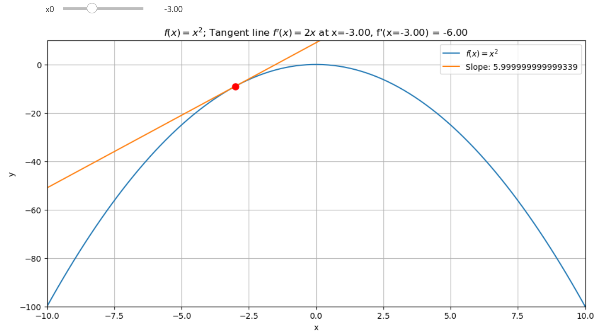

The gradient, \( \nabla f(\textbf{x}) \), is a vector of partial derivatives of a function. Each component tells us how fast our function is changing. If you want to optimize a function, you head in the negative gradient direction because the gradient points towards the steepest ascent.

{ align=center }
/// caption
Tangent Line of a function at a given point
///

<!-- more -->

### [Check the jupyter notebook](https://github.com/nickovchinnikov/datasatanism/blob/master/code/3.GradientDescent.ipynb)

### Optional: check my blog post if you want to know [why the gradient points to the steepest ascent](./why_does_the_gradient_point_to_the_steepest_ascent.md)

<iframe width="1707" height="765" src="https://www.youtube.com/embed/LE9O2ntmXGg" title="" frameborder="0" allow="accelerometer; autoplay; clipboard-write; encrypted-media; gyroscope; picture-in-picture; web-share" referrerpolicy="strict-origin-when-cross-origin" allowfullscreen></iframe>

---

## Simple way to understand the gradient descent: Tangent Line of a function at a given point

To grasp gradient descent, let's start simple: with the tangent line at a point on a curve. This line touches the curve at one point, showing the function's rate of change at that spot because the slope of the curve matches the tangent's.

Consider the point-slope form of a line where $x_1$ and $y_1$ are where the tangent touches:

$$y - y_1 = m \cdot (x - x_1)$$

Here, \( m \) is the slope, \( \frac{dy}{dx} \), or rise over run. We're looking for the function's rate of change at $x$. Since the derivative gives us this rate, we rewrite our equation using the function's derivative:

$$y = f(x) + f'(x) \cdot (x - x_1)$$

We can compute this derivative numerically using the **central difference** method, which approximates the derivative as:

\[
f'(x_0) = \frac{f(x_0 + h) - f(x_0 - h)}{2h}
\]

We know how to program derivatives using the **central difference**, with $h$ set to `0.001` for accuracy, similar to calculators like **TI-83**. You can check [Mastering Derivatives From Math to Code with Python Numerical Differentiation](./numerical_differentiation.md) for more details.

```python
# Central difference for derivative approximation
def cdiff(f, x, h=1e-3):
    return (f(x + h) - f(x - h)) / (2 * h)

```

## Visualizing the Tangent Line with Interactive Plots

Now, let's, we build interactive plots to dynamically visualize how the slope of the tangent changes with respect to different points on the curve. *This isn't just about seeing lines on a screen; it's about understanding the movement towards optimization through interaction.*

By following the derivative's direction, we can find the function's critical points—either maxima or minima. This idea is fundamental to methods like **gradient descent**, where we move in the direction of the negative gradient to optimize a function.

The interactive plot is created using Python's `ipywidgets` and `matplotlib`. Here's how it works:

```python
import numpy as np
import matplotlib.pyplot as plt
from ipywidgets import interact


# Our function for demonstration
def f(x):
    return -x**2


# Central difference for derivative approximation
def cdiff(f, x, h=1e-3):
    return (f(x + h) - f(x - h)) / (2 * h)


# Equation of the tangent line
def tangent_line(f, x, x0):
    fx0 = f(x0)
    dfx0 = cdiff(f, x0)
    return fx0 + dfx0 * (x - x0)


def interactive_plot(f, x):
    def _interactive_plot(x0):
        y = f(x)
        # Slope at the point x0
        slope = cdiff(f, x0)
        # Y values for the tangent line
        y_tangent = tangent_line(f, x, x0)

        plt.figure(figsize=(12, 6))
        plt.plot(x, y, label="$f(x) = -x^2$")
        plt.plot(x, y_tangent, label=f"Tangent at x={x0}, Slope: {slope}")
        # Point of tangency
        plt.plot(x0, f(x0), 'ro', markersize=8)

        plt.xlim(-10, 10)
        plt.ylim(-10, 1)
        plt.xlabel('x'); plt.ylabel('y')
        plt.title(f'Function: $f(x) = -x^2$ with Tangent at x={x0}, Slope: {slope}')
        plt.legend(); plt.grid(True)
        plt.show()

    return _interactive_plot

x = np.linspace(-10, 10, 200)
interact(interactive_plot(f, x), x0=(-10, 10, 0.1))

```

### How the Code Works

1. **Function Definition**: We define a function `f(x) = -x²`, which is an inverted parabola.

2. **Central Difference**: The `cdiff` function calculates the derivative using the central difference method, which approximates the slope of the function at any point.

3. **Tangent Line Calculation**: The `tangent_line` function calculates the tangent at a given point `x0` using the formula: $y=f(x_0) + f'(x_0) \cdot (x - x_0)$

4. **Interactive Plot**: The `interactive_plot` function binds the `x0` value to the plot using the `interact` function from `ipywidgets`. This allows us to dynamically adjust `x0` and visualize the tangent line and slope.

### Understanding Extrema

When the slope (or derivative) of a function at a given point equals zero, it means we have an extremum point, either a local minimum or maximum.

{ align=center }
/// caption
An extremum point is characterized by a horizontal tangent line. A zero slope at a point indicates that we are at an extremum.
///

To determine which one, we analyze the sign of the slope before and after the point:

- **Local Minimum**: If the slope changes from negative to positive as we approach the point, it indicates a minimum.
- **Local Maximum**: If the slope changes from positive to negative, it indicates a maximum.

We can see this in action with a function like \( f(x) = -x^2 \). For example:

1. Before the extremum at \( x = 0 \), the slope is positive (e.g., at \( x = -3 \), the slope is 6). As we approach \( x = 0 \), the slope becomes less steep and eventually reaches zero (horizontal tangent).

{ align=center }
/// caption
The slope at \( x = -3 \) is 6, but with the floating point error 5.999999
///

2. After \( x = 0 \), the slope becomes positive and steeper (e.g., at \( x = 3 \), the slope is -6). This change in slope from negative to positive shows that \( x = 0 \) is a **maxima**.

{ align=center }
/// caption
The slope at \( x = 3 \) is -6, but with the floating point error -5.999999
///

If we check the positive parabola function \( f(x) = x^2 \), we see the opposite effect. Now, the slope changes from negagtive to positive as we approach the extremum, indicating a **minimum**.

### Visualizing Extrema with `sin(x)`

Next, let's visualize another example using \( f(x) = \sin(x) \), where we analyze the extrema points.

```python
# Simply change the f(x) function and leave the rest as it is
def f(x):
    return np.sin(x)
```

### Analyzing Extrema in `sin(x)`

For \( f(x) = \sin(x) \), we can identify two extremum points in this range:

- **Right Extremum (Maxima)**: Around \( x = 1.57 \), the slope changes from positive to negative, indicating a local maximum.
- **Left Extremum (Minima)**: Around \( x = -1.57 \), the slope changes from negative to positive, indicating a local minimum.

We can also follow the derivative to find the maxima or minima of the function:

- Starting from \( x = -2 \), the derivative is positive (4), and we move towards the maximum.
- Similarly, starting from a positive side like \( x = 1 \), we move towards the maximum since the slope is negative initially.

The direction of the derivative acts like a compass, showing us the steepest ascent or descent of the function. Following the slope, we can find the maximum or minimum points.

This idea is key to optimization methods, such as **gradient descent**, where we move in the direction of the **negative gradient** (steepest descent) to minimize a function, or in the direction of the positive gradient to maximize it.

## Programming the Ascent and Descent

### Step 1: Gradient Ascent

The **gradient ascent** algorithm moves in the direction of the steepest ascent to find a function's maximum. Here's the process:

1. **Starting Point**: Begin with an initial value \( x_0 \).
2. **Compute the Derivative**: Use the central difference method to estimate the derivative at \( x_0 \).
3. **Update \( x \)**: Move in the direction of the gradient by adding the derivative scaled by the learning rate.
4. **Repeat**: Perform the above steps multiple times to move closer to the maximum.

#### Code for Gradient Ascent

```python
def ascent(f, x0, steps=5, lr=0.3):
    result = [x0]  # Store all steps for visualization

    for _ in range(steps):
        dfx0 = cdiff(f, x0)  # Compute the derivative
        x1 = x0 + dfx0 * lr  # Update x using the learning rate
        result.append(x1)    # Add the new value to the result
        x0 = x1              # Update x0 for the next iteration

    return result
```

### Step 2: Gradient Descent

The **gradient descent** algorithm works similarly but moves in the opposite direction—towards the steepest descent—to find the minimum of a function.

#### Code for Gradient Descent

```python
def descent(f, x0, steps=5, lr=0.3):
    result = [x0]  # Store all steps for visualization

    for _ in range(steps):
        dfx0 = cdiff(f, x0)  # Compute the derivative
        x1 = x0 - dfx0 * lr  # Subtract the scaled derivative
        result.append(x1)    # Add the new value to the result
        x0 = x1              # Update x0 for the next iteration

    return result
```

Let's join everything together. We're about to create functions that follow the path of the derivative to either climb or descend our mathematical hills. Here's how we're going to do it:

```python
from ipywidgets import interact, FloatSlider, IntSlider


def ascent(f, x0, steps=5, lr=0.3):
    # 'result' will store each step of our journey
    result = [x0]
    
    for _ in range(steps):
        # Compute the derivative at current x0
        dfx0 = cdiff(f, x0)
        # Move up in the direction of the derivative, scaled by learning rate
        x1 = x0 + dfx0 * lr
        result.append(x1)
        # Update x0 for next iteration
        x0 = x1

    return result


def descent(f, x0, steps=5, lr=0.3):
    # Similar to ascent, but we go down
    result = [x0]
    
    for _ in range(steps):
        dfx0 = cdiff(f, x0)
        # Move down by subtracting the derivative scaled by learning rate
        x1 = x0 - dfx0 * lr
        result.append(x1)
        x0 = x1

    return result


# Simple parabola for demonstration
def f(x):
    return x**2


def plot_path(f, path_builder):
    def _plot_path(x0, steps, lr):
        # Generate x values for plotting
        x = np.linspace(-10, 10, 200)
        y = f(x)

        # Calculate path using the ascent or descent function
        x_path = path_builder(f, x0, steps, lr)
        x_path = np.array(x_path)
        y_path = f(x_path)

        # Set up the plot
        _, ax = plt.subplots(figsize=(12, 6))
        
        # Plot the path taken
        ax.plot(x_path, y_path, 'g.-', markersize=10, label='Path')

        # Add arrows to show direction of movement
        for i in range(len(x_path) - 1):
            ax.annotate(
                '',
                xy=(x_path[i+1], y_path[i+1]),
                xytext=(x_path[i], y_path[i]),
                arrowprops=dict(facecolor='red', shrink=0.01, width=2),
            )

        # Plot the original function
        ax.plot(x, y, 'b-', label='$f(x) = x^2$')
        
        ax.set_xlabel('x')
        ax.set_ylabel('f(x)')
        ax.set_title('Path')
        ax.legend()
        plt.show()

    return _plot_path

# Interactive plot setup with descent
interact(plot_path(f, descent), 
    x0=FloatSlider(min=-10, max=10, step=1, value=9, description='Starting x'),
    steps=IntSlider(min=1, max=20, step=1, value=3, description='Steps'),
    lr=FloatSlider(min=0.01, max=1, step=0.01, value=0.1, description='Learning Rate'),
)

```

### The Learning Rate Experiment

* **A High Learning Rate:** When we set the learning rate too high, like 0.5, we reach the maximum in just a couple of steps, but we might overshoot or oscillate, for example for the learning rate equals 1 we have just the horyzontal line.
* **A Balanced Learning Rate:** Setting it to around 0.3 helps us smoothly approach the maximum or minimum without bouncing around, finding a sweet spot where we can see progress without instability.
* **The Descent:** Flip the sign, and you're on your way down. The descent function uses the same logic but subtracts the derivative, steering us towards the function's minimum.

This approach mimics *gradient descent*, a fundamental technique in optimization, where we adjust parameters to minimize a loss function. Here, we're not just riding the slope; we're controlling our speed with the learning rate, making sure we don't miss the mark or overshoot the target.

Experiment with different starting points, number of steps, and learning rates. You'll get a feel for how these parameters affect the path and convergence to the extrema. This isn't just math; it's the backbone of learning algorithms in AI, showing us how small steps in the right direction can lead to significant optimization outcomes. 

## Final words

Gradient descent isn't just about equations; it's a hands-on journey into optimization. With a well-chosen learning rate, we can guide algorithms toward an optimal solution.

* **Learning Rate Matters:** A low rate converges slowly, while a high rate risks overshooting or oscillation. For instance:
        Too High: A rate of 1 leads to erratic movement.
        Just Right: Rates around 0.3 ensure smooth convergence.
* **Interactive Exploration:** Use the interactive plots to experiment with:
* **Starting Points:** Test different x0x0​ values.
* **Steps:** Observe how step count affects convergence.
* **Learning Rate:** Fine-tune to balance speed and stability.

**Gradient descent** is a cornerstone of machine learning, turning abstract functions into real-world solutions. Experimenting with these concepts lays the foundation for understanding more advanced optimization techniques in AI and data science.
