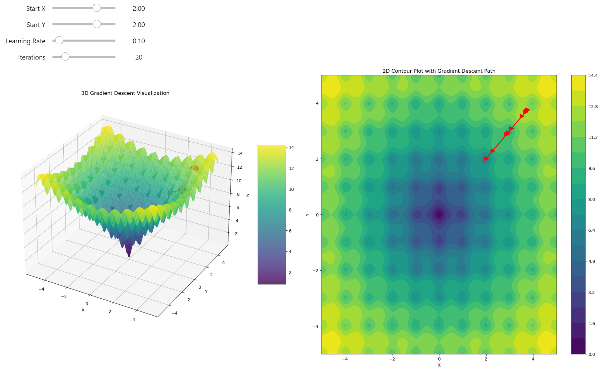
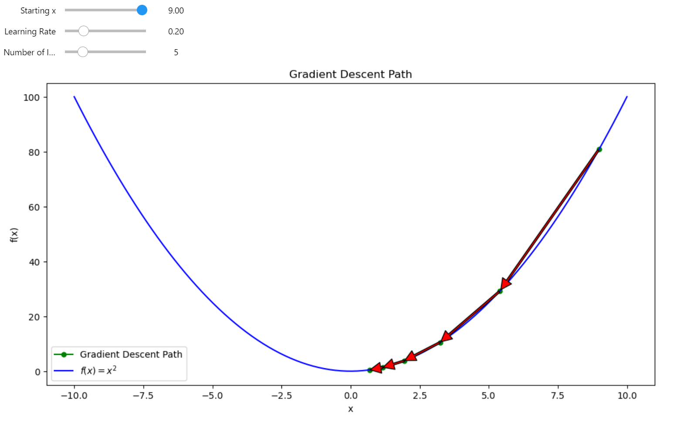
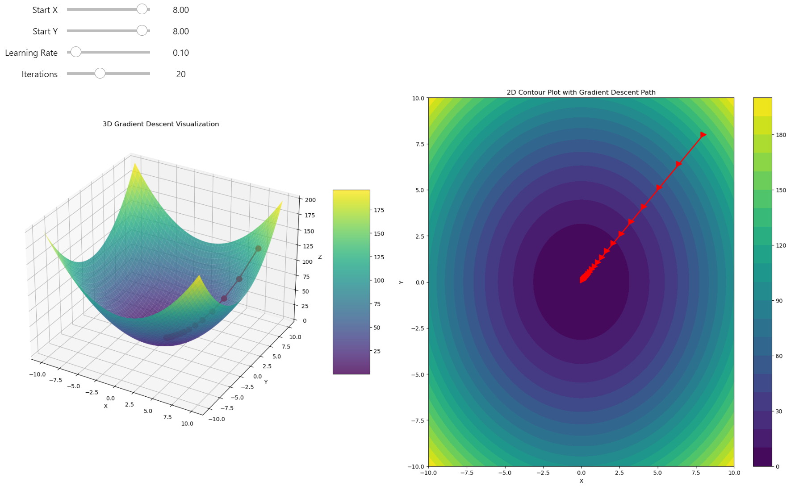
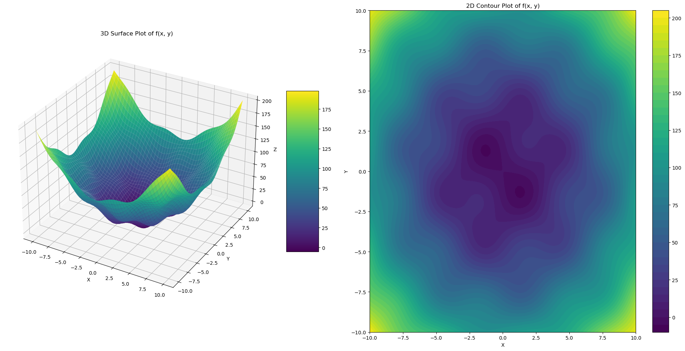
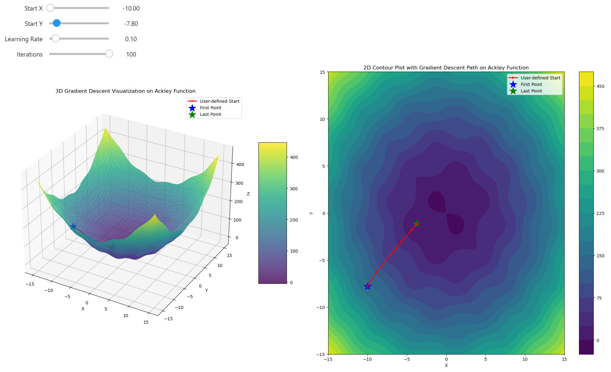
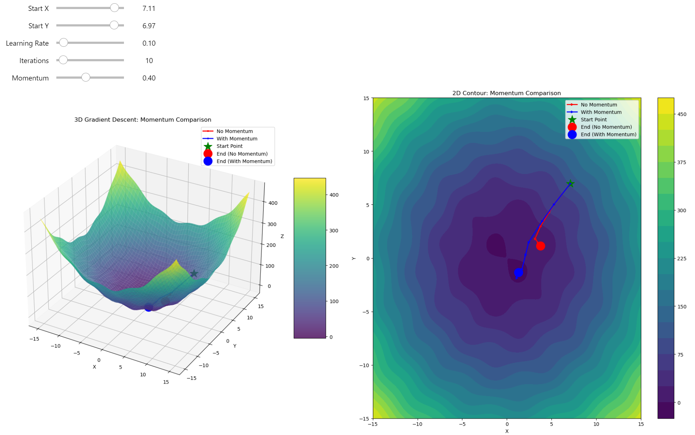

Today, we'll build the gradient descent for a complex function. It's not as easy as it was for the 2D parabola; we need to construct a more complicated method! **Momentum** - a powerful method to help us solve this challenge!

{ align=center }
/// caption
Gradient descent got stuck in a local minimum!
///

<!-- more -->


## Gradient Recap

The gradient is a vector of partial derivatives of a function. Essentially, it's the derivative of a function with respect to all its variables, represented as a vector.

Let's revisit the concept of the gradient for a moment. For example, if we have a function \(f(x, y)\), then the gradient of this function is a vector of its partial derivatives with respect to \(x\) and \(y\):


$$\nabla f(x, y) = \left(\frac{\partial f}{\partial x}, \frac{\partial f}{\partial y}\right)$$


The gradient is a multi-dimensional version of the derivative. We know the derivative represents the rate of change of a function or the **steepest ascent**. You can check [why is the gradient the steepest ascent](./why_does_the_gradient_point_to_the_steepest_ascent.md) post to know much more about the derivative and the gradient! The best way to see this in action is to start with the single-variable version of the gradient: the derivative. To understand derivatives better, it's useful to express them numerically. [Check this out to understand the underlying concepts](./numerical_differentiation.md)

However, the main problem with numerical differentiation is **numerical instability**. Function optimization requires precision; we can't afford methods that introduce instability or unpredictability. [I've illustrated a specific case of this issue here](./numerical_instability.md)

I won't use numerical differentiation; I'll only use **the exact gradient of the chosen function.**


### Glance at the Gradient Descent... Again!

On a **gradient field plot**, you see the gradient vector at each point of a 3D function surface. The gradient vectors point in the direction of the steepest ascent. If we start at some point in the field and move in the opposite direction of the gradient vector, we move downhill. This is the idea of gradient descent - follow the gradient’s direction to reach the function's minimum.

The most intuitive way to understand this is by reducing everything to the **2D case**—input \(x\) and output \(y\). [In the previous post, I talked about gradient descent using the derivative.](./gradient_descent_downhill_to_the_minima.md)

{ align=center }
/// caption
Gradient descent in 2D
///

For a 3D gradient, the concept is similar but scaled to multi-dimensional space. **The gradient represents the direction of the steepest ascent of a multivariable function in every dimension.** If we follow the negative direction of the gradient, we create a gradient descent in multiple dimensions.

First, I want to use a hyperparabola; it's the easiest way to start our gradient descent journey. The slope of the function is smooth, and the minimum of the function is pretty clear for the descent - just follow the negative gradient to reach the bottom of the bowl.


**3D Paraboloid Function**

\[ f(x, y) = x^2 + y^2 \]

This function represents a simple 3D paraboloid, which is essentially a bowl-shaped surface where the height of the function increases quadratically in both the x and y directions from the origin.


**Gradient of the 3D Paraboloid**

\[ \nabla f(x, y) = \begin{bmatrix} \frac{\partial f}{\partial x} \\ \frac{\partial f}{\partial y} \end{bmatrix} = \begin{bmatrix} 2x \\ 2y \end{bmatrix} \]

The gradient of this function gives the direction of the steepest ascent at any point on the surface.
For $f(x, y) = x^2 + y^2$, the gradient points radially outward from the origin since the function increases in all directions from the center.


```python
import numpy as np
import matplotlib.pyplot as plt
from ipywidgets import interact, FloatSlider, IntSlider


def f2d(vector):
    r"""
    3d Paraboloid function $f(x, y) = x^2 + y^2$.

    Args:
    vector: A 2D numpy array or list with shape (2,) representing (x, y) coordinates.

    Returns:
    Value of the function at point (x, y)
    """
    x, y = vector
    return x**2 + y**2


def grad_f2d(vector):
    """
    Gradient of the function $f(x, y) = x^2 + y^2$.

    Args:
    vector: A 2D numpy array or list with shape (2,) representing (x, y) coordinates.

    Returns:
    Gradient of the function at point (x, y) as a numpy array.
    """
    x, y = vector
    return np.array([2*x, 2*y])


def gradient_descent3d(start_vector, learning_rate, num_iterations):
    path = [start_vector]
    for _ in range(num_iterations):
        grad = grad_f2d(start_vector)
        start_vector = start_vector - learning_rate * grad
        path.append(start_vector)
    return np.array(path)


def plot_gradient_descent(start_x, start_y, learning_rate, num_iterations):
    # Create the surface
    x = np.linspace(-10, 10, 100)
    y = np.linspace(-10, 10, 100)
    X, Y = np.meshgrid(x, y)
    Z = f2d(np.array([X, Y]))

    # Perform gradient descent
    start_vector = np.array([start_x, start_y])
    path = gradient_descent3d(start_vector, learning_rate, num_iterations)

    # Create the figure and subplots
    fig = plt.figure(figsize=(20, 10))
    ax1 = fig.add_subplot(121, projection='3d')
    ax2 = fig.add_subplot(122)

    # 3D plot
    surf = ax1.plot_surface(X, Y, Z, cmap='viridis', alpha=0.8)
    ax1.plot(path[:, 0], path[:, 1], f2d(path.T), 'r.-', linewidth=2, markersize=20)
    ax1.set_xlabel('X')
    ax1.set_ylabel('Y')
    ax1.set_zlabel('Z')
    ax1.set_title('3D Gradient Descent Visualization')

    # 2D contour plot with filled contours for depth
    contour = ax2.contourf(X, Y, Z, levels=20, cmap='viridis')
    ax2.plot(path[:, 0], path[:, 1], 'r>-', linewidth=2, markersize=10)
    ax2.set_xlabel('X')
    ax2.set_ylabel('Y')
    ax2.set_title('2D Contour Plot with Gradient Descent Path')

    # Add color bars
    fig.colorbar(surf, ax=ax1, shrink=0.5, aspect=5)
    fig.colorbar(contour, ax=ax2)

    plt.tight_layout()
    plt.close(fig)
    return fig


# Create interactive plot
interact(plot_gradient_descent, 
         start_x=FloatSlider(min=-10, max=10, step=0.1, value=8, description='Start X'),
         start_y=FloatSlider(min=-10, max=10, step=0.1, value=8, description='Start Y'),
         learning_rate=FloatSlider(min=0.01, max=0.95, step=0.01, value=0.1, description='Learning Rate'),
         num_iterations=IntSlider(min=1, max=50, step=1, value=20, description='Iterations'))

```


{ align=center }
/// caption
Gradient descent in 3D
///


It works very fast and finds the minimum without any problems - just a half-parabola trajectory straight to the minimum! But this isn't always the case. For complicated function shapes, there's no easy and straight way to find the location of the global minimum, and in many cases, gradient descent can fall into a local minimum, giving us a suboptimal solution rather than the real optimum of the function. *I can show you an example.*


## Complexity of the Challenge

For real-world **challenges** you need to find solutions for multi-dimensional data with non-linear dependencies that are impossible to fit in a short amount of time. All these problems narrow down to the optimization problems one way or another, because the training process is when **you need to minimize the errors of your model.** Every model is just a fairly complicated approximator that we call **Neural Networks**, or we can call it **Non-Linear Functional Composition Approximator** to be more precise and clear.

To build an intuition behind the training process, we can examine gradient descent as applied to a complex function. The optimization challenge remains the same, and in Deep Learning or Machine Learning, this is referred to as the Training process.

The training input is always data, which can be thought of as just a collection of numbers. Under the hood, all algorithms are manipulating these numbers, adjusting the weights to produce the expected results. The training algorithms optimize these weights by moving in the direction of the steepest descent. If you truly master gradient descent, you grasp all these concepts at once. *There is the key to unlocking the full potential of this knowledge.*


## Falling into the Local Minimum

Let's apply our basic approach to much complex landscape. Before any strategic changes, we need to understand how we can fail. 

### Function:

The function we are working with is a **modified 3D quadratic function** combined with sinusoidal terms it can be described as a **quadratic function with sinusoidal perturbations** or **QFSP function**.

\[
f(x, y) = x^2 + y^2 + 10 \sin(x) \sin(y)
\]

### Gradient:

The gradient of the function is a vector of partial derivatives with respect to \(x\) and \(y\):

\[
\nabla f(x, y) = \left( \frac{\partial f}{\partial x}, \frac{\partial f}{\partial y} \right)
\]

The partial derivatives are calculated as:


$$\frac{\partial f}{\partial x} = 2x + 10 \cos(x) \sin(y)$$


$$\frac{\partial f}{\partial y} = 2y + 10 \sin(x) \cos(y)$$


Thus, the gradient is:

\[
\nabla f(x, y) = \left( 2x + 10 \cos(x) \sin(y), 2y + 10 \sin(x) \cos(y) \right)
\]

The QFSP function features a paraboloid shape disrupted by sinusoidal waves, creating a landscape with numerous local minima and maxima, challenging for gradient descent due to potential entrapment in local optima.


{ align=center }
/// caption
Quadratic function with sinusoidal perturbations in 3D
///


## Python Optimizer

First, I want to build an `Optimizer` class, which will help us to add functionality to our optimization process. Using this class, we can now proceed to apply our standard gradient descent to a function known for its local minima, such as the [QFSP](#function) function, and observe how the optimization fails without advanced techniques.


```python
import numpy as np
import matplotlib.pyplot as plt
from typing import Callable, Tuple

from ipywidgets import interact, FloatSlider, IntSlider


class Optimizer:
    """
    A class for performing gradient-based optimization techniques.
    
    Attributes:
        f (Callable[[np.ndarray], float]): The objective function to minimize.
        grad_f (Callable[[np.ndarray], np.ndarray]): The gradient of the objective function.
    """

    f: Callable[[np.ndarray], float]
    grad_f: Callable[[np.ndarray], np.ndarray]

    def __init__(self, f: Callable[[np.ndarray], float], grad_f: Callable[[np.ndarray], np.ndarray]):
        """
        Initialize the OptimizationSolver with the objective function and its gradient.

        Args:
            f (Callable[[np.ndarray], float]): The function to minimize.
            grad_f (Callable[[np.ndarray], np.ndarray]): The gradient of the function.
        """
        self.f = f
        self.grad_f = grad_f


    def gradient_descent(
        self,
        start_point: np.ndarray,
        learning_rate: float = 0.1,
        num_iterations: int = 10,
    ) -> np.ndarray:
        """
        Perform gradient descent optimization with optional momentum and regularization.

        Args:
            start_point (np.ndarray): Initial guess for the optimization.
            learning_rate (float): Step size for each iteration.
            num_iterations (int): Maximum number of iterations to perform.

        Returns:
            np.ndarray: Path of points visited during optimization.
        """

        path = [start_point]

        # Init the momentum velocity
        velocity = np.zeros_like(start_point)

        for _ in range(num_iterations):
            grad = self.grad_f(start_point)

            new_point = start_point - learning_rate * grad

            start_point = new_point
            path.append(new_point)

        return np.array(path)


    def plot_gradient_descent(self, path: np.ndarray, min_max: Tuple[int, int] = (-15, 15)) -> plt.Figure:
        """
        Visualize the gradient descent path on the Ackley function in both 3D and 2D.

        Args:
            path (np.ndarray): Path of points visited during optimization.
            min_max (Tuple[int, int]): Min and max values on the grid.

        Returns:
            plt.Figure: Matplotlib figure object containing the plots.
        """

        # Create the surface
        x = y = np.linspace(min_max[0], min_max[1], 100)
        X, Y = np.meshgrid(x, y)

        last_point = path[-1]
        first_point = path[0]
        
        Z = np.zeros_like(X)
        for i in range(X.shape[0]):
            for j in range(X.shape[1]):
                Z[i, j] = self.f(np.array([X[i, j], Y[i, j]]))

        # Create the figure and subplots
        fig = plt.figure(figsize=(20, 10))
        ax1 = fig.add_subplot(121, projection='3d')
        ax2 = fig.add_subplot(122)

        # 3D plot
        surf = ax1.plot_surface(X, Y, Z, cmap='viridis', alpha=0.8)
        # Plot the path from the user-defined start
        Z_path = [self.f(point) for point in path]
        ax1.plot(path[:, 0], path[:, 1], Z_path, 'r.-', linewidth=2, markersize=5, label='User-defined Start')

        point_size = 300

        # Plot the best point found by multi-start (Here we use the last point as we've only done one descent)
        ax1.scatter(first_point[0], first_point[1], self.f(first_point), s=point_size, c='b', marker='*', label='First Point')
        ax1.scatter(last_point[0], last_point[1], self.f(last_point), s=point_size, c='g', marker='*', label='Last Point')

        ax1.set_xlabel('X')
        ax1.set_ylabel('Y')
        ax1.set_zlabel('Z')
        ax1.set_title('3D Gradient Descent Visualization on Ackley Function')
        ax1.legend()

        # 2D contour plot with filled contours for depth
        contour = ax2.contourf(X, Y, Z, levels=20, cmap='viridis')
        ax2.plot(path[:, 0], path[:, 1], 'r>-', linewidth=2, markersize=5, label='User-defined Start')
        ax2.scatter(first_point[0], first_point[1], s=point_size, c='b', marker='*', label='First Point')
        ax2.scatter(last_point[0], last_point[1], s=point_size, c='g', marker='*', label='Last Point')
        
        ax2.set_xlabel('X')
        ax2.set_ylabel('Y')
        ax2.set_title('2D Contour Plot with Gradient Descent Path on Ackley Function')
        ax2.legend()

        # Add color bars
        fig.colorbar(surf, ax=ax1, shrink=0.5, aspect=5)
        fig.colorbar(contour, ax=ax2)

        plt.tight_layout()
        plt.close(fig)
        return fig


def build_grad_and_plot(start_x, start_y, learning_rate, num_iterations):
    start_point = np.array([start_x, start_y])
    optimizer = Optimizer(f3d, grad_f3d)

    path = optimizer.gradient_descent(
        start_point,
        learning_rate,
        num_iterations
    )
    return optimizer.plot_gradient_descent(path)


# Create interactive plot
interact(build_grad_and_plot, 
         start_x=FloatSlider(min=-10, max=10, step=0.1, value=7.11, description='Start X'),
         start_y=FloatSlider(min=-10, max=10, step=0.1, value=6.97, description='Start Y'),
         learning_rate=FloatSlider(min=0.01, max=0.95, step=0.01, value=0.1, description='Learning Rate'),
         num_iterations=IntSlider(min=1, max=100, step=1, value=10, description='Iterations'))

```


**The Challenge of Escaping Local Minima**. We're stuck in a local minimum where, no matter how many steps we take, we remain trapped due to the nature of gradient descent

{ align=center }
/// caption
Gradient descent trapped
///


## Momentum pull

Gradient Descent does not perform well when tackling a complicated function space. With each step of gradient descent, we compute the gradient and take a single step in the direction of that gradient. However, the gradient indicates the direction of the steepest ascent at that exact point, and if we find ourselves in a local minimum area, moving in the negative direction of the gradient might just plunge us deeper into that local minimum. This is problematic because our algorithm only "looks" one step ahead without any heuristic or corrective measures. How can we address this?

Momentum is a technique that introduces a velocity term to the gradient updates. Instead of simply adjusting our position based on the current gradient, we now also consider the direction and magnitude of previous steps. Here's how it works:

* Velocity Accumulation: We maintain a running average of the gradients from previous steps. This average is what we call the "velocity". The velocity helps us to keep moving in a consistent direction even if the gradient in the current step might suggest otherwise.

* Update Formula: First we compute the Momentum:


$$v_{t+1} = \mu \cdot v_{t} - \alpha \nabla f(x_t)$$


* The update rule for our position becomes:


$$x_{t+1} = x_t + v_{t+1}$$


**Where:**

* $\mu$ is the momentum coefficient (typically between 0 and 1), where higher values make the algorithm "remember" previous gradients more strongly.

* $\alpha$ is the learning rate of the gradient

**The Momentum leads to faster convergence** - it helps to accelerate gradient descent in the relevant direction, potentially leading to faster convergence to the **global minimum.** By accumulating velocity, momentum allows the optimization to bypass small local minima that would otherwise trap the straightforward gradient descent. The choice of the momentum parameter $\mu$ is crucial. Too high, and the algorithm might overshoot; too low, and momentum might not provide significant benefits. Adding momentum increases the number of hyperparameters to tune, which can complicate the optimization process.

By incorporating momentum, we essentially give our gradient descent a "memory" of past movements, which can smooth out the descent path over complex landscapes, making it more effective for functions with many local minima or flat regions.


```python
class Optimizer:
    # ... (previous methods and initialization remain unchanged)
    def gradient_descent(
        self,
        start_point: np.ndarray,
        learning_rate: float = 0.1,
        num_iterations: int = 10,
        momentum: float = 0
    ) -> np.ndarray:
        """
        Perform gradient descent optimization with optional momentum and regularization.

        Args:
            start_point (np.ndarray): Initial guess for the optimization.
            learning_rate (float): Step size for each iteration.
            num_iterations (int): Maximum number of iterations to perform.
            momentum (float): Momentum factor if momentum is used.

        Returns:
            np.ndarray: Path of points visited during optimization.
        """

        path = [start_point]

        # Init the momentum velocity
        velocity = np.zeros_like(start_point)

        for _ in range(num_iterations):
            grad = self.grad_f(start_point)

            if momentum > 0:
                velocity = momentum * velocity - learning_rate * grad
                new_point = start_point + velocity
            else:
                new_point = start_point - learning_rate * grad

            start_point = new_point
            path.append(new_point)

        return np.array(path)


    def compare_momentum_paths(
        self,
        start_point: np.ndarray,
        learning_rate: float = 0.1,
        num_iterations: int = 10,
        momentum: float = 0.9,
        min_max: Tuple[int, int] = (-15, 15)
    ) -> plt.Figure:
        """
        Compare gradient descent paths with and without momentum.

        Args:
            start_point (np.ndarray): Initial guess for the optimization.
            learning_rate (float): Step size for each iteration.
            num_iterations (int): Maximum number of iterations to perform.
            momentum (float): Momentum factor to use.
            min_max (Tuple[int, int]): Min and max values on the grid.

        Returns:
            plt.Figure: Matplotlib figure object comparing paths with and without momentum.
        """

        # Path without momentum
        path_no_momentum = self.gradient_descent(
            start_point,
            learning_rate=learning_rate,
            num_iterations=num_iterations,
            momentum=0
        )

        # Path with momentum
        path_with_momentum = self.gradient_descent(
            start_point,
            learning_rate=learning_rate,
            num_iterations=num_iterations,
            momentum=momentum
        )

        # Create the surface
        x = y = np.linspace(min_max[0], min_max[1], 100)
        X, Y = np.meshgrid(x, y)
        
        Z = np.zeros_like(X)
        for i in range(X.shape[0]):
            for j in range(X.shape[1]):
                Z[i, j] = self.f(np.array([X[i, j], Y[i, j]]))

        # Create the figure and subplots
        fig = plt.figure(figsize=(20, 10))
        ax1 = fig.add_subplot(121, projection='3d')
        ax2 = fig.add_subplot(122)

        # 3D plot
        surf = ax1.plot_surface(X, Y, Z, cmap='viridis', alpha=0.8)
        
        # Compute function values for paths
        Z_path_no_momentum = [self.f(point) for point in path_no_momentum]
        Z_path_with_momentum = [self.f(point) for point in path_with_momentum]

        # Plot paths
        ax1.plot(path_no_momentum[:, 0], path_no_momentum[:, 1], Z_path_no_momentum, 
                'r.-', linewidth=2, markersize=5, label='No Momentum')
        ax1.plot(path_with_momentum[:, 0], path_with_momentum[:, 1], Z_path_with_momentum, 
                'b.-', linewidth=2, markersize=5, label='With Momentum')

        # Plot start and end points
        point_size = 300
        ax1.scatter(start_point[0], start_point[1], self.f(start_point), 
                    s=point_size, c='g', marker='*', label='Start Point')
        
        # Last points for each path
        ax1.scatter(path_no_momentum[-1, 0], path_no_momentum[-1, 1], self.f(path_no_momentum[-1]), 
                    s=point_size, c='r', marker='o', label='End (No Momentum)')
        ax1.scatter(path_with_momentum[-1, 0], path_with_momentum[-1, 1], self.f(path_with_momentum[-1]), 
                    s=point_size, c='b', marker='o', label='End (With Momentum)')

        ax1.set_xlabel('X')
        ax1.set_ylabel('Y')
        ax1.set_zlabel('Z')
        ax1.set_title('3D Gradient Descent: Momentum Comparison')
        ax1.legend()

        # 2D Contour Plot
        contour = ax2.contourf(X, Y, Z, levels=20, cmap='viridis')
        
        # Plot 2D paths
        ax2.plot(path_no_momentum[:, 0], path_no_momentum[:, 1], 'r>-', 
                linewidth=2, markersize=5, label='No Momentum')
        ax2.plot(path_with_momentum[:, 0], path_with_momentum[:, 1], 'b>-', 
                linewidth=2, markersize=5, label='With Momentum')

        # Plot start and end points
        ax2.scatter(start_point[0], start_point[1], 
                    s=point_size, c='g', marker='*', label='Start Point')
        ax2.scatter(path_no_momentum[-1, 0], path_no_momentum[-1, 1], 
                    s=point_size, c='r', marker='o', label='End (No Momentum)')
        ax2.scatter(path_with_momentum[-1, 0], path_with_momentum[-1, 1], 
                    s=point_size, c='b', marker='o', label='End (With Momentum)')

        ax2.set_xlabel('X')
        ax2.set_ylabel('Y')
        ax2.set_title('2D Contour: Momentum Comparison')
        ax2.legend()

        # Add color bars
        fig.colorbar(surf, ax=ax1, shrink=0.5, aspect=5)
        fig.colorbar(contour, ax=ax2)

        plt.tight_layout()
        plt.close(fig)
        return fig


def build_grad_and_plot(start_x, start_y, learning_rate, num_iterations, momentum):
    start_point = np.array([start_x, start_y])
    optimizer = Optimizer(f3d, grad_f3d)
    # Compare paths with different momentum values
    return optimizer.compare_momentum_paths(
        start_point, 
        learning_rate=learning_rate, 
        num_iterations=num_iterations, 
        momentum=momentum
    )


# Create interactive plot
interact(build_grad_and_plot, 
         start_x=FloatSlider(min=-10, max=10, step=0.1, value=7.11, description='Start X'),
         start_y=FloatSlider(min=-10, max=10, step=0.1, value=6.97, description='Start Y'),
         learning_rate=FloatSlider(min=0.01, max=0.95, step=0.01, value=0.1, description='Learning Rate'),
         num_iterations=IntSlider(min=1, max=100, step=1, value=10, description='Iterations'),
         momentum=FloatSlider(min=0, max=0.95, step=0.01, value=0, description='Momentum'))

```

You can see how momentum helps in finding the global minimum, performing significantly better than pure gradient descent.

{ align=center }
/// caption
Gradient Descent VS Gradient Descent with Momentum
///


## Sign off

Gradient descent is a powerful tool for optimization, but it's not without challenges, especially in complex landscapes riddled with local minima. While basic gradient descent might suffice for simple functions, real-world applications demand more sophisticated approaches. Momentum is key, acting like a memory of past directions to help navigate through local traps towards global minima. Remember, the choice of hyperparameters like learning rate and momentum can make or break your optimization journey. Keep experimenting, keep learning, and always aim for that global minimum!
