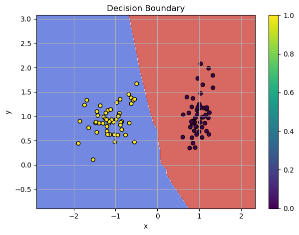
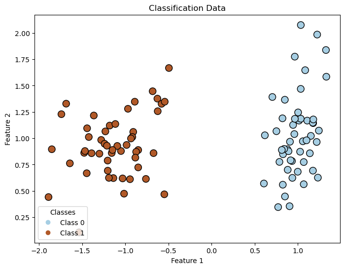
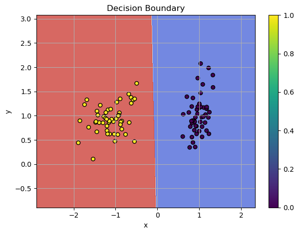

The human brain remains one of the greatest mysteries, far more complex than anything else we know. **It is the most complicated object in the universe that we know of.** The underlying processes and the source of consciousness, as well as consciousness itself, remain unknown. Neural Nets are good for popularizing Deep Learning algorithms, but we can't say for sure what mechanism behind biological Neural Networks enables intelligence to arise.


/// caption
Visualized Boundaries
///


<!-- more -->


<iframe width="1410" height="765" src="https://www.youtube.com/embed/RO0cDCnPeyE" title="" frameborder="0" allow="accelerometer; autoplay; clipboard-write; encrypted-media; gyroscope; picture-in-picture; web-share" referrerpolicy="strict-origin-when-cross-origin" allowfullscreen></iframe>


### [Check the jupyter notebook](https://github.com/nickovchinnikov/datasatanism/blob/master/code/9.LinearLayerAndSGD.ipynb)


## What We'll Build

In this chapter, we'll construct a Neural Network from the ground up using only Python and NumPy. By building everything from scratch, we'll demonstrate that Deep Learning isn't a black box - it's a system we can fully deconstruct and understand. This hands-on approach will show how the fundamental principles of neural networks can be implemented with minimal tools, demystifying the core concepts that power modern machine learning.


## Prerequisites

To understand this chapter, I recommend that you to check my previous post about gradient descent: [Gradient Descent - Downhill to the Minima](./gradient_descent_downhill_to_the_minima.md). We will use gradient descent to train our first neural network.

The challenge our network is going to solve is the classical linearly separable pattern, which we use as a **classification problem**. You can check my previous post for more details about the classification problem and the training process: [Dive into Learning from Data - MNIST Video Adventure](./dive_into_learning_from_data.md)


## Training in a Nutshell

To train our network, we compute the gradient and update parameters in the direction of the steepest descent, following the negative gradient. If you want to know more about the gradient, you can check my post on [why the gradient points upwards](./why_does_the_gradient_point_to_the_steepest_ascent.md) and [downhill to the minima](./gradient_descent_downhill_to_the_minima.md)


In short, the gradient is the most important operation in the training process. We need to follow the negative gradient direction to train our model. **Backpropagation** is the process of propagating the error backward through the network to update the model's parameters.

The training consists of two main phases:

* `forward`: computes the model's output for a given input, storing intermediate values required for gradient computation.

* `backward`: calculates the **derivatives** with respect to each parameter using the **Chain Rule of Calculus**. Gradient are then used to adjust the parameters in the direction that minimizes the loss.


## Module

To maintain consistency across different components of our neural network, we'll use a base class called `Module`. This class provides a structure for implementing layers, activations, and other elements.
The `Parameter` class makes it easy to manage and identify model parameters during optimization. It allows the `Optimizer` to access and modify parameter data and gradients in a structured way after the `forward` and `backward` steps.

Here's the implementation:

```python
from dataclasses import dataclass


@dataclass
class Parameter:
    r"""
    Represents a trainable parameter in a neural network model.

    Attributes:
        name (str): The name of the parameter, typically identifying its purpose (e.g., "weights", "biases").
        data (np.ndarray): The current value of the parameter, stored as a NumPy array.
        grad (np.ndarray): The gradient of the parameter, calculated during the backward pass.
    """

    name: str
    data: np.ndarray
    grad: np.ndarray


class Module:
    r"""
    A base class for all neural network components.
    Provides a consistent interface for forward and backward passes,
    and allows for the implementation of common operations like
    parameter updates.
    """

    def __call__(self, *args, **kwargs):
        r"""
        Enables the object to be called like a function. Internally,
        this redirects the call to the `forward` method of the module,
        which computes the model's output for the given input.

        Args:
            *args: Positional arguments passed to the `forward` method.
            **kwargs: Keyword arguments passed to the `forward` method.

        Returns:
            The output of the `forward` method.
        """
        return self.forward(*args, **kwargs)

    def forward(self, *args, **kwargs):
        r"""
        Forward Pass: Compute the model's output for a given input,
        accumulating the values required for gradient computation.
        """
        raise NotImplementedError

    def backward(self, *args, **kwargs):
        r"""
        Backward Pass: Calculate the derivative of the loss function
        with respect to each parameter using the chain rule of calculus.
        These derivatives (gradients) are then used to adjust the
        parameters in the direction that minimizes the loss.
        """
        raise NotImplementedError

    def parameters(self) -> List[Parameter]:
        r"""Returns all trainable parameters of the module."""
        return []

    def zero_grad(self):
        r"""
        Resets the gradients of all parameters in the module to zero.
        This is typically done at the start of a new optimization step
        to prevent accumulation of gradients from previous steps.
        """
        for param in self.parameters():
            param.grad.fill(0)


```


## Weights initialization

Before implementing the Linear Layer, it's essential to consider the importance of weight initialization! Proper weight initialization can significantly affect the performance of your neural network. For more details on this topic, you can refer to [Weight Initialization Methods in Neural Networks](./weights_init.md).

In short, the choice of initialization depends on the activation function used in your network:

* **LeakyReLU**: The best weight initialization for this activation function is the [Leaky He](./weights_init.md#he-initialization-for-leakyrelu) method.
* **Sigmoid**: For Sigmoid activation, the [Xavier-Glorot](./weights_init.md#xavier-glorot-initialization) method works best.

To simplify the implementation of the *Dense Layer*, we can leverage the [parameter](./weights_init.md#universal-parameter-implementation), which handles different initialization methods effectively.


```python
import numpy as np
from typing import Literal

# Define a custom type alias for initialization methods
InitMethod = Literal["xavier", "he", "he_leaky", "normal", "uniform"]

def parameter(
    input_size: int,
    output_size: int,
    init_method: InitMethod = "xavier",
    gain: float = 1,
    alpha: float = 0.01
) -> np.ndarray:
    weights = np.random.randn(input_size, output_size)

    if init_method == "xavier":
        std = gain * np.sqrt(1.0 / input_size)
        return std * weights
    if init_method == "he":
        std = gain * np.sqrt(2.0 / input_size)
        return std * weights
    if init_method == "he_leaky":
        std = gain * np.sqrt(2.0 / (1 + alpha**2) * (1 / input_size))
        return std * weights
    if init_method == "normal":
        return gain * weights
    if init_method == "uniform":
        return gain * np.random.uniform(-1, 1, size=(input_size, output_size))

    raise ValueError(f"Unknown initialization method: {init_method}")

```

For a comprehensive overview of weight initialization techniques, visit [Weight Initialization Methods in Neural Networks](./weights_init.md).


## Forward Mode for Linear Layer 

At layer $i$, the linear transformation is defined as:

$$\tag{linear step}
\label{eq:linear_step}
A_i(\mathbf{x}) = \mathbf{x}\mathbf{w}_i + b_i$$

Here, $\mathbf{x}$ is the input to layer $i$, $\mathbf{w}_i$ represents the weights, and $\mathbf{b}_i$ denotes the biases of the layer. The activation function, $\sigma$, is then applied to introduce non-linearity after the linear transformation.

The single step $i$ of the network can be written explicitly as:

$$f_i(\mathbf{x}) = \sigma(A_i(\mathbf{x}))$$ 

where $A_i(\mathbf{x})$ denotes the linear transformation at layer $i$.

In a neural network, the input data undergoes a series of transformations layer by layer, resulting in the final output:

$$f(\mathbf{x}) = \sigma(A_L(\sigma(A_{L-1}( \dots \sigma(A_1(\mathbf{x})) \dots ))).$$

Using **functional composition**, the deep neural network is compactly expressed as:


$$\tag{deep neural net}
\label{eq:deep_nn}
f(\mathbf{x}) = A_L \circ \sigma \circ A_{L-1} \circ \dots \circ \sigma \circ A_1 (\mathbf{x})$$

The **forward pass** computes these transformations sequentially, storing intermediate values for use during the **backward pass**.

We can implement the backbone of the `Linear` layer and its `forward` method based on the equations.


```python
class Linear(Module):
    def __init__(
        self,
        input_size: int,
        output_size: int,
        init_method: Literal["xavier", "he", "he_leaky", "normal", "uniform"] = "xavier"
    ):
        self.input: np.ndarray = None

        self.weights: np.ndarray = parameter(input_size, output_size, init_method)
        self.d_weights: np.ndarray = np.zeros_like(self.weights)

        self.biases: np.ndarray = np.zeros((1, output_size))
        self.d_biases: np.ndarray = np.zeros_like(self.biases)

    def forward(self, x: np.ndarray) -> np.ndarray:
        self.input = x
        x1 = x @ self.weights + self.biases
        return x1

```


## Backward Mode for Linear Layer

In backpropagation, the **goal is to compute the gradient of the loss function** $\mathcal{L}$ with respect to every parameter in the network, so that the model parameters can be updated to minimize the loss.

This is achieved by applying the **chain rule** of calculus, which allows the gradients to be propagated backward from the output layer to the input layer.

In calculus, the **chain rule** describes how to compute the derivative of a composite function. For two functions $f(g(x))$, the chain rule states:

$$\frac{d}{dx} f(g(x)) = f'(g(x)) \cdot g'(x)$$

In neural networks, the loss function $\mathcal{L}$ depends on multiple layers of transformations applied to the input, forming a composition of functions:

$$\mathcal{L} = f(A_L(\sigma(A_{L-1}(\dots \sigma(A_1(x)) \dots))))$$

To compute the gradient $\nabla \mathcal{L}$ with respect to each parameter, we apply the chain rule recursively for this composition.

We can express the gradient flow through the network as:

$$\tag{backprop}
\label{eq:backprop}
\nabla f = \nabla A_1 \circ \sigma' \circ \nabla A_2 \circ \dots \circ \sigma' \circ \nabla A_L (\mathcal{L})$$


The chain rule propagates gradients backward: starting with the gradient of the loss ($\nabla \mathcal{L}$) with respect to the output ($x_{\text{out}}$), gradients are successively multiplied by $\nabla A_i$ and $\sigma'$ for each layer. This backpropagates information through the network.

This structured approach ensures that gradients are correctly computed and used to update all parameters.

In the `backward` method, we compute the gradients of the loss with respect to the network's parameters. This is done by using the **gradients of the output** (denoted as `d_out`) and backpropagating them through the network using the chain rule. Essentially, the backward method applies the chain of gradients to adjust the weights and biases, improving the network's performance over time.

The gradient vector with respect to the parameters (weights $w_i$​ and biases $b_i$​) is expressed as:

$$\nabla A_i(\mathbf{x}) = \begin{bmatrix}
\frac{\partial A_i(\mathbf{x})}{\partial \mathbf{w_i}} \\
\frac{\partial A_i(\mathbf{x})}{\partial \mathbf{b_i}}
\end{bmatrix}
$$

**Partial Derivative with Respect to Weights**

The partial derivative of the affine transformation $A_i​(x)$ with respect to the weights $\mathbf{w}_i$​ is:

$$\frac{\partial (\mathbf{w}_i \mathbf{x} + b_i)}{\partial \mathbf{w_i}}=\mathbf{x}^T$$

**Why Do We Have $\mathbf{x}^T$?**

$\mathbf{w}_i$ is a $m \times n$ matrix and $\mathbf{x}$ is a $n \times 1$ column vector, resulting in $A_i(\mathbf{x})$ being a $m \times 1$ vector.

The derivative \(\frac{\partial A_i(\mathbf{x})}{\partial \mathbf{w}_i}\) represents the sensitivity of each element of \(A_i(\mathbf{x})\) to changes in each element of \(\mathbf{w}_i\). Specifically, \(\mathbf{w}_i\) contains \(m \times n\) elements. For each scalar output in \(A_i(\mathbf{x})\), its derivative with respect to each element in \(\mathbf{w}_i\) involves \(\mathbf{x}\), as:

\[
\frac{\partial (\mathbf{w}_i \mathbf{x})}{\partial \mathbf{w}_i} = \mathbf{x}^T
\]

- Each row of \(\mathbf{x}^T\) corresponds to the gradient contribution for one output in \(A_i(\mathbf{x})\).
- Mathematically, \(\mathbf{x}^T\) reshapes the gradient into a form that matches the structure of \(\mathbf{w}_i\).

**Intuition Behind \(\mathbf{x}^T\):**

- **Transpose Role:** \(\mathbf{x}^T\) rearranges the input \(\mathbf{x}\) so that its dimensions align correctly with the gradient \(d_{\text{out}}\) in the backward pass.
- **Gradient Flow:** Each column of \(\mathbf{w}_i\) corresponds to how strongly a specific input feature contributes to each output. The transpose ensures that we sum over the batch dimension (if present) and correctly propagate the gradient back to the weights.


By the chain rule we need to use the gradient of the loss with respect to the output of the current layer $d_{\text{out}}$:

$$\frac{\partial L}{\partial \mathbf{w}_i} = \mathbf{x}^T \cdot d_{\text{out}}$$

This is efficiently computed in matrix form as:

```python
dw = self.input.T @ d_out
```

`self.input.T` is the transpose of the input matrix $\mathbf{x}$, which aligns the dimensions for the matrix multiplication. `d_out` represents the gradient of the loss with respect to the output of the current layer, $\frac{\partial L}{\partial A_i}$.


**Partial Derivative with Respect to Biases**

The partial derivative of the affine transformation $A_i(\mathbf{x})$ with respect to the biases $b_i$ is:

$$\frac{\partial (\mathbf{w}_i \mathbf{x} + b_i)}{\partial \mathbf{b_i}}=1$$


In backpropagation, the chain rule is used to propagate gradients from the loss function $L$ through the layers of the network.

Start with the total derivative of the loss with respect to the bias:

$$\frac{\partial L}{\partial b_i} = \frac{\partial L}{\partial A_i} \cdot \frac{\partial A_i}{\partial b_i}.
$$

Substituting, we get:

$$\frac{\partial L}{\partial b_i} = \frac{\partial L}{\partial A_i} \cdot 1 = \frac{\partial L}{\partial A_i}.
$$

In the case of a batch of data, the bias gradient accumulates contributions from all samples in the batch. This is implemented as:

```python
db = np.sum(d_out, axis=0, keepdims=True)
```

`np.sum(d_out, axis=0, keepdims=True)` computes the sum of gradients across all samples in the batch, resulting in a single gradient vector for the biases. `keepdims=True` ensures that the resulting array maintains the correct dimensionality shape `(1, output_size)` for compatibility with subsequent computations.

Finally, the gradient of affine transformation is defined as:

$$\tag{layer gradient}
\label{eq:layer_gradient}
\nabla A_i(\mathbf{x}) = \begin{bmatrix}
\frac{\partial A_i(\mathbf{x})}{\partial \mathbf{w_i}} \\
\frac{\partial A_i(\mathbf{x})}{\partial \mathbf{b_i}}
\end{bmatrix} =
\begin{bmatrix}
\mathbf{x}^T \\
1
\end{bmatrix}$$

Here's the full implementation of the `Linear` layer:

```python
class Linear(Module):
    r"""
    A linear layer in a neural network that performs an affine transformation 
    followed by the addition of a bias term. It is the core building block 
    for many neural network architectures.

    Attributes:
        input (np.ndarray): The input to the linear layer, used during the forward and backward passes.
        weights (np.ndarray): The weights of the linear transformation, initialized using the specified method.
        d_weights (np.ndarray): The gradients of the weights with respect to the loss, computed during backpropagation.
        biases (np.ndarray): The biases added during the linear transformation.
        d_biases (np.ndarray): The gradients of the biases with respect to the loss, computed during backpropagation.
    """

    def __init__(
        self,
        input_size: int,
        output_size: int,
        init_method: InitMethod = "xavier"
    ):
        r"""
        Initializes a Linear layer with the given input size and output size.
        The weights are initialized using the specified method (e.g., Xavier, He, etc.), 
        and biases are initialized to zeros.

        Args:
            input_size (int): The number of input features to the layer.
            output_size (int): The number of output features from the layer.
            init_method (InitMethod): The initialization method for the weights (default is "xavier").

        Attributes:
            input (np.ndarray): Stores the input to the layer during the forward pass.
            weights (np.ndarray): The weights for the linear transformation.
            d_weights (np.ndarray): The gradients for the weights, calculated during backpropagation.
            biases (np.ndarray): The biases for the linear transformation.
            d_biases (np.ndarray): The gradients for the biases, calculated during backpropagation.
        """

        self.input: np.ndarray = None

        self.weights: np.ndarray = parameter(input_size, output_size, init_method)
        self.d_weights: np.ndarray = np.zeros_like(self.weights)

        self.biases: np.ndarray = np.zeros((1, output_size))
        self.d_biases: np.ndarray = np.zeros_like(self.biases)

    def forward(self, x: np.ndarray) -> np.ndarray:
        r"""
        Computes the forward pass of the linear layer. The input is multiplied by 
        the weights and biases are added, producing the output.

        Args:
            x (np.ndarray): The input to the layer, typically the output of the previous layer.

        Returns:
            np.ndarray: The output of the linear transformation (after applying weights and biases).
        """

        self.input = x
        return x @ self.weights + self.biases

    def backward(self, d_out: np.ndarray) -> np.ndarray:
        r"""
        Computes the backward pass for the linear layer, calculating the gradients 
        with respect to the weights and biases, and the gradient of the input 
        to be passed to the next layer.

        Args:
            d_out (np.ndarray): The gradient of the loss with respect to the output of this layer. 

        Returns:
            np.ndarray: The gradient of the loss with respect to the input of this layer, 
                        which will be passed to the next layer.
        """

        # Compute gradients for weights and biases
        self.d_weights = self.input.T @ d_out
        self.d_biases = np.sum(d_out, axis=0, keepdims=True)

        # Chain rule!
        layer_out = d_out @ self.weights.T
        return layer_out

    def parameters(self):
        r"""
        Retrieves the parameters of the linear layer, including weights and biases, 
        along with their corresponding gradients. This method is typically used for 
        optimization purposes during training.

        Returns:
            list[Parameter]: A list of `Parameter` objects, where each object contains:
                - `name` (str): The name of the parameter (e.g., "weights", "biases").
                - `data` (np.ndarray): The parameter values (e.g., weights or biases).
                - `grad` (np.ndarray): The gradients of the parameter with respect to the loss.
        """

        return [
            Parameter(
                name="weights",
                data=self.weights,
                grad=self.d_weights
            ),
            Parameter(
                name="biases",
                data=self.biases,
                grad=self.d_biases
            ),
        ]
```


## Loss

To check the accuracy of the model, we compare the predicted output, $y_{\text{pred}}$, with the true labels, $y_{\text{target}}$. The measure of this discrepancy is what we call the **loss function** or $\mathcal{L}$.

For a classification problem with 2 classes, we deal with a **Binary Classification Task**, and the most effective loss function in this case is the **Binary Cross-Entropy Loss**. 

The **binary cross-entropy** formula for two classes (0 and 1) is:

$$\tag{BCE} \label{eq:bce}
\mathcal{L} = - \frac{1}{N} \sum_{i=1}^{N} y_i \log(p_i) + (1 - y_i) \log(1 - p_i)
$$

**Binary Cross-Entropy derivative**

$$\tag{BCE derivative} \label{eq:bce_derivative}
\frac{\partial \mathcal{L}}{\partial p_i} = \frac{1}{N} \sum_{i=1}^{N} \frac{p_i - y_i}{p_i (1 - p_i)}$$

For more details, check out my post on [Cross-Entropy](./cross_entropy_loss.md).

The complete implementation of the BCE module:

```python
import numpy as np


class BCELoss(Module):
    def forward(
        self, pred: np.ndarray, target: np.ndarray, epsilon: float = 1e-7
    ) -> np.ndarray:
        loss = -(
            target * np.log(pred + epsilon) + 
            (1 - target) * np.log(1 - pred + epsilon)
        )

        # Average the loss over the batch size
        return np.mean(loss)

    def backward(
        self, pred: np.ndarray, target: np.ndarray, epsilon: float = 1e-7
    ) -> np.ndarray:
        grad = (pred - target) / (pred * (1 - pred) + epsilon)

        # you should not average the gradients!
        # instead, you should return the gradient for each example,
        # as gradients represent how much the loss changes with
        # respect to each individual prediction.

        return grad

```

For more details, check out my post on [Cross-Entropy](./cross_entropy_loss.md)


## Sigmoid

The **sigmoid activation function** is defined as:

$$\tag{sigmoid function}
\label{eq:sigmoid_function}
\sigma(\mathbf{x}) = \frac{1}{1 + e^{-\mathbf{x}}}$$

The derivative of the sigmoid activation function is:

$$\tag{sigmoid derivative}
\label{eq:sigmoid_derivative}
\sigma'(\mathbf{x}) = \sigma(\mathbf{x}) \cdot (1 - \sigma(\mathbf{x}))
$$

[Check out this post](./logits_probs_sigmoid.md#sigmoid) to learn more about sigmoid, logits, and probabilities.

The `Sigmoid` class inherits from `Module` and implements both the `forward` and `backward` methods for the sigmoid activation function. The `forward` method applies the sigmoid function to the input data, and the `backward` method computes the gradient required for the backward pass during model optimization (training).


```python
class Sigmoid(Module):
    r"""Sigmoid activation function and its derivative for backpropagation."""

    def forward(self, x: np.ndarray):
        # Apply the Sigmoid function element-wise
        self.output = 1 / (1 + np.exp(-x))
        return self.output

    def backward(self, d_out: np.ndarray):
        # Derivative of the Sigmoid function: sigmoid * (1 - sigmoid)
        ds = self.output * (1 - self.output)
        return d_out * ds

```

`d_out` represents the gradient from the output of the current layer, to propagate errors backward through the network.

Here's how the `Sigmoid` class can be used in practice:

```python
# Example inputs
input_x = np.array([0.5, 1.0, -1.5])

# Initialize the Sigmoid activation
activation = Sigmoid()

# Forward pass
output = activation(input_x)
print("Output of Sigmoid:", output)

# Backward pass
d_out = np.array([0.1, 0.2, 0.3])  # Example gradient from next layer
gradient = activation.backward(d_out)
print("Gradient of Sigmoid:", gradient)

```


## Stochastic Gradient Descent (SGD)

In training neural networks, **Stochastic Gradient Descent (SGD)** is one of the popular optimization algorithms. It aims to minimize the loss function $\mathcal{L}$ by updating model parameters in the direction that reduces the loss.

The key idea behind SGD is that, rather than using the entire dataset to compute gradients (as in batch gradient descent), we use only a **single data point** or a **mini-batch** to compute the gradients and update parameters. This makes the optimization process faster and more scalable.

In SGD, the parameter update rule is given by:

$$\mathbf{w}_i = \mathbf{w}_i - \eta \nabla \mathcal{L}(\mathbf{w}_i)$$

Where $\eta$ is the learning rate and $\nabla \mathcal{L}(\mathbf{w}_i)$ is the gradient of the loss with respect to the parameter $\mathbf{w}_i$.

To help accelerate convergence, **momentum** is introduced. It helps smooth the updates and avoid oscillations by incorporating the previous gradient into the current update. First we compute the Momentum:

$$v_{t+1} = \mu \cdot v_{t} - \alpha \nabla f(x_t)$$

The update rule for our position becomes:

$$x_{t+1} = x_t + v_{t+1}$$

For more datils check my post: [Gradient Descent Ninja with Momentum](./gradient_descent_ninja_with_momentum.md)


**Implementation:**

```python
class SGD:
    def __init__(
        self,
        lr: float = 0.01,
        momentum: float = 0.0,
    ):
        """
        Initializes the Stochastic Gradient Descent (SGD) optimizer.

        - **Learning Rate (`lr`)**: Controls how big the updates are. A larger learning rate might result in faster convergence but could also cause instability.
        - **Momentum (`momentum`)**: Helps accelerate the gradient descent process by adding inertia to the parameter updates. This makes the algorithm more efficient by using past gradients to update parameters in a more "smooth" way.
        
        The optimizer aims to update the model's parameters in a way that reduces the loss function, allowing the model to improve its performance over time.

        Args:
            lr (float): Learning rate for updating the model's parameters.
            momentum (float): Momentum for accelerating gradient descent.
        """
        self.lr = lr
        self.momentum = momentum
        self.velocity = {}  # Store momentum for each parameter

    def step(self, module: Module):
        """
        Performs a single update step on the parameters using the gradients.

        Args:
            module (Module): The module (e.g., layer) whose parameters are being updated.
        """
        for param in module.parameters():
            param_id = param.name

            # Initialize velocity if not exists
            if param_id not in self.velocity:
                self.velocity[param_id] = np.zeros_like(param.data)

            grad = param.grad.copy()  # Make a copy to avoid modifying original

            # Update with momentum
            self.velocity[param_id] = self.momentum * self.velocity[param_id] - self.lr * grad

            # Update parameters
            param.data += self.velocity[param_id]

```


**Example:**

```python
# Initialize the SGD optimizer with custom settings
optimizer = SGD(lr=0.01, momentum=0.9)

# Perform a parameter update for each layer/module in the network
optimizer.step(module)
```

This method updates the model parameters by using the gradients calculated during the backward pass, applying momentum, weight decay, and gradient clipping where needed.


## Putting It All Together: Training a Model with SGD

Let's use the previously defined `Linear` layer, `BCELoss` function, and `SGD` optimizer to train a binary classification model on some random input data. The process involves a forward pass, a backward pass, and parameter updates using Stochastic Gradient Descent (SGD).

We are going to use `make_classification` from `sklearn`. Let's import it and visualize the data.

```python
from sklearn.datasets import make_classification
import matplotlib.pyplot as plt


# Default params
n_samples = 100
features = 2

# Create random input data
x, y_target = make_classification(
    n_samples=n_samples,
    n_features=features,
    n_informative=2,
    n_redundant=0,
    n_clusters_per_class=1,
    flip_y=0,
    random_state=1
)

y_target = y_target.reshape(-1, 1)

# Plot the data
plt.figure(figsize=(8, 6))

# Create scatter plot
scatter = plt.scatter(
    x[:, 0],
    x[:, 1],
    c=y_target.flatten(), 
    cmap=plt.cm.Paired, 
    edgecolor='k', 
    s=100,
)

# Title and labels
plt.title("Classification Data")
plt.xlabel("Feature 1")
plt.ylabel("Feature 2")

# Add color legend using scatter's 'c' values
handles, labels = scatter.legend_elements()

# Modify labels to add custom class names
custom_labels = ['Class 0', 'Class 1']  # Custom labels for each class

# Use the custom labels in the legend
plt.legend(handles, custom_labels, title="Classes", loc="lower left")

plt.show()
```

**Output:**




This dataset represents a linearly separable pattern with two classes, which the network must classify. Since data generation can vary slightly, you can experiment by creating and visualizing your own datasets. In this example, we use `random_state=1` to fix the data generation for reproducibility, but feel free to change it to explore different patterns.

Also, let's define function for plotting decision boundaries

```python
def plot_decision_boundaries(model, X, y, bins=500):
    # Set the limits of the plot
    x_min, x_max = X[:, 0].min() - 1, X[:, 0].max() + 1
    y_min, y_max = X[:, 1].min() - 1, X[:, 1].max() + 1

    # Generate a grid of points
    xx, yy = np.meshgrid(np.linspace(x_min, x_max, bins), np.linspace(y_min, y_max, bins))
    grid = np.c_[xx.ravel(), yy.ravel()]

    # Get the predicted class for each point in the grid
    Z = model.forward(grid)  # Only get the predicted output
    Z = (Z > 0.5).astype(int)  # Assuming binary classification

    # Reshape the predictions back to the grid shape
    Z = Z.reshape(xx.shape)

    # Plot the decision boundary
    plt.contourf(xx, yy, Z, alpha=0.8, cmap='coolwarm')
    plt.scatter(X[:, 0], X[:, 1], c=y.ravel(), edgecolors='k', marker='o', s=30, label='Data Points')
    plt.title('Decision Boundary')
    plt.xlabel('x')
    plt.ylabel('y')
    plt.xlim(xx.min(), xx.max())
    plt.ylim(yy.min(), yy.max())
    plt.colorbar()
    plt.tight_layout()
    plt.grid(True)
    plt.show()

```

Create the model, activation, loss function, and optimizer:

```python
# Linear layer with 3 input features and 1 output.
model = Linear(input_size=features, output_size=1, init_method="xavier")

# Sigmoid activation
activation = Sigmoid()

# BCE calculate the loss between predicted and actual values
bce = BCELoss()

# optimizer with a learning rate of 0.01, and momentum of 0.9
optimizer = SGD(lr=0.01, momentum=0.9)

```

**Training Loop:**

We'll train the model over 10 epochs. At each epoch, we:

* Perform a **forward pass**: Compute the predicted output using the model.

* Calculate the **loss** using `BCELoss`.

* **zero_grad** before the `backward` step

* Perform a **backward pass**: Compute the gradients of the loss with respect to the parameters.

* **Update parameters**: Use the optimizer to update the model weights.

Here's the training loop:

```python
n_epoch = 10

for epoch in range(n_epoch):
    # Forward
    output = model(x)
    y_pred = activation(output)
    loss = bce(y_pred, y_target)

    model.zero_grad()

    # Backward
    grad = bce.backward(y_pred, y_target)
    grad = activation.backward(grad)
    model.backward(grad)

    optimizer.step(model)

    print(f"Epoch {epoch}, Loss: {loss:.4f}")
```

**Output:**

```
Epoch 0, Loss: 0.2021
Epoch 1, Loss: 0.1668
Epoch 2, Loss: 0.1235
Epoch 3, Loss: 0.0893
Epoch 4, Loss: 0.0655
Epoch 5, Loss: 0.0485
Epoch 6, Loss: 0.0361
Epoch 7, Loss: 0.0268
Epoch 8, Loss: 0.0200
Epoch 9, Loss: 0.0151
```

Almost perfect score! Let's plot the decision boundaries.

```python
plot_decision_boundaries(model, x, y_target)

```

**Output:**


/// caption
Visualized Boundaries
///


## Sign off

We've broken down the fundamental building blocks of training a neural network. The journey starts with forward and backward passes, leveraging gradients to adjust model parameters and minimize loss. By implementing layers like `Linear`, activation functions like `Sigmoid`, and optimization algorithms like `SGD`, we create a system capable of learning from data.

Each component - forward computation, backpropagation, and optimization plays a vital role in ensuring the network trains effectively. The concepts of the chain rule, gradient clipping, and momentum enhance stability and convergence during training.

Together, these elements form the backbone of modern deep learning, providing the tools needed to solve complex problems with elegance and precision. Whether you're experimenting with binary classification or scaling to larger networks, the same principles apply, making this modular approach robust and versatile.
