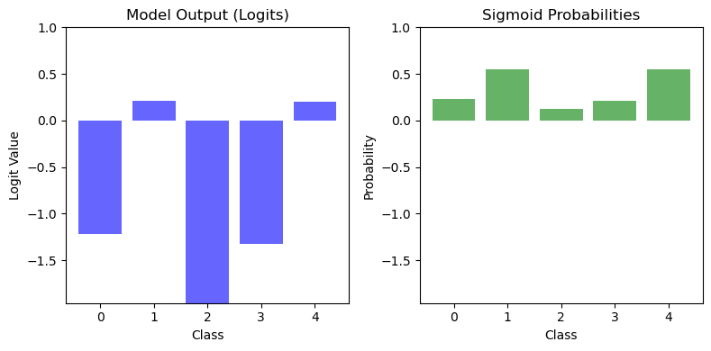

## Understanding Logits

**Logits** are the raw outputs generated by a model before applying any activation function, such as the **sigmoid** or **softmax** functions. These values are unbounded, meaning they can be positive, negative, or zero. Logits represent the model's unnormalized confidence scores for assigning an input to different classes.


/// caption
Logits vs Probabilities
///

In a classification problem, especially in **multi-class classification**, the model produces a set of logits—one for each class. These logits indicate the model's relative confidence in each class without being normalized into probabilities.


<!-- more -->


## **[Check the jupyter notebook](https://github.com/nickovchinnikov/datasatanism/blob/master/code/7.SigmoidLogitsProbs.ipynb)**


Let's consider a 5-class classification problem. The model outputs the following **logits**, which are generated using `np.random.randn(5)`. To ensure reproducibility, we set the random seed using `np.random.seed(42)`:


```python
import numpy as np
np.random.seed(42)

logits = np.random.randn(5)
logits
```

**Output:**

```
array([ 0.49671415, -0.1382643,  0.64768854,  1.52302986, -0.23415337])
```

These are the raw outputs. To convert them into **probabilities**, you can apply the **sigmoid function**.

!!! info "Softmax for Multi-Class classification"

    For multi-class classification, we typically use the **softmax** function rather than the **sigmoid** function to convert logits to probabilities. The softmax function ensures all probabilities sum to 1, which is essential for multi-class problems.


These **logits** represent the raw, unnormalized scores assigned by the model to each of the 5 classes, they can take any value - positive, negative, or zero. 


## Inside the Linear Layer

The model performs a key operation: a linear transformation. This is represented as:

$$\hat{x}_{i+1} = \sigma(\mathbf{w}_i^T \mathbf{x} + b_i)$$

Here $\mathbf{w}_i^T$ are the model's weights and $b_i$ represents the biases. The term $\mathbf{w}_i^T \mathbf{x} + b_i$ applies a matrix multiplication (weights times the input) and adds the biases. We can simulate this step with the following code:

```python
import numpy as np

W = np.random.randn(5, 5)  # Random weights
x = np.random.randn(5)     # Input vector
b = np.ones(5)             # Biases

x_1 = W @ x + b            # Linear transformation
x_1

```

**Output:**

```
array([ 4.99851316,  1.01778965, -0.74321057,  0.75818997, -0.80840313])
```

In this example, we simulate the computation inside a model layer to create the logits-raw scores that are unbounded and not yet normalized.

To make these logits interpretable as **probabilities** for each class, we use an activation function like the **sigmoid function**. The sigmoid maps these raw values into a range between 0 and 1, making them easier to interpret as class probabilities. For multi-class classification, we use the **softmax** function, which converts these raw values into a probability distribution that sums to 1.


## Sigmoid

The **sigmoid function** is defined as:

$$\tag{sigmoid function}
\label{eq:sigmoid_function}
\sigma(\mathbf{x}) = \frac{1}{1 + e^{-\mathbf{x}}}$$

This function maps any input value $\mathbf{x}$ to a range between 0 and 1, making it particularly useful for binary classification tasks or probabilistic outputs.

To compute the derivative of $\sigma(\mathbf{x})$, we begin with the definition:

$$\frac{d}{dx} \left( \sigma(\mathbf{x}) \right) = \frac{d}{dx} \left( \frac{1}{1 + e^{-\mathbf{x}}} \right) =$$

$$= \frac{e^{-\mathbf{x}}}{(1 + e^{-\mathbf{x}})^2}$$

Next, we rewrite this derivative using the original sigmoid function $\sigma(\mathbf{x})$:

$$\frac{e^{-\mathbf{x}}}{(1 + e^{-\mathbf{x}})^2} = \frac{1}{1 + e^{-\mathbf{x}}}\frac{e^{-\mathbf{x}}}{1 + e^{-\mathbf{x}}} =$$

$$= \sigma(\mathbf{x}) \cdot \frac{e^{-\mathbf{x}}}{1 + e^{-\mathbf{x}}}$$

From the sigmoid definition, we know:

$$\frac{e^{-x}}{1 + e^{-x}} = \frac{1+e^{-\mathbf{x}}}{1+e^{-\mathbf{x}}} - \frac{1}{1+e^{-\mathbf{x}}} = 1 - \sigma(\mathbf{x})$$

Substituting this back, we get:

$$\frac{d(\sigma(\mathbf{x}))}{dx} = \sigma(\mathbf{x}) \cdot (1 - \sigma(\mathbf{x}))$$

Finally, the derivative of the sigmoid activation function is:

$$\tag{sigmoid derivative}
\label{eq:sigmoid_derivative}
\sigma'(\mathbf{x}) = \sigma(\mathbf{x}) \cdot (1 - \sigma(\mathbf{x}))
$$

This elegant result highlights a **key property of the sigmoid function: its derivative can be expressed directly in terms of the function itself.**


## Implementation

```python
import numpy as np


class Sigmoid:
    r"""Sigmoid function and its derivative for backpropagation."""

    def forward(self, x: np.ndarray):
        r"""
        Compute the Sigmoid of the input.
        $$\sigma(x) = \frac{1}{1 + e^{-x}}$$

        Args:
            x (np.ndarray): Input array, typically the weighted sum of inputs to a neuron.

        Returns:
            np.ndarray: Sigmoid-transformed values.
        """

        return 1 / (1 + np.exp(-x))

    def backward(self, x: np.ndarray):
        r"""
        Compute the derivative of the sigmoid.
        
        $$\sigma'(x) = \sigma(x) \cdot (1 - \sigma(x))$$

        Args:
            x (np.ndarray): Input array, typically the weighted sum of inputs to a neuron.

        Returns:
            np.ndarray: Derivative of the sigmoid with respect to the input.
        """

        sig = self.forward(x)
        
        # Derivative of the Sigmoid function: sigmoid * (1 - sigmoid)
        ds = sig * (1 - sig)
        return ds

```


## Sigmoid and derivative plot

The **Sigmoid Function** maps input values to an output range between 0 and 1. For large negative inputs ($x \to -\infty$), the sigmoid output approaches 0. For large positive inputs ($x \to +\infty$), the sigmoid output approaches 1. At $x = 0$, the sigmoid output is 0.5, providing symmetry around the origin.


/// caption
Sigmoid and derivative
///

The **left graph** shows the sigmoid curve. Notice its smooth S-shape transitioning from 0 to 1 as $x$ increases. This smoothness is crucial for backpropagation in neural networks, as it allows gradients to flow efficiently during optimization.

The **right graph** shows the derivative of the sigmoid function. The peak at $x = 0$ highlights the point of maximum sensitivity. This is the region where the sigmoid responds most strongly to changes in input. At the tails ($x \to \pm\infty$), the derivative diminishes, leading to the vanishing gradient problem in deep networks when using sigmoid in multiple layers.

This derivative shows how the sigmoid output changes with respect to the input $x$.


## Logits to Probabilities

Now, let's use the **sigmoid function** to transform the simulated logits into probabilities:

```python
W = np.random.randn(5, 5)
x = np.random.randn(5)
b = np.ones(5)

x_1 = W @ x + b
sigmoid.forward(x_1)

```

**Output:**

```
array([0.99577714, 0.47530024, 0.17042292, 0.85459768, 0.80969836])
```

The output shows the **normalized probabilities** for each class. These probabilities are easy to interpret and directly usable for classification tasks.


## Interpreting the Sigmoid Output

- As $x$ decreases toward negative infinity, the sigmoid output approaches 0.
- As $x$ increases toward positive infinity, the sigmoid output approaches 1.

A threshold of **0.5** is commonly used:

- Outputs below 0.5 are typically classified as class 0.
- Outputs above 0.5 are classified as class 1.

This transformation helps us map the model's raw outputs (logits) into meaningful probabilities, ready for decision-making.

You can explore the Logits vs. Probabilities simulation on your own, [code is here](https://github.com/nickovchinnikov/datasatanism/blob/master/code/7.SigmoidLogitsProbs.ipynb)


/// caption
Logits vs Probabilities 5 classes
///


## Check this out

### Sigmoid in action

<iframe width="1707" height="765" src="https://www.youtube.com/embed/iRecnibNI2Q" title="Sigmoid function in action" frameborder="0" allow="accelerometer; autoplay; clipboard-write; encrypted-media; gyroscope; picture-in-picture; web-share" referrerpolicy="strict-origin-when-cross-origin" allowfullscreen></iframe>


### Sigmoid and Logistic Regression

<iframe width="471" height="838" src="https://www.youtube.com/embed/1u5JeZl4PxU" title="Logistic Regression in action" frameborder="0" allow="accelerometer; autoplay; clipboard-write; encrypted-media; gyroscope; picture-in-picture; web-share" referrerpolicy="strict-origin-when-cross-origin" allowfullscreen></iframe>
