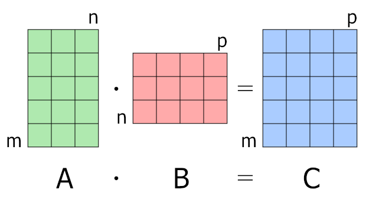

Understanding the transformation of input through weights and biases is fundamental in machine learning. Let's dive into how matrix multiplication plays a crucial role. It's all about matrix multiplication, the bread and butter of transforming inputs into meaningful outputs. Let's dive into how weights, biases, and inputs dance together in this mathematical ballet.

{ align=center, width="500" }
/// caption
For matrix multiplication, the number of columns in the first matrix must be equal to the number of rows in the second matrix. The result matrix has the number of rows of the first and the number of columns of the second matrix.
///

<!-- more -->

## Exploring Matrix Multiplication in Detail

> Matrix multiplication is not just about numbers; it's about understanding how data flows through layers of computation in machine learning models.

<iframe width="1707" height="765" src="https://www.youtube.com/embed/rfTwxV6H-8o" title="Matrix Multiplication, The Broadcasting rules" frameborder="0" allow="accelerometer; autoplay; clipboard-write; encrypted-media; gyroscope; picture-in-picture; web-share" referrerpolicy="strict-origin-when-cross-origin" allowfullscreen></iframe>

### Setting Up Our Matrices:

- **Input Matrix $\mathbf{X}$**: This represents our data, with each row being a sample and each column a feature. **For 100 samples and 3 features, we have:**

$$
\mathbf{X} = \begin{bmatrix}
x_{11} & x_{12} & x_{13} \\
x_{21} & x_{22} & x_{23} \\
\vdots & \vdots & \vdots \\
x_{101} & x_{102} & x_{103}
\end{bmatrix}
$$

- **Weights Vector $\mathbf{W}$**: Our weights are like the tuning knobs for our model; they adjust how much each feature influences the outcome:

$$
\mathbf{W} = \begin{bmatrix}
w_1 \\
w_2 \\
w_3
\end{bmatrix} \quad \text{(3 weights)}
$$

- **Bias $b$**: A little nudge to shift our predictions, just a single number:

$$
b = 1 \quad \text{(Scalar bias term)}
$$

### The Process

- **Linear Combination $Z$**: The first step in our logistic regression model is to compute $z$, the linear combination of our features with their respective weights plus the bias:

$$
z = \mathbf{X} \cdot \mathbf{W} + b = \begin{bmatrix}
z_1 \\
z_2 \\
\vdots \\
z_{100}
\end{bmatrix} \quad \text{(100 linear combinations)}
$$

- **Predicted Probabilities $\hat{y}$**: We then pass our linear combinations through the sigmoid function to squash the results between 0 and 1, turning them into probabilities:

$$
\hat{y} = \sigma(Z) = \begin{bmatrix}
\hat{y}_1 \\
\hat{y}_2 \\
\vdots \\
\hat{y}_{100}
\end{bmatrix} \quad \text{(100 predicted probabilities)}
$$

But why do we end up with 100 results? Let's examine this more closely!

### The Dot Product - Vector Multiplication

This simple operation is the heartbeat of matrix multiplication, allowing our model to compute how much each feature contributes to the prediction. The dot product is the sum of the element-wise products of two vectors.

$$
\mathbf{a} \cdot \mathbf{b} =
\begin{bmatrix} a_1 & a_2 \end{bmatrix} \cdot
\begin{bmatrix} b_1 \\ b_2 \end{bmatrix} =
a_1 \cdot b_1 + a_2 \cdot b_2
$$

## Matrix Multiplication

Matrix multiplication is not just about numbers; it's about understanding how data flows through layers of computation in machine learning models. Consider **Matrix A** with dimensions 2x2 and **Matrix B** also with dimensions 2x2:

$$
\mathbf{A} = \begin{bmatrix}
1 & 2 \\
3 & 1
\end{bmatrix}, \quad
\mathbf{B} = \begin{bmatrix}
2 & 1 \\
3 & 0
\end{bmatrix}
$$

$$
\mathbf{C} = \mathbf{A} \cdot \mathbf{B} = \begin{bmatrix}
1 \cdot 2 + 2 \cdot 3 & 1 \cdot 1 + 2 \cdot 0 \\
3 \cdot 2 + 1 \cdot 3 & 3 \cdot 1 + 1 \cdot 0
\end{bmatrix} = \begin{bmatrix}
8 & 1 \\
9 & 3
\end{bmatrix}
$$

### Step-by-Step Matrix Multiplication

Here's the color-coded step-by-step representation of matrix multiplication. To compute \(\mathbf{C} = \mathbf{A} \cdot \mathbf{B}\):

**Step #1:**

\[
\mathbf{A} = \begin{bmatrix}
\colorbox{blue}{1} & \colorbox{blue}{2} \\
3 & 1
\end{bmatrix}, \quad
\mathbf{B} = \begin{bmatrix}
\colorbox{blue}{2} & 1 \\
\colorbox{blue}{3} & 0
\end{bmatrix}
\]

- **First Element of \( \mathbf{C} \)**:

$$
C_{11} = \colorbox{blue}{1} \cdot \colorbox{blue}{2} + \colorbox{blue}{2} \cdot \colorbox{blue}{3} = 2 + 6 = 8
$$

**Step #2:**

\[
\mathbf{A} = \begin{bmatrix}
\colorbox{blue}{1} & \colorbox{blue}{2} \\
3 & 1
\end{bmatrix}, \quad
\mathbf{B} = \begin{bmatrix}
2 & \colorbox{blue}{1} \\
3 & \colorbox{blue}{0}
\end{bmatrix}
\]

- **Second Element of the First Row**:

\[
C_{12} = \colorbox{blue}{1} \cdot \colorbox{blue}{1} + \colorbox{blue}{2} \cdot \colorbox{blue}{0} = 1 + 0 = 1
\]

**Step #3:**

\[
\mathbf{A} = \begin{bmatrix}
1 & 2 \\
\colorbox{blue}{3} & \colorbox{blue}{1}
\end{bmatrix}, \quad
\mathbf{B} = \begin{bmatrix}
\colorbox{blue}{2} & 1 \\
\colorbox{blue}{3} & 0
\end{bmatrix}
\]

- **First Element of the Second Row**:

\[
C_{21} = \colorbox{blue}{3} \cdot \colorbox{blue}{2} + \colorbox{blue}{1} \cdot \colorbox{blue}{3} = 6 + 3 = 9
\]

**Step #4:**

\[
\mathbf{A} = \begin{bmatrix}
1 & 2 \\
\colorbox{blue}{3} & \colorbox{blue}{1}
\end{bmatrix}, \quad
\mathbf{B} = \begin{bmatrix}
2 & \colorbox{blue}{1} \\
3 & \colorbox{blue}{0}
\end{bmatrix}
\]

- **Second Element of the Second Row**:

\[
C_{22} = \colorbox{blue}{3} \cdot \colorbox{blue}{1} + \colorbox{blue}{1} \cdot \colorbox{blue}{0} = 3 + 0 = 3
\]

After completing these steps, the resulting matrix \( \mathbf{C} \) would be:

\[
\mathbf{C} = \begin{bmatrix}
\colorbox{blue}{8} & \colorbox{blue}{1} \\
\colorbox{blue}{9} & \colorbox{blue}{3}
\end{bmatrix}
\]

Each step highlights the corresponding elements from \(\mathbf{A}\) and \(\mathbf{B}\) used in the calculation, with the color blue indicating the active elements in the multiplication.

### Dimensionality in Matrix Multiplication

Matrix multiplication is not only about the arithmetic of numbers but also about how dimensions play a crucial role in the operation. Here's a detailed look:

- Let's revisit **Matrix A** and **Matrix B**:

\[
\mathbf{A} = \begin{bmatrix}
1 & 2 \\
3 & 1
\end{bmatrix}, \quad
\mathbf{B} = \begin{bmatrix}
2 & 1 \\
3 & 0
\end{bmatrix}
\]

- **The Requirement for Multiplication**: The number of columns in \(\mathbf{A}\) must equal the number of rows in \(\mathbf{B}\). Both \(\mathbf{A}\) and \(\mathbf{B}\) are 2x2, fitting this requirement perfectly. But, if we take a column from \(\mathbf{B}\), say \( \begin{bmatrix} 2 \\ 3 \end{bmatrix} \), we can multiply \(\mathbf{A}\) by this vector!

**Step #1 - Matrix A by Column of B:**

\[
\mathbf{A} = \begin{bmatrix}
\colorbox{blue}{1} & \colorbox{blue}{2} \\
\colorbox{blue}{3} & \colorbox{blue}{1}
\end{bmatrix}, \quad
\mathbf{B1} = \begin{bmatrix}
\colorbox{blue}{2} \\
\colorbox{blue}{3}
\end{bmatrix}
\]

- **First Row Multiplication:**

\[
1 \cdot 2 + 2 \cdot 3 = 2 + 6 = 8
\]

- **Second Row Multiplication:**

\[
3 \cdot 2 + 1 \cdot 3 = 6 + 3 = 9
\]

Resulting in:

\[
\begin{bmatrix}
\colorbox{blue}{8} \\
\colorbox{blue}{9}
\end{bmatrix}
\]

This operation indeed matches the first column of the full matrix multiplication result! Now, take only the first row of \(\mathbf{A}\) and multiply it by \(\mathbf{B}\):

**Step #1 - Row of A by Matrix B:**

\[
\mathbf{A1} = \begin{bmatrix}
\colorbox{blue}{1} & \colorbox{blue}{2}
\end{bmatrix}, \quad
\mathbf{B} = \begin{bmatrix}
\colorbox{blue}{2} & \colorbox{blue}{1} \\
3 & 0
\end{bmatrix}
\]

- **First Column Multiplication:**

\[
1 \cdot 2 + 2 \cdot 3 = 2 + 6 = 8
\]

- **Second Column Multiplication:**

\[
1 \cdot 1 + 2 \cdot 0 = 1 + 0 = 1
\]

Resulting in:

\[
\begin{bmatrix}
\colorbox{blue}{8} & \colorbox{blue}{1}
\end{bmatrix}
\]

This matches the first row of our previous matrix multiplication result.

## Generalizing Matrix Multiplication

- When we multiply a matrix \(\mathbf{A}\) of size \(M \times N\) by a matrix \(\mathbf{B}\) of size \(N \times P\), the result is a matrix \(\mathbf{C}\) of size \(M \times P\):

\[
\mathbf{C}_{m \times p} = \mathbf{A}_{m \times n} \cdot \mathbf{B}_{n \times p}
\]

- **Dimensionality Rules:**
- The dimensions of \(\mathbf{A}\)'s columns must match the dimensions of \(\mathbf{B}\)'s rows (`N`).
- The resulting matrix \(\mathbf{C}\) has the row dimension of \(\mathbf{A}\) (`M`) and the column dimension of \(\mathbf{B}\) (`P`).

This process helps in understanding how matrix multiplication transforms data across neural network layers or any other application requiring feature transformation. It's about ensuring that the 'middle' dimensions align, allowing for a fusion of input data with weights to produce an output that can be interpreted in the context of our model's needs.


## Exploring Different Approaches to Matrix Multiplication

Matrix multiplication isn't limited to one technique; there are various ways to conceptualize and compute it. Here's how we can think about this operation both horizontally (column by column) and vertically (row by row):

### Horizontal Stacking - Multiply `A` by Columns of `B`:

Let's split matrix $\mathbf{B}$ into columns $b_1$ and $b_2$:

$$
\mathbf{B} = \begin{bmatrix}
2 & 1 \\
3 & 0
\end{bmatrix}
\rightarrow
\mathbf{b_1} = \begin{bmatrix}
    2 \\
    3
\end{bmatrix},
\mathbf{b_2} = \begin{bmatrix}
    1 \\
    0
\end{bmatrix}
$$

Then, we can multiply matrix $\mathbf{A}$ by each of these vectors and stack the results horizontally:

$$
\mathbf{C} = \begin{bmatrix}
    \mathbf{A}\mathbf{b_1} & \mathbf{A}\mathbf{b_2}
\end{bmatrix} =
\begin{bmatrix}
    \begin{bmatrix}
        1 & 2 \\
        3 & 1
    \end{bmatrix}
    \begin{bmatrix}
        2 \\
        3
    \end{bmatrix}
    &
    \begin{bmatrix}
        1 & 2 \\
        3 & 1
    \end{bmatrix}
    \begin{bmatrix}
        1 \\
        0
    \end{bmatrix}
\end{bmatrix}
$$

- **First Column of $\mathbf{C}$:**

\[
\mathbf{A}\mathbf{b_1} = \begin{bmatrix}
1 & 2 \\
3 & 1
\end{bmatrix}
\begin{bmatrix}
2 \\
3
\end{bmatrix} = \begin{bmatrix}
1 \cdot 2 + 2 \cdot 3 \\
3 \cdot 2 + 1 \cdot 3
\end{bmatrix} = \begin{bmatrix}
8 \\
9
\end{bmatrix}
\]

- **Second Column of $\mathbf{C}$:**

\[
\mathbf{A}\mathbf{b_2} = \begin{bmatrix}
1 & 2 \\
3 & 1
\end{bmatrix}
\begin{bmatrix}
1 \\
0
\end{bmatrix} = \begin{bmatrix}
1 \cdot 1 + 2 \cdot 0 \\
3 \cdot 1 + 1 \cdot 0
\end{bmatrix} = \begin{bmatrix}
1 \\
3
\end{bmatrix}
\]

Thus, the resulting matrix $\mathbf{C}$ is:

\[
\mathbf{C} = \begin{bmatrix}
8 & 1 \\
9 & 3
\end{bmatrix}
\]

### Vertical Stacking - Multiply Rows of `A` by `B`:

Now, let's split matrix $\mathbf{A}$ into rows $a_1$ and $a_2$:

$$
\mathbf{A} = \begin{bmatrix}
1 & 2 \\
3 & 1
\end{bmatrix}
\rightarrow
\mathbf{a_1} = \begin{bmatrix}
    1 & 2
\end{bmatrix},
\mathbf{a_2} = \begin{bmatrix}
    3 & 1
\end{bmatrix}
$$

Then, we multiply each row of $\mathbf{A}$ by $\mathbf{B}$ and stack the results vertically:

$$
\mathbf{C} = \begin{bmatrix}
    \mathbf{a_1}\mathbf{B} \\
    \mathbf{a_2}\mathbf{B}
\end{bmatrix} =
\begin{bmatrix}
    \begin{bmatrix}
        1 & 2
    \end{bmatrix}
    \begin{bmatrix}
        2 & 1 \\
        3 & 0
    \end{bmatrix} \\
    \begin{bmatrix}
        3 & 1
    \end{bmatrix}
    \begin{bmatrix}
        2 & 1 \\
        3 & 0
    \end{bmatrix}
\end{bmatrix}
$$

- **First Row of $\mathbf{C}$:**

\[
\mathbf{a_1}\mathbf{B} = \begin{bmatrix}
1 & 2 
\end{bmatrix}
\begin{bmatrix}
2 & 1 \\
3 & 0
\end{bmatrix} = \begin{bmatrix}
1 \cdot 2 + 2 \cdot 3 & 1 \cdot 1 + 2 \cdot 0 
\end{bmatrix} = \begin{bmatrix}
8 & 1 
\end{bmatrix}
\]

- **Second Row of $\mathbf{C}$:**

\[
\mathbf{a_2}\mathbf{B} = \begin{bmatrix}
3 & 1 
\end{bmatrix}
\begin{bmatrix}
2 & 1 \\
3 & 0
\end{bmatrix} = \begin{bmatrix}
3 \cdot 2 + 1 \cdot 3 & 3 \cdot 1 + 1 \cdot 0 
\end{bmatrix} = \begin{bmatrix}
9 & 3 
\end{bmatrix}
\]

Thus, the resulting matrix $\mathbf{C}$ is:

\[
\mathbf{C} = \begin{bmatrix}
8 & 1 \\
9 & 3
\end{bmatrix}
\]

Both horizontal and vertical stacking methods yield the same result, highlighting the flexibility in matrix multiplication techniques while emphasizing the importance of understanding how dimensions interact.


## Matrix Multiplication: An Interesting Dimensionality Example

In the world of matrix operations, sometimes the dimensionality rules allow for some intriguing transformations. Let's dive into an example where the dimensions seem unconventional:

- **Matrix $\mathbf{A}$**: 3 rows and 1 column,
- **Matrix $\mathbf{B}$**: 1 row and 2 columns.

Here, $\mathbf{A}$ and $\mathbf{B}$ have matching dimensions for multiplication, specifically the column dimentions of $\mathbf{A}$ matches the row dimentions of $\mathbf{B}$:

$$
\mathbf{A} = \begin{bmatrix}
1 \\
2 \\
3
\end{bmatrix}, \quad
\mathbf{B} = \begin{bmatrix}
1 & 2
\end{bmatrix}
$$

- **Computing the Output:**

\[
\mathbf{C} = \mathbf{A} \cdot \mathbf{B} = \begin{bmatrix}
1 \\
2 \\
3
\end{bmatrix}
\begin{bmatrix}
1 & 2
\end{bmatrix} = \begin{bmatrix}
1 \cdot 1 & 1 \cdot 2 \\
2 \cdot 1 & 2 \cdot 2 \\
3 \cdot 1 & 3 \cdot 2
\end{bmatrix} = \begin{bmatrix}
1 & 2 \\
2 & 4 \\
3 & 6
\end{bmatrix}
\]

The resulting matrix $\mathbf{C}$ has dimensions $3 \times 2$, showing how the multiplication can indeed change the shape of our data.

## Matrix Multiplication: Column-Row Way

Let's use this method for **Matrix $\mathbf{A}$** and **Matrix $\mathbf{B}$**:

\[
\mathbf{A} = \begin{bmatrix}
1 & 2 \\
3 & 1
\end{bmatrix}, \quad
\mathbf{B} = \begin{bmatrix}
2 & 1 \\
3 & 0
\end{bmatrix}
\]

- **First Column of $\mathbf{A}$ by First Row of $\mathbf{B}$:**

\[
\begin{bmatrix}
1 \\
3
\end{bmatrix}
\begin{bmatrix}
2 & 1
\end{bmatrix} = \begin{bmatrix}
1 \cdot 2 & 1 \cdot 1 \\
3 \cdot 2 & 3 \cdot 1
\end{bmatrix} = \begin{bmatrix}
2 & 1 \\
6 & 3
\end{bmatrix}
\]

- **Second Column of $\mathbf{A}$ by Second Row of $\mathbf{B}$:**

\[
\begin{bmatrix}
2 \\
1
\end{bmatrix}
\begin{bmatrix}
3 & 0
\end{bmatrix} = \begin{bmatrix}
2 \cdot 3 & 2 \cdot 0 \\
1 \cdot 3 & 1 \cdot 0
\end{bmatrix} = \begin{bmatrix}
6 & 0 \\
3 & 0
\end{bmatrix}
\]

Now, we sum these resulting matrices:

\[
\mathbf{C} = \begin{bmatrix}
2 & 1 \\
6 & 3
\end{bmatrix} +
\begin{bmatrix}
6 & 0 \\
3 & 0
\end{bmatrix} = 
\begin{bmatrix}
8 & 1 \\
9 & 3
\end{bmatrix}
\]

This method, where we multiply a column from one matrix by a row from another, effectively constructs the result matrix $\mathbf{C}$ by summing these intermediate results. Each element of $\mathbf{C}$ is formed by considering the dot product between corresponding columns of $\mathbf{A}$ and rows of $\mathbf{B}$, which is a fundamental way to understand how matrix elements interact in matrix multiplication.


## Broadcasting: Expanding the Dimensions

Now let's come back to our example. We know that our Matrix `X` is of 3 by 3 dimensions, and Matrix `W` is three rows with only one column. We then add a bias term `B`, which is just a scalar, equal to 1. The dimensionality of `X * W` results in a `3x1` matrix, and adding the scalar `B` involves an operation called broadcasting.

Broadcasting is a method used by most scientific computing libraries like PyTorch or NumPy to handle operations between arrays of different shapes. Here’s how it works:

- **Broadcasting Rules**: 
  - When performing an operation, compare the dimensions from right to left side.
  - If the dimensions do not match, the shape with a size of 1 is stretched to match the other shape.

In our example, if we were to broadcast:

- **Matrix `A`** with shape `(3, 1)` (our `X * W` result)
- **Matrix `B`** with shape `(1, 4)` (our bias `B` expanded to match `X * W` for broadcasting)

For the addition, we:

1. Stretch `A` to match `B` by duplicating the column four times.
2. Stretch `B` to match `A` by duplicating the row three times.

Thus, both matrices would be aligned to have dimensions of 3x4, allowing for element-wise addition.

### Broadcasting Example in Python

Let's see this in code using NumPy:

```python
import numpy as np

# Define array A with shape (3, 1)
A = np.array([
    [1],
    [2],
    [3],
])
print(f"Array A shape: {A.shape}")

# Define array B with shape (1, 4)
B = np.array([
    [1, 2, 3, 4],
])
print(f"Array B shape: {B.shape}")

# Perform broadcasting addition
result = A + B

print("A + B result: ")
print(result)

print(f"Result of A + B shape: {result.shape}")

# Broadcasting the same for the matrix multiplication
matmul = A @ B
print(f"Matmul A @ B shape: {matmul.shape}")

print("Matmul result: ")
print(matmul)
```

*Output:*

```
Array A shape: (3, 1)
Array B shape: (1, 4)
A + B result: 
[[2 3 4 5]
 [3 4 5 6]
 [4 5 6 7]]
Result of A + B shape: (3, 4)
Matmul A @ B shape: (3, 4)
Matmul result: 
[[ 1  2  3  4]
 [ 2  4  6  8]
 [ 3  6  9 12]]
```

This code demonstrates:

- Broadcasting addition where `A` is extended across columns and `B` across rows to perform element-wise addition, yielding a `3x4` result.
- Matrix multiplication where `A` (as a column vector) is multiplied with `B` (as a row vector), also yielding a `3x4` matrix.

Both operations use the broadcasting mechanism to align the arrays appropriately before performing the operation. The output shapes and values will confirm that the broadcasting worked as expected, providing insight into how matrix dimensions can be manipulated and aligned for operations in machine learning and data processing tasks.

## Final Step: The Power of Broadcasting

Returning to our initial example, we have:

- **Matrix `X`** with 100 samples and 3 features, leading to a 100x3 matrix.
- **Matrix `W`** with 3 weights, forming a 3x1 matrix after transposition.
- **Bias `B`** as a scalar, which we can consider as having dimensions 1x1.

When performing the linear combination of `X` with `W`, we get a result with dimensions 100x1, as each sample in `X` is mapped to a single value through the weights. Now, we add `B`:

### Broadcasting in Action

- **Applying Broadcasting Rules:**

  - **Step 1**: The rightmost dimension of `B` (1) matches with the leftmost dimension of the result of `X * W` (1). This means `B` can be broadcasted along the rows of our result to match the 100 rows.
  
  - **Operation**: We're adding a 1x1 matrix to a 100x1 matrix. Broadcasting stretches `B` to have the same number of rows as our result from the multiplication, effectively turning it into a 100x1 matrix where every element is `1`.

Thus, the addition operation looks like this:

\[
\mathbf{Z} = \mathbf{X} \cdot \mathbf{W} + \mathbf{B} = \begin{bmatrix}
z_1 \\
z_2 \\
\vdots \\
z_{100}
\end{bmatrix} + \begin{bmatrix}
1 \\
1 \\
\vdots \\
1
\end{bmatrix} = \begin{bmatrix}
z_1 + 1 \\
z_2 + 1 \\
\vdots \\
z_{100} + 1
\end{bmatrix}
\]

The final output `Z` still has dimensions `100x1`, giving us 100 linear combinations with the bias term added to each.

## Takeaways

**Remember, in machine learning, the shape of your data often dictates the shape of your solution!**

- **Matrix Shapes**: The shape of your matrices tells you a lot about the nature of your data and what operations are possible or necessary. Here, the shape of `Z` after broadcasting indicates that we now have a vector of 100 predictions, each adjusted by our bias term.

- **Dimension Management**: Understanding and managing dimensions is crucial in machine learning. Broadcasting allows us to perform operations that would otherwise require reshaping or looping over arrays manually, simplifying our code and making operations more efficient.

- **Predictive Power**: With this setup, each element in `Z` represents a 'score' for each sample, which, when passed through an activation function like sigmoid, gives us probabilistic predictions for classification tasks.
