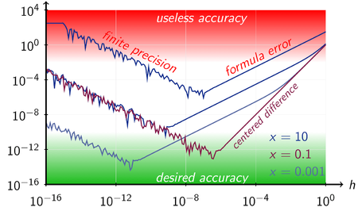
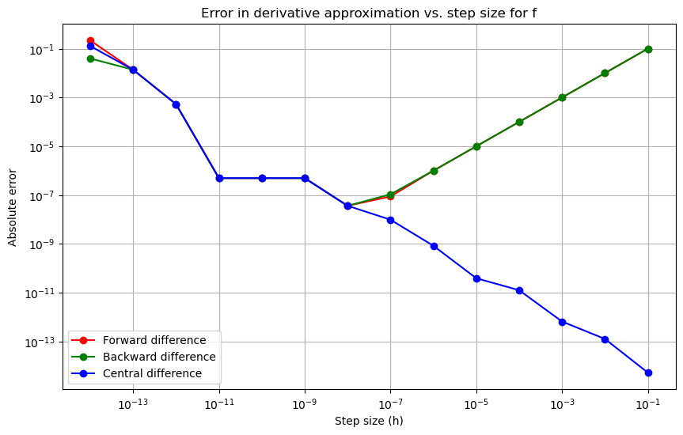
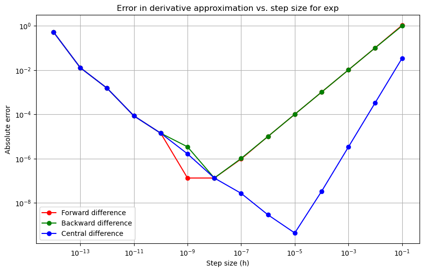
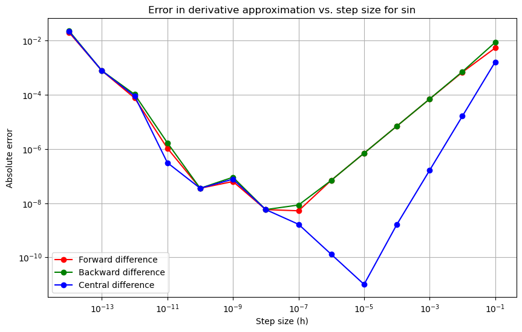

Learn the mathematical concept, see how it translates into Python code, and discover three numerical differentiation methods - forward, backward, and central. Watch as we visualize their performance, helping you understand which method provides the most precise results for your calculations!

{ align=center }
/// caption
Absolute Error Numerical Differentiation Example
///

<!-- more -->

### [Check the jupyter notebook](https://github.com/nickovchinnikov/datasatanism/blob/master/code/1.Numerical_Differentiation.ipynb)

<iframe width="1707" height="765" src="https://www.youtube.com/embed/Xynwf7su6DI" title="Mastering Derivatives: From Math to Code - Python Numerical Differentiation" frameborder="0" allow="accelerometer; autoplay; clipboard-write; encrypted-media; gyroscope; picture-in-picture; web-share" referrerpolicy="strict-origin-when-cross-origin" allowfullscreen></iframe>

## The Derivative: A Simple Example

Let's consider a basic function:

\[ f(x) = x^2 \]

The derivative of this function, \( f'(x) \), is:

\[ f'(x) = 2x \]

### Mathematical Definition of a Derivative

The derivative \( f'(x) \) is defined as:

\[ f'(x) = \lim_{h \to 0} \frac{f(x + h) - f(x)}{h} \]

Here's what this means:

- **\( f(x + h) \)**: The function's value when we slightly change the input by adding \( h \).
  
- **\( f(x) \)**: The function's original value.
  
- **\( \frac{f(x + h) - f(x)}{h} \)**: This fraction shows how much the function changes when its input changes by \( h \).

### Applying This to Our Function

For \( f(x) = x^2 \):

\[ f'(x) = \lim_{h \to 0} \frac{(x + h)^2 - x^2}{h} \]

Simplifying:

\[ f'(x) = \lim_{h \to 0} \frac{x^2 + 2xh + h^2 - x^2}{h} = \lim_{h \to 0} \frac{2xh + h^2}{h} = \lim_{h \to 0} 2x + h \]

As \( h \) approaches zero, we get:

\[ f'(x) = 2x \]

**Yes, math checks out!**

## Understanding Derivatives Through Coding

To really get how derivatives work, let's code them and see what's happening behind the scenes.

### The Functions

Let's define \( f(x) = x^2 \) in Python:

```python
def f(x):
    return x**2
```

Next, the derivative \( f'(x) = 2x \):

```python
def df(x):
    return 2*x
```

### Numerical Derivative

Now, how do we code the derivative's limit definition? We'll use a small value for \( h \):

\[ f'(x) \approx \frac{f(x+h) - f(x)}{h} \]

Here's our function to calculate this:

```python
def ndiff(f, x, h=1e-2):
    return (f(x + h) - f(x)) / h
```

## Testing Our Functions

Let's test with \( x = 3 \):

```python
x = 3

fx = f(x)  # This should give us 9
dfx = df(x)  # This should give us 6
fndfx = ndiff(f, x, h=1e-4)  # Here we use a smaller h for better precision

print(fx, dfx, fndfx)
```

- \( f(3) = 9 \)
- \( df(3) = 6 \)
- Our `ndiff` function gives us 6.0001, which is very close to the actual derivative.

### Exploring Step Size

As we reduce \( h \), the numerical derivative becomes more accurate:

```python
import matplotlib.pyplot as plt

x = 3
dfx = df(x)

hs = [10**-p for p in range(1, 15)]
abs_errors = []

for h in hs:
    ndfx = ndiff(f, x, h)
    abs_errors.append(abs(ndfx - dfx))

plt.plot(hs, abs_errors)
plt.xscale('log')
plt.yscale('log')
plt.xlabel('Step Size h')
plt.ylabel('Absolute Error')
plt.title('Error vs Step Size for Numerical Derivative')
plt.show()
```

This plot will show how the error decreases as we make \( h \) smaller, confirming our understanding of derivatives through practical implementation.

{ align=center }
/// caption
It's a dragon!
///

### Observations

- The plot shows error vs. step size.
- As we reduce \( h \), the error decreases initially, which is expected.
- Around \( 10^{-8} \), there's an inflection point where the error starts to **increase**.
- This indicates that beyond a certain small \( h \), our numerical method for differentiation might not be optimal due to precision issues in floating-point arithmetic.

Our basic approach to estimate numerical derivatives works well until we hit very small step sizes where computational errors become significant.

## Three Methods to Numerically Estimate Derivatives

There are three common ways to approximate derivatives numerically. Let me explain each:

### 1. **Forward Difference**

\[ \frac{df}{dx} \approx \frac{f(x + h) - f(x)}{h} \]

- **Why 'Forward'?** Because we're looking at how the function changes when we move \( x \) in the **positive direction** by a small amount \( h \).

### 2. **Backward Difference**

\[ \frac{df}{dx} \approx \frac{f(x) - f(x - h)}{h} \]

- **Why 'Backward'?** This method measures the change in the function by moving \( x \) slightly in the **negative direction**.

### 3. **Central Difference**

\[ \frac{df}{dx} \approx \frac{f(x + h) - f(x - h)}{2h} \]

- **The Process:**
  - We take the average of the forward and backward differences to get this formula.
  - Simplification leads to dropping common terms and results in the formula above.

- **Why 'Central'?** This method balances both directions, often providing the **most accurate** approximation of the derivative.

The **Central Difference** is usually the most precise for estimating derivatives numerically due to its symmetry and error cancellation properties.


## Comparing Three Numerical Differentiation Methods

Let's program and compare the performance of three numerical differentiation methods: Forward, Backward, and Central differences.

### The Functions

We already have `ndiff` for forward difference. Let's implement backward and central differences:

```python
def fdiff(f, x, h=1e-2):
    return (f(x + h) - f(x)) / h

def bdiff(f, x, h=1e-2):
    return (f(x) - f(x - h)) / h

def cdiff(f, x, h=1e-2):
    return (f(x + h) - f(x - h)) / (2 * h)
```

### Testing with Functions

#### Exponential Function

\[ \frac{d}{dx}e^x = e^x \]

```python
import numpy as np

def exp(x):
    return np.exp(x)

def d_exp(x):
    return np.exp(x)

x = 3
plot_errors(exp, d_exp, x)
```

{ align=center }
/// caption
Exponential Function
///

#### Sine Function

\[ \frac{d}{dx}sin(x) = cos(x) \]

```python
def sin(x):
    return np.sin(x)

def d_sin(x):
    return np.cos(x)

x = 3
plot_errors(sin, d_sin, x)
```

{ align=center }
/// caption
Sin Function
///

#### Hyperbolic Tangent

\[ \frac{d}{dx}tanh(x) = 1 - tanh^2(x) \]

```python
def tanh(x):
    return np.tanh(x)

def d_tanh(x):
    return 1 - np.tanh(x)**2

x = 3
plot_errors(tanh, d_tanh, x)
```

{ align=center }
/// caption
Hyperbolic Tangent Function
///

### Observations

- **Central Difference** is generally more precise, particularly at smaller step sizes.
- Forward and Backward methods show similar error behavior, but Central difference often results in lower errors, especially for \( h \approx 10^{-5} \).
- The performance can vary slightly based on the function being differentiated, but Central difference consistently outperforms the others in accuracy.

### Fun Fact:
The *symmetric difference quotient*, also known as the *central difference*, is used as the method for approximating derivatives in various calculators. Specifically, **TI-82, TI-83, TI-84, and TI-85** calculators all implement this technique with a standard step size of \( h = 0.001 \).

