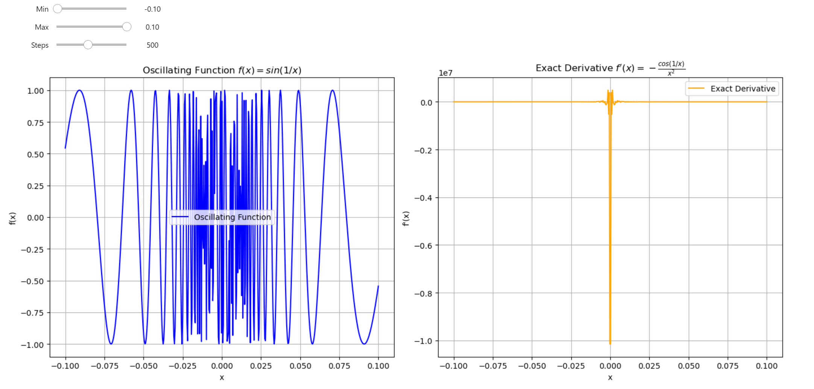

Using the **Centered Difference** approximation of the derivative can lead to **numerical instability**. Function optimization is a precise task; we cannot afford methods that introduce instability and unpredictability into our results. I've discovered a specific case that illustrates this issue.

{ align=center }
/// caption
Oscillating Function VS Exact Derivative
///

<!-- more -->

Let's compare the numerical derivative of the oscillating function $f(x) = \sin(\frac{1}{x})$ with its exact derivative. First, we need to determine the exact derivative analytically.

The exact derivative of $f(x) = \sin(\frac{1}{x})$ can be computed using the chain rule. The derivative is:

$$
f'(x) = \cos(\frac{1}{x}) \cdot \left(-\frac{1}{x^2}\right) = -\frac{\cos(\frac{1}{x})}{x^2}
$$

This derivative also oscillates as $x \rightarrow 0$ because it leads to division by zero! Let's define a legitimate function that works everywhere.


#### Oscillating Function

The function $f(x)$ is defined as:

$$
f(x) = 
\begin{cases} 
\sin\left(\frac{1}{x}\right) & \text{if } x \neq 0 \\
0 & \text{if } x = 0
\end{cases}
$$

*This function $\sin(\frac{1}{x})$ oscillates rapidly as $x \to 0$ and tends to explode to infinity. To prevent this behavior, I defined it as a piecewise function.*


#### Derivative

The derivative $f'(x)$ is:

$$
f'(x) = 
\begin{cases} 
-\frac{\cos\left(\frac{1}{x}\right)}{x^2} & \text{if } x \neq 0 \\
0 & \text{if } x = 0
\end{cases}
$$


### Visualize the Function and Derivative

Let's implement a Python script that computes both the numerical and exact derivatives for $f(x) = \sin(\frac{1}{x})$ as $x$ approaches 0, and then compare the results. We can plot this function along with its derivative.


```python
import numpy as np
import matplotlib.pyplot as plt
from ipywidgets import interact, FloatSlider, IntSlider


# Function to calculate the oscillating function sin(1/x) for an array of x values
def oscillating(x):
    """Vector-valued function that oscillates rapidly as x approaches 0."""

    # Create an array filled with zeros with the same shape as x
    result = np.zeros_like(x)
    # Create a boolean mask for x values not equal to zero
    non_zero_mask = x != 0
    # Apply sin(1/x) only where x is not zero to avoid division by zero
    result[non_zero_mask] = np.sin(1 / x[non_zero_mask])
    return result


# Function to compute the derivative of the oscillating function
def d_oscillating(x):
    """Vector-valued exact derivative of the oscillating function."""

    # Similar to oscillating, initialize result with zeros
    result = np.zeros_like(x)
    # Mask for non-zero x values
    non_zero_mask = x != 0
    # Calculate the derivative where x is not zero
    result[non_zero_mask] = -np.cos(1 / x[non_zero_mask]) / (x[non_zero_mask] ** 2)
    return result


# Function to plot both the oscillating function and its derivative
def plot_oscillating(min=-0.1, max=0.1, steps=500):
    # Generate x values between min and max, avoiding zero to prevent division by zero
    x_values = np.linspace(min, max, steps)

    # Compute the function values and its derivative
    y_values = oscillating(x_values)
    dy_values = d_oscillating(x_values)

    # Create plots
    plt.figure(figsize=(14, 6))

    # Plot oscillating function
    plt.subplot(1, 2, 1)
    plt.plot(x_values, y_values, label='Oscillating Function', color='blue')
    plt.title('Oscillating Function $f(x) = sin(1/x)$')
    plt.xlabel('x')
    plt.ylabel('f(x)')
    plt.grid(True)
    plt.legend()

    # Plot exact derivative
    plt.subplot(1, 2, 2)
    plt.plot(x_values, dy_values, label='Exact Derivative', color='orange')
    plt.title("Exact Derivative $f'(x) = -\\frac{cos(1/x)}{x^2}$")
    plt.xlabel('x')
    plt.ylabel("f'(x)")
    plt.grid(True)
    plt.legend()

    plt.tight_layout()
    plt.show()

# Use interact to create interactive sliders for adjusting plot parameters
interact(
    plot_oscillating,
    min=FloatSlider(min=-0.1, max=-0.01, step=0.01, value=-0.1, description='Min'),
    max=FloatSlider(min=0.01, max=0.1, step=0.01, value=0.1, description='Max'),
    steps=IntSlider(min=100, max=1000, step=100, value=500, description='Steps')
)

```


#### Plot

{ align=center }
/// caption
Oscillating Function VS Exact Derivative
///

The derivative of this function is not well-defined at $x = 0$, and for practical purposes, we can consider it as $0$.

These expressions describe an oscillating function that becomes increasingly unpredictable as $x$ approaches zero, with its derivative mirroring the complex behavior in that region.


### Numerical Derivative with the Central Difference

We can attempt to estimate the derivative of this oscillated function using the [Central Difference method](./numerical_differentiation.md#3-central-difference). This approach works well for larger values of $x$ but as $x$ gets smaller, the method begins to fail. Here is how we can demonstrate this:

```python
import numpy as np


def cdiff(func, x, h=1e-3):
    """Centered difference approximation of the derivative."""
    return (func(x + h) - func(x - h)) / (2 * h)


def oscillating(x):
    """Function that oscillates rapidly as x approaches 0."""
    return np.sin(1/x) if x != 0 else 0


def d_oscillating(x):
    """Exact derivative of the oscillating function."""
    if x != 0:
        return -np.cos(1/x) / (x**2)
    else:
        return 0  # Not defined, but can be treated as 0 for comparison


# Test values close to 0
x_values = [0.1, 0.01, 0.001, 0.0001, 0.00001]

# Compute and compare the derivatives
print(f"{'x':>12} | {'Numerical Derivative':>20} | {'Exact Derivative':>20} | {'Abs Error':>20}")
print("-" * 80)
for x in x_values:
    numerical_derivative = cdiff(oscillating, x)
    exact_deriv = d_oscillating(x)
    
    # Calculate the relative error
    if exact_deriv != 0:  # Avoid division by zero for relative error
        abs_error = np.abs((numerical_derivative - exact_deriv))
    else:
        abs_error = np.nan  # Not defined for comparison

    print(f"{x:>12} | {numerical_derivative:>20.6f} | {exact_deriv:>20.6f} | {abs_error:>20.6f}")

```


#### Output

|       x       | Numerical Derivative | Exact Derivative      | Abs Error           |
|---------------|-----------------------|-----------------------|---------------------|
| 0.1           | 83.721363            | 83.907153             | 0.185790           |
| 0.01          | 555.383031           | -8623.188723          | 9178.571754        |
| 0.001         | -233.885903          | -562379.076291        | 562145.190388      |
| 0.0001        | -884.627816          | 95215536.825901       | 95216421.453717    |
| 1e-05         | -736.979383          | 9993608074.376921     | 9993608811.356304  |


**Rapid Oscillation**: The exact derivative $-\frac{\cos(\frac{1}{x})}{x^2}$ oscillates rapidly, especially as $x$ approaches zero. The $\cos(\frac{1}{x})$ term oscillates between `-1` and `1`, causing the derivative to fluctuate greatly in both positive and negative directions. The centered difference method can still provide accurate approximations for larger values of $x$ like `0.1` when we have:

* **Numerical Derivative: 83.721363 VS Exact Derivative 83.907153**

**Numerical Stability** issues start to appear for smaller values of $x$ such as `0.01` where we have:

* **Numerical Derivative: 555.383031 VS Exact Derivative -8623.188723**

As $x$ approaches zero, the numerical method begins to exhibit instability due to the oscillatory nature of both the function and its derivative. This instability can be critical in deep learning applications, as we need to optimize functions that handle high-dimensional data.

Recall the [MNIST dataset challange from my first video](./dive_into_learning_from_data.md)? With 784 pixels for such simple data! Imagine now working with high-resolution images, video, or text data, which requires utmost precision.


### Final words

Numerical differentiation is excellent for understanding the true nature of the derivative, but it falls short when facing real challenges in the Deep Learning field. We should use the exact derivative of the function; tools like `backpropagation` or `autodiff` algorithms can compute these derivatives efficiently. That's where the true power of frameworks like `PyTorch` lies - in `autodiff`!

