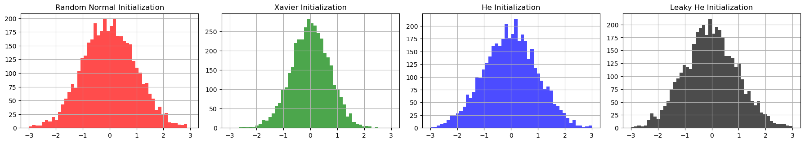
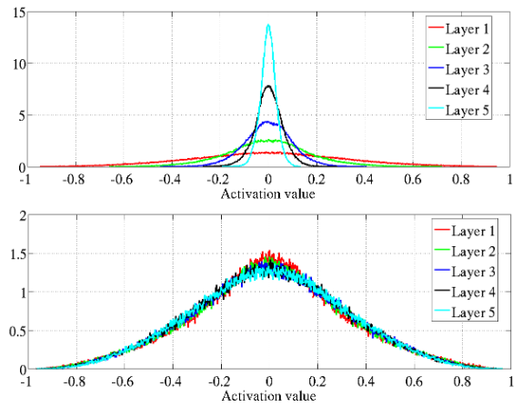
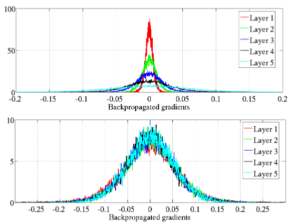
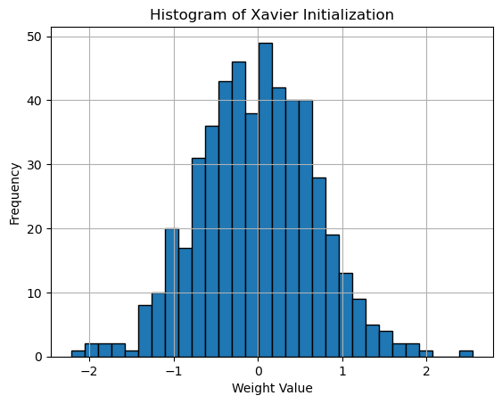
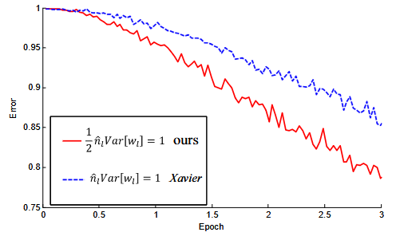
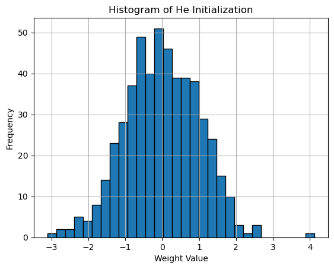
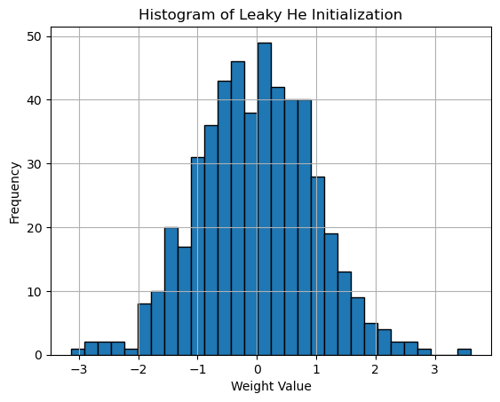

Weight initialization is crucial in training neural networks, as it sets the starting point for optimization algorithms. The activation function applies a non-linear transformation in our network. Different activation functions serve different purposes. Choosing the right weight initialization and activation function is key to better neural network performance. `Xavier` initialization is ideal for `Sigmoid` or `Tanh` in feedforward networks. `He` initialization pairs well with `ReLU` for faster convergence, especially in `CNNs`. Matching these improves training efficiency and model performance.



/// caption
Comparison of different initialization methods
///


<!-- more -->


## Gaussian Initialization

Gaussian (or Normal) Initialization draws weights from a normal distribution. The concept of Gaussian initialization has its roots in the early studies of neural networks, where researchers recognized the importance of weight initialization in preventing problems like *vanishing and exploding gradients*. The work of Glorot and Bengio (2010) further emphasized the need for proper initialization methods, leading to the development of techniques like [Xavier initialization](#xavier-glorot-initialization).


Weights $W$ are initialized using a normal distribution defined as:

$$W \sim \mathcal{N}(0, \sigma^2)$$

where $\mathcal{N}(0, \sigma^2)$ represents a normal distribution with mean 0 and variance $\sigma^2$.


??? note "Gaussian (Normal) Distribution"

    The standard normal distribution $\mathcal{N}(0, 1)$ can be expressed using its probability density function (PDF):

    $$\mathcal{N}(x \mid \mu, \sigma^2) = \frac{1}{\sqrt{2 \pi \sigma^2}} e^{-\frac{(x - \mu)^2}{2 \sigma^2}}$$

    For the standard normal distribution, where $\mu = 0$ and $\sigma^2 = 1$, this simplifies to:

    $$\mathcal{N}(x \mid 0, 1) = \frac{1}{\sqrt{2 \pi}} e^{-\frac{x^2}{2}}$$

    Here $x$ is the value for which the probability density is calculated, $\mu$ is the mean (here 0), and $\sigma^2$ is the variance (here 1).


Here is the weights histogram plot:


```python
np.random.seed(96)

# Define input and output sizes
input_size, output_size = 2, 256

# Generate normal distribution
weights_normal = np.random.randn(input_size, output_size)

# Plot histogram
plt.hist(weights_normal.flatten(), bins=30, edgecolor='black')
plt.title('Histogram of Gaussian Initialization')
plt.xlabel('Weight Value')
plt.ylabel('Frequency')
plt.grid(True)
plt.show()

```

**Output:**


/// caption
Histogram of Gaussian Initialization
///

In practice, Gaussian initialization is often implemented as a variant of [Xavier initialization](#xavier-glorot-initialization), where the weights are drawn from a normal distribution scaled by the input dimension. **Most deep learning frameworks use this approach as their default initialization strategy.**


## Xavier (Glorot) Initialization

The original paper [Understanding the Difficulty of Training Deep Feedforward Neural Networks](https://www.researchgate.net/publication/215616968_Understanding_the_difficulty_of_training_deep_feedforward_neural_networks) by Xavier Glorot and Yoshua Bengio introduces the concept of Xavier (Glorot) Initialization, which addresses the challenges of training deep neural networks.

The authors explore how back-propagated gradients diminish as they move from the output layer to the input layer, particularly under standard initialization methods. This phenomenon can lead to *vanishing gradients*, making it difficult for deeper layers to learn effectively.

They propose a normalized initialization method that maintains consistent variances for activations and gradients across layers.



/// caption
Figure 6: Activation values normalized histograms with hyperbolic tangent activation, with standard (top) vs normalized initialization (bottom). Top: 0-peak increases for higher layers.
///



/// caption
Figure 7: Back-propagated gradients normalized histograms with hyperbolic tangent activation, with standard (top) vs normalized (bottom) initialization. Top: 0-peak decreases for higher layers.
///


This is achieved by initializing weights from a *uniform distribution* between:

$$W \in (-\sqrt{\frac{6}{n_{\text{in}} + n_{\text{out}}}}, \sqrt{\frac{6}{n_{\text{in}} + n_{\text{out}}}})$$

where $n_{\text{in}}$ and $n_{\text{out}}$ are the number of input and output neurons, respectively.

**Xavier (Glorot) Initialization:**

$$W \sim \mathcal{N}(0, \frac{1}{n_{\text{in}}})$$

where $\mathcal{N}(0, \frac{1}{n_{\text{in}}})$ is the standart normal distribution with the mean 0 and the variance $\frac{1}{n_{\text{in}}}$.

The `Xavier` initialization works particularly well with `Sigmoid` and `Tanh` activation functions because it helps prevent saturation. By ensuring that the variance of activations remains stable, it allows these functions to operate in their most effective range, thus facilitating better gradient flow during backpropagation.


??? note "The range of Xavier Uniform Initialization comes from the variance of the weights."

    Weights $W$ are initialized with a uniform distribution:

    $$W \sim U\left(-a, a\right)$$

    For a [uniform distribution](https://en.wikipedia.org/wiki/Continuous_uniform_distribution), the variance is given by:

    $$\text{Var}(W) = \frac{(b - a)^2}{12}$$  

    For a symmetric uniform distribution ($-a$ to $a$):

    $$\text{Var}(W) = \frac{(a - (-a))^2}{12} = \frac{(2a)^2}{12} = \frac{4a^2}{12} = \frac{a^2}{3}$$

    To balance the variance of inputs and outputs, we require:  

    $$\text{Var}(\text{outputs}) = \text{Var}(\text{inputs}) = \frac{1}{n_{\text{in}}}$$

    Thus, the total variance of the weights should satisfy:

    $$\frac{a^2}{3} = \frac{1}{n_{\text{in}} + n_{\text{out}}}$$

    Rearranging gives:

    $$a = \sqrt{\frac{3}{n_{\text{in}} + n_{\text{out}}}}$$

    To emphasize the range's symmetry and its relation to variance, the expression is often rewritten by factoring out $\sqrt{6}$. **Range for \(W\)**:

    $$W \in \left(-\sqrt{\frac{6}{n_{\text{in}} + n_{\text{out}}}}, \sqrt{\frac{6}{n_{\text{in}} + n_{\text{out}}}}\right)$$

    This equivalence comes from the relationship between the variance $\frac{a^2}{3}$ and the range $-a$ to $a$. The factor $\sqrt{6}$ arises naturally because the variance involves dividing the squared range $(2a)^2 = 4a^2$ by 12.


Here is the python implementation:


```python
np.random.seed(96)

# Define input and output sizes
input_size, output_size = 2, 256

# Generate normal distribution
N = np.random.randn(input_size, output_size)

# Xavier initialization
weights_xavier = N * np.sqrt(1. / input_size)

# Plot histogram
plt.hist(weights_xavier.flatten(), bins=30, edgecolor='black')
plt.title('Histogram of Xavier Initialization')
plt.xlabel('Weight Value')
plt.ylabel('Frequency')
plt.grid(True)
plt.show()

```


**Output:**


/// caption
Histogram of Xavier Initialization
///


The main lines:

```python
# Generate normal distribution
N = np.random.randn(input_size, output_size)

# Xavier initialization
weights_xavier = N * np.sqrt(1. / input_size)
```

This directly corresponds to:

$$W = N \cdot \sqrt{\frac{1}{n_{\text{in}}}}$$

Where: $N \sim \mathcal{N}(0, 1)$, a standard normal distribution, and $\sqrt{\frac{1}{n_{\text{in}}}}$ scales the standard deviation to match the Xavier initialization rule.

??? note "The range of Xavier Uniform Initialization comes from the variance of the weights."

    Xavier (Glorot) Initialization:

    $$W \sim \mathcal{N}(0, \frac{1}{n_{\text{in}}})$$

    This formula initializes weights $W$ with a normal distribution where the variance is $\frac{1}{n_{\text{in}}}$, ensuring the weights are scaled to prevent vanishing or exploding gradients during training.

    To scale the standard normal distribution to have the desired variance, we multiply the standard normal random variable $N \sim \mathcal{N}(0, 1)$ by a scaling factor. The scaling factor ensures that the variance of the weights is $\frac{1}{n_{\text{in}}}$. 

    Let's define the weight initialization as:

    $$W = N \cdot \sqrt{\frac{1}{n_{\text{in}}}}$$

    Here, $N$ is a random variable sampled from the standard normal distribution $\mathcal{N}(0, 1)$, and multiplying by $\sqrt{\frac{1}{n_{\text{in}}}}$ scales the variance of the weights. If you multiply a random variable $N$ by a constant $c$, the new variance becomes $\text{Var}(c \cdot N) = c^2 \cdot \text{Var}(N)$. For the standard normal distribution $N$, the variance is 1. By multiplying by $\sqrt{\frac{1}{n_{\text{in}}}}$, the variance of $W$ becomes:
    
    $$\text{Var}(W) = \left(\sqrt{\frac{1}{n_{\text{in}}}}\right)^2 \cdot \text{Var}(N) = \frac{1}{n_{\text{in}}} \cdot 1 = \frac{1}{n_{\text{in}}}$$

    This matches the desired variance in the Xavier initialization, ensuring that the weight distribution has the right scaling for stable training.


In modern deep learning practice, **Gaussian initialization with Xavier scaling** has become the de facto standard due to its robust performance across different architectures and tasks.


## He Initialization

He initialization, introduced in the paper [Delving Deep into Rectifiers: Surpassing Human-Level Performance on ImageNet Classification](https://arxiv.org/abs/1502.01852) by Kaiming He et al., addresses specific challenges when using `ReLU` activation functions in deep neural networks. This initialization method was developed to maintain variance across layers specifically for `ReLU`-based architectures, which became increasingly popular due to their effectiveness in reducing the vanishing gradient problem.


/// caption
Figure 2. The convergence of a 22-layer large model (B in Table 3). The x-axis is the number of training epochs. The y-axis is
the top-1 error of 3,000 random val samples, evaluated on the center crop. We use ReLU as the activation for both cases. Both our
initialization (red) and "Xavier" (blue) lead to convergence, but ours starts reducing error earlier.
///

The authors discovered that while `Xavier` initialization works well for linear and tanh activation functions, it can lead to dead neurons when used with `ReLU` activations. This occurs because `ReLU` sets all negative values to zero, effectively reducing the variance of the activations by half.

To compensate for this effect, `He` initialization scales the weights by a factor of $\sqrt{2}$:

$$W \sim \mathcal{N}(0, \frac{2}{n_{\text{in}}})$$

where $\mathcal{N}(0, \frac{2}{n_{\text{in}}})$ is the normal distribution with mean 0 and variance $\frac{2}{n_{\text{in}}}$, and $n_{\text{in}}$ is the number of input neurons.


??? note "Mathematical Intuition Behind He Initialization"

    The factor of 2 in `He` initialization comes from the `ReLU` activation function's behavior. When using `ReLU`:
    
    1. Approximately half of the neurons will output zero (for negative inputs)
    2. The other half will pass through unchanged (for positive inputs)
    
    This means the variance is effectively halved after `ReLU` activation. To maintain the desired variance:
    
    $$\text{Var}(W_{\text{He}}) = \frac{2}{n_{\text{in}}} = 2 \cdot \text{Var}(W_{\text{Xavier}})$$
    
    This compensates for the variance reduction caused by `ReLU`, ensuring proper gradient flow during training.


Here is the python implementation:

```python
# Define input and output sizes
input_size, output_size = 2, 256

# Generate normal distribution
N = np.random.randn(input_size, output_size)

# He initialization
weights_he = N * np.sqrt(2. / input_size)

# Plot histogram
plt.hist(weights_he.flatten(), bins=30, edgecolor='black')
plt.title('Histogram of He Initialization')
plt.xlabel('Weight Value')
plt.ylabel('Frequency')
plt.grid(True)
plt.show()

```


**Output:**


/// caption
Histogram of He Initialization
///

The main lines:

```python
# Generate normal distribution
N = np.random.randn(input_size, output_size)

# He initialization
weights_he = N * np.sqrt(2. / input_size)
```

This directly corresponds to:

$$W = N \cdot \sqrt{\frac{2}{n_{\text{in}}}}$$

Where: $N \sim \mathcal{N}(0, 1)$ is a standard normal distribution, and $\sqrt{\frac{2}{n_{\text{in}}}}$ scales the standard deviation to match the `He` initialization rule.

He initialization has become particularly important in modern deep learning architectures, especially in Convolutional Neural Networks (CNNs) where `ReLU` is the dominant activation function. By properly scaling the initial weights, `He` initialization helps maintain healthy gradients throughout the network, enabling faster convergence and better overall performance in deep architectures.


## He Initialization for LeakyReLU

`He` initialization can be further adapted for `LeakyReLU` activation functions. While standard `He` initialization accounts for `ReLU`'s zero output for negative inputs, `LeakyReLU` has a small slope $\alpha$ for negative values, which affects the variance calculation.

For `LeakyReLU` defined as:

$$
f(x) = \begin{cases} 
x & \text{if } x > 0 \\
\alpha x & \text{if } x \leq 0
\end{cases}
$$

The initialization is modified to:

$$W \sim \mathcal{N}(0, \frac{2}{(1 + \alpha^2)n_{\text{in}}})$$

where $\alpha$ is the negative slope parameter of `LeakyReLU` (typically 0.01).

??? note "Mathematical Intuition Behind He Initialization for LeakyReLU"

    The adjustment for `LeakyReLU` comes from considering both positive and negative inputs:
    
    1. For positive inputs (approximately half), the variance remains unchanged
    2. For negative inputs (approximately half), the variance is multiplied by $\alpha^2$
    
    The total variance after `LeakyReLU` activation becomes:
    
    $$\text{Var}(output) = \frac{1}{2} \cdot \text{Var}(input) + \frac{1}{2} \cdot \alpha^2 \cdot \text{Var}(input) = \frac{1 + \alpha^2}{2} \cdot \text{Var}(input)$$
    
    To maintain variance across layers, we scale the initialization by $\sqrt{\frac{2}{1 + \alpha^2}}$ compared to standard `He` initialization.

Here is the python implementation:

```python
# Define input and output sizes and LeakyReLU alpha
input_size, output_size = 2, 256
alpha = 0.01  # LeakyReLU negative slope

# Generate normal distribution
N = np.random.randn(input_size, output_size)

# He initialization for LeakyReLU
weights_he_leaky = N * np.sqrt(2. / ((1 + alpha**2) * input_size))

# Plot histogram
plt.hist(weights_he_leaky.flatten(), bins=30, edgecolor='black')
plt.title('Histogram of He Initialization (LeakyReLU)')
plt.xlabel('Weight Value')
plt.ylabel('Frequency')
plt.grid(True)
plt.show()
```

**Output:**


/// caption
Histogram of He Initialization adapted for LeakyReLU activation
///

The main lines:

```python
# Generate normal distribution
N = np.random.randn(input_size, output_size)

# He initialization for LeakyReLU
weights_he_leaky = N * np.sqrt(2. / ((1 + alpha**2) * input_size))
```

This directly corresponds to:

$$W = N \cdot \sqrt{\frac{2}{(1 + \alpha^2)n_{\text{in}}}}$$

Where: $N \sim \mathcal{N}(0, 1)$ is a standard normal distribution, and $\sqrt{\frac{2}{(1 + \alpha^2)n_{\text{in}}}}$ scales the standard deviation to account for the `LeakyReLU` activation function.

When $\alpha = 0$, this reduces to standard `He` initialization for `ReLU`. For typical `LeakyReLU` with $\alpha = 0.01$, the difference from standard `He` initialization is minimal but can become more significant with larger $\alpha$ values.


## Plot: Comparing Initialization Methods

To better understand the differences between these initialization methods, let's examine them side by side. The following plots show the distribution of weights for each initialization method:

```python

np.random.seed(96)

# Define input and output sizes
input_size, output_size, bins = 2, 2000, 50

# LeakyReLU negative slope
alpha = 0.01

# Random normal initialization
weights_random = np.random.randn(input_size, output_size)

# Xavier (Glorot) initialization
weights_xavier = np.random.randn(input_size, output_size) * np.sqrt(1. / input_size)

# He initialization
weights_he = np.random.randn(input_size, output_size) * np.sqrt(2. / input_size)

# Leaky He init
weights_leaky_he = np.random.randn(input_size, output_size) * np.sqrt(2. / ((1 + alpha**2) * input_size))

# Plotting the histograms for the weights initialized by different methods
plt.figure(figsize=(18, 6))

# Random init plot
plt.subplot(2, 4, 1)
plt.hist(weights_random.flatten(), range=[-3, 3], bins=bins, color='red', alpha=0.7)
plt.title('Random Normal Initialization')
plt.grid(True)

# Xavier init plot
plt.subplot(2, 4, 2)
plt.hist(weights_xavier.flatten(), range=[-3, 3], bins=bins, color='green', alpha=0.7)
plt.title('Xavier Initialization')
plt.grid(True)

# He initialization plot
plt.subplot(2, 4, 3)
plt.hist(weights_he.flatten(), range=[-3, 3], bins=bins, color='blue', alpha=0.7)
plt.title('He Initialization')
plt.grid(True)

# Leaky He initialization plot
plt.subplot(2, 4, 4)
plt.hist(weights_leaky_he.flatten(), range=[-3, 3], bins=bins, color='black', alpha=0.7)
plt.title('Leaky He Initialization')
plt.grid(True)

plt.tight_layout()
plt.show()

```


**Output:**


/// caption
Comparison of different initialization methods (left-right): Random Normal, Xavier, He, and Leaky He
///

The plots reveal several key differences between the initialization methods:

1. **Random Normal Initialization** (red) shows the widest spread of weights, with no consideration for the network architecture. This can lead to vanishing or exploding gradients, especially in deeper networks.

2. **Xavier Initialization** (green) demonstrates a more controlled distribution, with weights scaled according to the input dimension. The narrower spread helps maintain stable gradients when using sigmoid or tanh activation functions.

3. **He Initialization** (blue) shows a slightly wider distribution than Xavier, but still maintains a structured spread. The increased variance compensates for the ReLU activation function's tendency to zero out negative values.

4. **Leaky He Initialization** (black) scales the variance for `LeakyReLU` activations, slightly narrowing the spread compared to **He Initialization**. This accounts for the negative slope $\alpha$, ensuring effective propagation of both positive and negative signals.


??? note "Distribution Characteristics"

    The variance of each distribution reflects its intended use:
    
    - Random Normal: $\sigma^2 = 1$
    - Xavier: $\sigma^2 = \frac{1}{n_{\text{in}}}$
    - He: $\sigma^2 = \frac{2}{n_{\text{in}}}$
    - Leaky He: $\sigma^2 = \frac{2}{(1 + \alpha^2)n_{\text{in}}}$
    
    These differences in variance directly impact how well each method maintains the signal through deep networks with different activation functions.


## Universal Parameter Implementation

The `Parameter` class for the weight initialization.

```python
import numpy as np
from typing import Literal

def parameter(
    input_size: int,
    output_size: int,
    init_method: Literal["xavier", "he", "he_leaky", "normal", "uniform"] = "xavier",
    gain: float = 1,
    alpha: float = 0.01
) -> np.ndarray:
    """
    Initialize weights using specified initialization method.

    Args:
        input_size (int): Number of input neurons.
        output_size (int): Number of output neurons.
        init_method (str): Method of initialization ("xavier", "he", "he_leaky", "normal", "uniform").
        gain (float): Scaling factor for weight initialization.
        alpha (float): Slope for Leaky ReLU in "he_leaky" initialization.

    Returns:
        np.ndarray: The initialized weight matrix.
    
    Raises:
        ValueError: If the initialization method is unknown.
    """
    weights = np.random.randn(input_size, output_size)

    if init_method == "xavier":
        std = gain * np.sqrt(1.0 / input_size)
        return std * weights
    if init_method == "he":
        std = gain * np.sqrt(2.0 / input_size)
        return std * weights
    if init_method == "he_leaky":
        std = gain * np.sqrt(2.0 / (1 + alpha**2) * (1 / input_size))
        return std * weights
    if init_method == "normal":
        return gain * weights
    if init_method == "uniform":
        return gain * np.random.uniform(-1, 1, size=(input_size, output_size))

    raise ValueError(f"Unknown initialization method: {init_method}")


class Parameter:
    """
    A class to represent and initialize neural network parameters (weights).
    
    Attributes:
        gain (float): Scaling factor for weight initialization.
        input_size (int): Number of input neurons.
        output_size (int): Number of output neurons.
    
    Methods:
        he(): Initializes weights using He initialization.
        he_leaky(alpha): Initializes weights using He initialization with Leaky ReLU.
        xavier(): Initializes weights using Xavier initialization.
        random(): Initializes weights with a normal distribution.
        uniform(): Initializes weights with a uniform distribution.
    """
    def __init__(self, input_size: int, output_size: int, gain: float = 1):
        """
        Initialize the Parameter object with input size, output size, and scaling factor.

        Args:
            input_size (int): Number of input neurons.
            output_size (int): Number of output neurons.
            gain (float): Scaling factor for initialization.
        """
        self.input_size = input_size
        self.output_size = output_size
        self.gain = gain

    def he(self) -> np.ndarray:
        """
        Initializes weights using He initialization (for ReLU activations).

        Returns:
            np.ndarray: The initialized weight matrix.
        """
        return parameter(self.input_size, self.output_size, "he", self.gain)

    def he_leaky(self, alpha: float = 0.01) -> np.ndarray:
        """
        Initializes weights using He initialization with Leaky ReLU.

        Args:
            alpha (float): Slope of Leaky ReLU.

        Returns:
            np.ndarray: The initialized weight matrix.
        """
        return parameter(self.input_size, self.output_size, "he_leaky", self.gain, alpha)

    def xavier(self) -> np.ndarray:
        """
        Initializes weights using Xavier initialization.

        Returns:
            np.ndarray: The initialized weight matrix.
        """
        return parameter(self.input_size, self.output_size, "xavier", self.gain)

    def random(self) -> np.ndarray:
        """
        Initializes weights with a standard normal distribution.

        Returns:
            np.ndarray: The initialized weight matrix.
        """
        return parameter(self.input_size, self.output_size, "normal", self.gain)

    def uniform(self) -> np.ndarray:
        """
        Initializes weights using a uniform distribution.

        Returns:
            np.ndarray: The initialized weight matrix.
        """
        return parameter(self.input_size, self.output_size, "uniform", self.gain)

```

**Example of Usage:**

```python
param = Parameter(input_size=1, output_size=10, gain=0.1)
weights = param.he()  # Will use "he" initialization
weights

```

**Output:**

```
array([[-0.13668641,  0.06869297,  0.14488719,  0.13556128, -0.10379101,
        -0.02760059, -0.20395249,  0.08597498, -0.11700688, -0.21882887]])
```


## Conclusion

The choice of weight initialization method significantly impacts neural network training dynamics. Through our analysis, we can draw several key conclusions:

1. Random (Normal) initialization, while simple, lacks the mathematical foundation to ensure stable gradient flow in deep networks.

2. `Xavier` initialization provides a robust solution for networks using `sigmoid` or `tanh` activation functions by maintaining variance across layers.

3. `He` initialization builds upon `Xavier's` insights to specifically address the characteristics of `ReLU` activation functions, making it the preferred choice for modern architectures using `ReLU` and its variants.

4. `Leaky He` initialization extends `He` initialization to account for the non-zero negative slope of `LeakyReLU` activations, ensuring both positive and negative signals propagate effectively through the network. The slight adjustment in variance makes it ideal for networks with `LeakyReLU` or similar activations.

The evolution from random to `Xavier` to `He` initialization reflects our growing understanding of deep neural networks. Each method addresses specific challenges in training deep networks, with `He` initialization currently standing as the most widely used approach in modern architectures, particularly those employing `ReLU` activations.

While batch normalization has made weight initialization less critical, it’s still important. **Batch normalization** normalizes layer inputs, reducing the effects of poor initialization. Even so, starting with proper methods like `Xavier` or `He` can improve convergence speed. Combining good initialization with batch normalization gives the best results for training deep networks.
