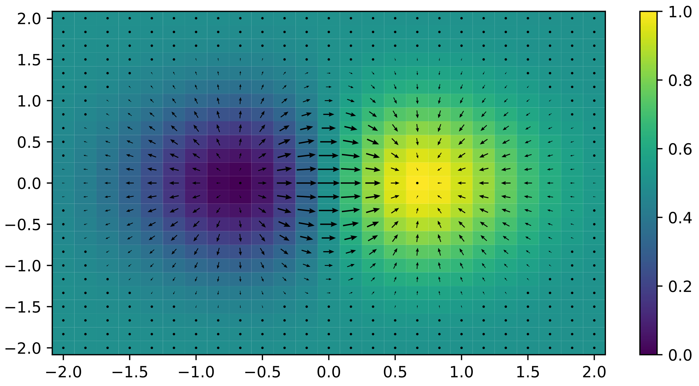
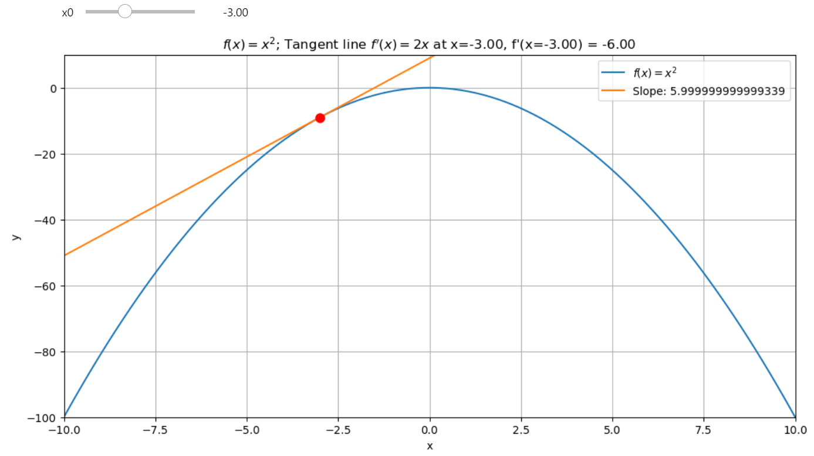
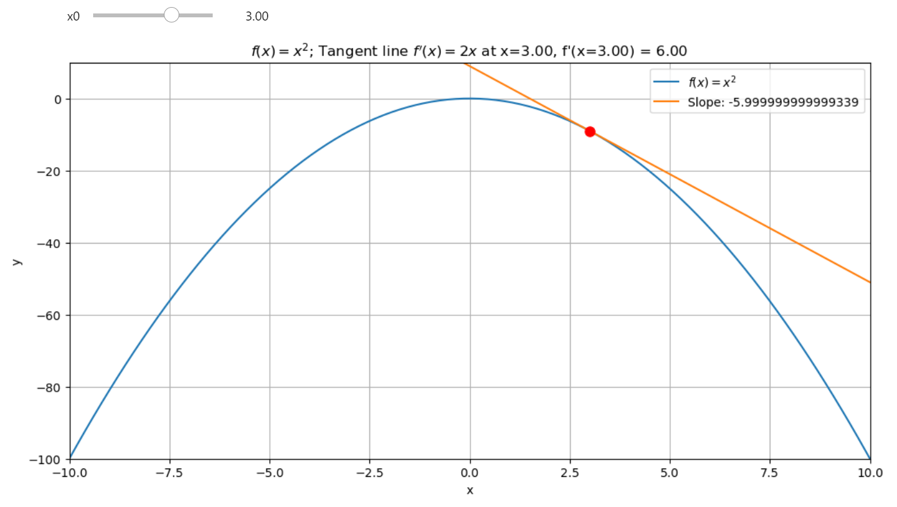
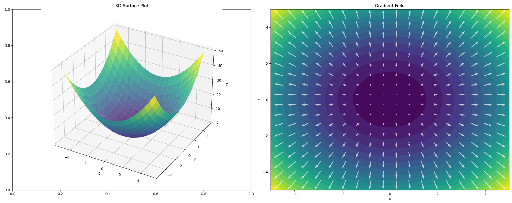

The gradient, \( \nabla f(\textbf{x}) \), tells us the direction in which a function increases the fastest. But why?

{ align=center }
/// caption
Gradient direction in 3D from Min => Max
///


<!-- more -->


### [Check the jupyter notebook](https://github.com/nickovchinnikov/datasatanism/blob/master/code/2.GradientIsTheSteepestAscent.ipynb)


### What is gradient?

Gradient is a vector of partial derivatives of a function. It's a vector of derivatives of a function with respect to its variables.
For example, if we have a function $f(x, y)$, then the gradient of this function is a vector of its partial derivatives with respect to $x$ and $y$.

$$\nabla f(x, y) = \left(\frac{\partial f}{\partial x}, \frac{\partial f}{\partial y}\right)$$

The Gradient is the Derivative of a multivariable (multi-dimensional) function in every direction. Strictly speaking, it's the Partial Derivatives; we apply the derivative to each variable one at a time. We can simply understand the process in one direction and then do the same for all directions!


## Derivative definition

The derivative measures how the function's value changes as we move along the input axis. Here's why based on the limit definition - the derivative at a point \(x\) is defined as:

$$f'(x) = \lim_{h \to 0} \frac{f(x + h) - f(x)}{h}$$

This expression calculates **the rate of change of the function \(f(x)\) over a small interval \(h\)**.

The fraction shows how much the function value (\(f(x)\)) changes per unit change in \(x\):

$$\frac{f(x + h) - f(x)}{h}$$

This is the **slope** of the line connecting \(x\) and \(x + h\).

**As \(h\) gets smaller** the limit \(\lim_{h \to 0}\) makes \(h\) shrink to an infinitesimally small value. This zooms in on the curve around \(x\), ensuring we measure the exact slope at \(x\).

If you follow the derivative means you follow to the steepest ascent all the time. The derivative gives the direction of the fastest increase in \(f(x)\) because it captures how \(f(x)\) changes most rapidly with respect to \(x\). 

At any point \( x \), the derivative \( f'(x) \) indicates the slope of the tangent line, showing how \( f(x) \) changes most rapidly with respect to \( x \). If you move in the direction of \( f'(x) \), you are indeed moving towards the steepest ascent of \( f(x) \).


### Direction of Movement

* **If \( f'(x) \) is positive**, moving in the direction of the derivative increases \( f(x) \).

* **If \( f'(x) \) is negative**, following "the negative" side from the perspective of the \( x \) - axis means moving in the direction opposite to the derivative to increase \( f(x) \).


**Mathematical Expression**: Given a function \( f(x) \) and starting at \( x_0 \), the update rule for moving along the steepest ascent can be written as:

\[ x_{n+1} = x_n + \alpha \cdot f'(x_n) \]

**where:**

* \( x_n \) is your current position on the \( x \)-axis.
* \( f'(x_n) \) is the derivative at \( x_n \).
* \( \alpha \) (learning rate) determines how big a step we take towards the steepest ascent.


**Explanation**: 

- If \( f'(x_n) > 0 \), \( x_{n+1} \) will be greater than \( x_n \), moving you uphill along \( f(x) \).

{ align=center }
/// caption
Before the extrema point
///

- If \( f'(x_n) < 0 \), \( x_{n+1} \) will still be greater than \( x_n \) because you're adding a negative value (which is correct if we interpret "following the negative" as moving in the opposite direction of the derivative to increase the function).

{ align=center }
/// caption
After the extrema point
///

This `ascent` function does exactly this, iteratively applying the derivative to move towards where the function \( f(x) \) increases most rapidly, whether that's by directly following a positive derivative or by counteracting a negative derivative.

```python
def ascent(f, x0, steps=5, lr=0.3):
    result = [x0]

    for _ in range(steps):
        dfx0 = cdiff(f, x0)
        x1 = x0 + dfx0 * lr
        result.append(x1)
        x0 = x1

    return result
```

*`cdiff` here is the [Central Difference](./numerical_differentiation.md#3-central-difference)*


## Gradient and Steepest Ascent in Multiple Dimensions

**For the gradient we just follow the same logic but for every variable in the gradient vector.** Just as in the single-variable case, the gradient in multiple dimensions gives us the direction of the fastest increase for a multivariable function \( f(x, y) \). The gradient vector \( \nabla f(x, y) \) contains partial derivatives with respect to each variable:

\[ \nabla f(x, y) = \left( \frac{\partial f}{\partial x}, \frac{\partial f}{\partial y} \right) \]

**Direction of Movement for Gradient:** Each component of the gradient vector points in the direction where \( f \) increases most rapidly for that particular variable.

**Mathematical Expression for Gradient Ascent:**

To ascend along the gradient, we update each variable according to its corresponding partial derivative:

\[ \mathbf{x}_{n+1} = \mathbf{x}_n + \alpha \cdot \nabla f(\mathbf{x}_n) \]


where:

* \( \mathbf{x}_n = \begin{pmatrix} x_n \\ y_n \end{pmatrix} \) represents the current point in the space.
  
* \( \nabla f(\mathbf{x}_n) \) is the gradient at that point.
  
* \( \alpha \) (learning rate) scales the step size.


**Explanation:**

- **Positive Component:** If a partial derivative is positive, moving in the direction of that component increases \( f \).
- **Negative Component:** If a partial derivative is negative, moving opposite to that component (i.e., in the direction of \( -\nabla f \)) still aims to increase \( f \), as you're moving away from where the function decreases.


**Gradient Ascent Function:**

```python
def gradient_ascent(f, initial_coords, steps=5, lr=0.3):
    result = [initial_coords]
    x = initial_coords  # Use a list or numpy array for vector-like operations

    for _ in range(steps):
        # Assuming we have a function to compute the gradient
        grad = compute_gradient(f, *x)
        x = [xi + gi * lr for xi, gi in zip(x, grad)]
        result.append(x.copy())

    return result
```

Here, `compute_gradient(f, *x)` would return the gradient vector at `x`, where `x` is a list or array of coordinates. This function iteratively moves in the direction of the gradient to find where the function `f(x, y)`, increases most rapidly, much like the single-variable case but now in multiple dimensions.


## Gradient ascent in action!

```python
import numpy as np

# Example function and its gradient
def f(x, y):
    return -(x**2 + y**2) + 4  # Paraboloid (maximum at (0, 0))

def grad_f(x, y):
    return [-2 * x, -2 * y]  # Gradient of the function


def gradient_ascent(grad_f, initial_coords, steps=5, lr=0.3):
    """
    Perform gradient ascent to maximize the function f.

    Parameters:
    - grad_f: A function that returns the gradient of f as a list or array.
    - initial_coords: A list or array of initial coordinates for the ascent.
    - steps: Number of iterations for the ascent.
    - lr: Learning rate, which controls the step size.

    Returns:
    - result: A list of coordinates visited during the ascent.
    """
    result = [initial_coords.copy()]  # Copy to avoid modification issues
    current_point = initial_coords    # Use descriptive names for clarity

    for _ in range(steps):
        # Compute the gradient at the current point
        grad = grad_f(*current_point)
        # Update each coordinate using the gradient and learning rate
        current_point = [xi + gi * lr for xi, gi in zip(current_point, grad)]
        result.append(current_point.copy())  # Store a copy of the current point

    return result


# Perform gradient ascent
trajectory = gradient_ascent(grad_f, initial_coords=[1, 1], steps=10, lr=0.1)
trajectory

```

### Output

You can see how it goes upwards to the maxima!

```
[[1, 1],
 [0.8, 0.8],
 [0.64, 0.64],
 [0.512, 0.512],
 [0.4096, 0.4096],
 [0.32768, 0.32768],
 [0.26214400000000004, 0.26214400000000004],
 [0.20971520000000005, 0.20971520000000005],
 [0.16777216000000003, 0.16777216000000003],
 [0.13421772800000004, 0.13421772800000004],
 [0.10737418240000003, 0.10737418240000003]]
```


## The Dot Product Formula is the key!

For a given unit vector \( \vec{v} \), the **directional derivative** measures this, and it's defined as:

$$\nabla_{\vec{v}} f = \nabla f(\textbf{x}) \cdot \vec{v}$$

Using the dot product formula, we can rewrite this as:

$$\nabla_{\vec{v}} f = |\nabla f(\textbf{x})||\vec{v}|\cos \theta$$

Since \( \vec{v} \) is a unit vector (\( |\vec{v}| = 1 \)), this simplifies to:

$$\nabla_{\vec{v}} f = |\nabla f(\textbf{x})| \cos \theta$$

Here, \( \theta \) is the angle between \( \nabla f(\textbf{x}) \) and \( \vec{v} \). The key insight? The **cosine of the angle**, \( \cos \theta \), determines how large the directional derivative is:

**When \( \theta = 0^\circ \):** \( \cos(0) = 1 \), so \( \nabla_{\vec{v}} f \) reaches its maximum value:
  
$$\nabla_{\vec{v}} f = |\nabla f(\textbf{x})|$$

**For any other angle:** \( \cos \theta < 1 \), so the directional derivative is smaller.

Thus, the gradient \( \nabla f(\textbf{x}) \) points in the **steepest ascent** direction because that's where \( \cos \theta = 1 \) the function increases the fastest when you move directly in the direction of the gradient!

**The gradient vector \( \nabla f(\textbf{x}) \) not only gives the direction of steepest ascent but also quantifies how steep this ascent is**, and by using the cosine of the angle between the gradient and any other direction, we can determine the rate of change in that direction. This understanding is fundamental in fields like optimization where we aim to find the path of maximum increase or decrease of a function.


## Visualizing the Gradient Field

The function \( f(x, y) = x^2 + y^2 \) is a classic example. Its gradient points outward, showing how the function rises steeply as you move away from the origin. Here's an interactive plot to explore the gradient field:

```python
import numpy as np
import matplotlib.pyplot as plt
from ipywidgets import interact, IntSlider, FloatSlider


def f2d(x, y):
    r"""
    3d Paraboloid function $f(x, y) = x^2 + y^2$.

    Args:
    x: x coordinate
    y: y coordinate

    Returns:
    Value of the function at point (x, y)
    """
    return x**2 + y**2


def grad_f2d(x, y):
    """
    Gradient of the function $f(x, y) = x^2 + y^2$.

    Args:
    x: x coordinate
    y: y coordinate

    Returns:
    Gradient of the function at point (x, y)
    """
    return np.array([2*x, 2*y])


def plot_gradient_field(density=10, arrow_scale=20):
    r"""
    Plot the gradient field of the function $f(x, y) = x^2 + y^2$.

    Args:
    density: density of the grid
    arrow_scale: scale of the arrows
    """
    # Create the x/y grid
    x = np.linspace(-5, 5, density)
    y = np.linspace(-5, 5, density)

    # Create the meshgrid X/Y
    X, Y = np.meshgrid(x, y)
    # Compute the function values
    Z = f2d(X, Y)

    # Create the figure and subplots
    fig, (ax1, ax2) = plt.subplots(1, 2, figsize=(20, 8))

    # 3D surface plot
    ax1 = fig.add_subplot(121, projection='3d')
    ax1.plot_surface(X, Y, Z, cmap='viridis', alpha=0.8)
    ax1.set_xlabel('X')
    ax1.set_ylabel('Y')
    ax1.set_zlabel('Z')
    ax1.set_title('3D Surface Plot')

    # 2D contour plot with gradient field
    ax2.contourf(X, Y, Z, levels=20, cmap='viridis')
    
    # Compute the gradient
    U, V = grad_f2d(X, Y)
    # Plot the gradient field
    ax2.quiver(X, Y, U, V, scale=arrow_scale, scale_units='inches', color='w', alpha=0.7)
    
    ax2.set_xlabel('X')
    ax2.set_ylabel('Y')
    ax2.set_title('Gradient Field')

    plt.tight_layout()
    plt.close(fig)
    return fig

# Create interactive plot
interact(plot_gradient_field, 
         density=IntSlider(min=5, max=30, step=1, value=10, description='Grid Density'),
         arrow_scale=FloatSlider(min=1, max=100, step=1, value=20, description='Arrow Scale'))

```

{ align=center }
/// caption
Gradient field direction in 3D towards the maximum
///

When exploring this plot, notice how the arrows point directly away from the origin—the direction of the steepest ascent. **By following these arrows in reverse (negative gradient), you can descend to the minimum.**


## Gradient descent in 3D

I just leave this code as an exercise for you.

```python
import numpy as np
import matplotlib.pyplot as plt
from ipywidgets import interact, FloatSlider, IntSlider


def f2d(x, y):
    r"""
    3d Paraboloid function $f(x, y) = x^2 + y^2$.

    Args:
    x: x coordinate
    y: y coordinate

    Returns:
    Value of the function at point (x, y)
    """
    return x**2 + y**2


def grad_f2d(x, y):
    """
    Gradient of the function $f(x, y) = x^2 + y^2$.

    Args:
    x: x coordinate
    y: y coordinate

    Returns:
    Gradient of the function at point (x, y)
    """
    return np.array([2*x, 2*y])


def gradient_descent3d(start_x, start_y, learning_rate, num_iterations):
    path = [(start_x, start_y)]
    x, y = start_x, start_y
    for _ in range(num_iterations):
        grad = grad_f2d(x, y)
        x -= learning_rate * grad[0]
        y -= learning_rate * grad[1]
        path.append((x, y))
    return np.array(path)


def plot_gradient_descent(start_x, start_y, learning_rate, num_iterations):
    # Create the surface
    x = np.linspace(-10, 10, 100)
    y = np.linspace(-10, 10, 100)
    X, Y = np.meshgrid(x, y)
    Z = f2d(X, Y)

    # Perform gradient descent
    path = gradient_descent3d(start_x, start_y, learning_rate, num_iterations)

    # Create the figure and subplots
    fig = plt.figure(figsize=(20, 10))
    ax1 = fig.add_subplot(121, projection='3d')
    ax2 = fig.add_subplot(122)

    # 3D plot
    surf = ax1.plot_surface(X, Y, Z, cmap='viridis', alpha=0.8)
    ax1.plot(path[:, 0], path[:, 1], f2d(path[:, 0], path[:, 1]), 'r.-', linewidth=2, markersize=20)
    ax1.set_xlabel('X')
    ax1.set_ylabel('Y')
    ax1.set_zlabel('Z')
    ax1.set_title('3D Gradient Descent Visualization')

    # 2D contour plot with filled contours for depth
    contour = ax2.contourf(X, Y, Z, levels=20, cmap='viridis')
    ax2.plot(path[:, 0], path[:, 1], 'r>-', linewidth=2, markersize=10)
    ax2.set_xlabel('X')
    ax2.set_ylabel('Y')
    ax2.set_title('2D Contour Plot with Gradient Descent Path')

    # Add color bars
    fig.colorbar(surf, ax=ax1, shrink=0.5, aspect=5)
    fig.colorbar(contour, ax=ax2)

    plt.tight_layout()
    plt.close(fig)
    return fig


# Create interactive plot
interact(plot_gradient_descent, 
         start_x=FloatSlider(min=-10, max=10, step=0.1, value=8, description='Start X'),
         start_y=FloatSlider(min=-10, max=10, step=0.1, value=8, description='Start Y'),
         learning_rate=FloatSlider(min=0.01, max=0.95, step=0.01, value=0.1, description='Learning Rate'),
         num_iterations=IntSlider(min=1, max=50, step=1, value=20, description='Iterations'))

```
